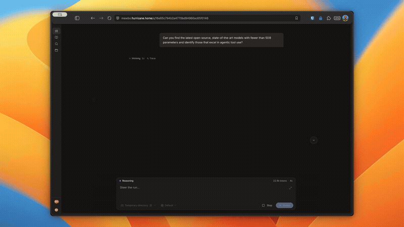
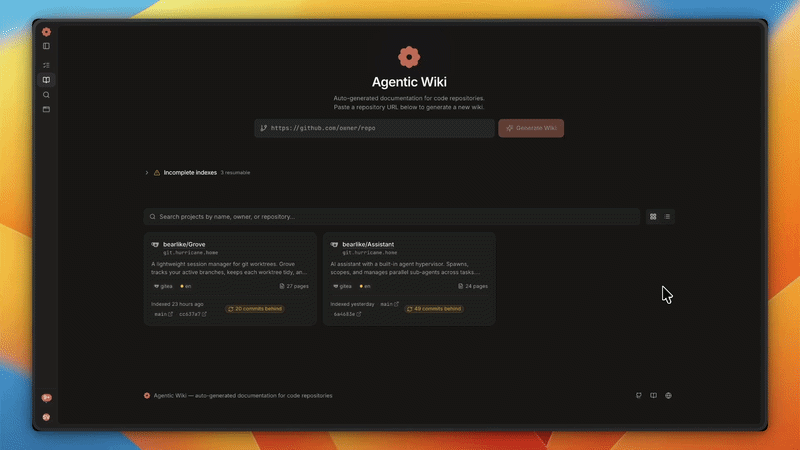
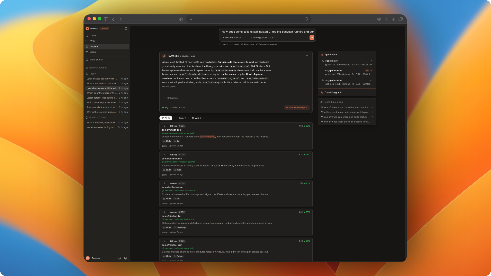
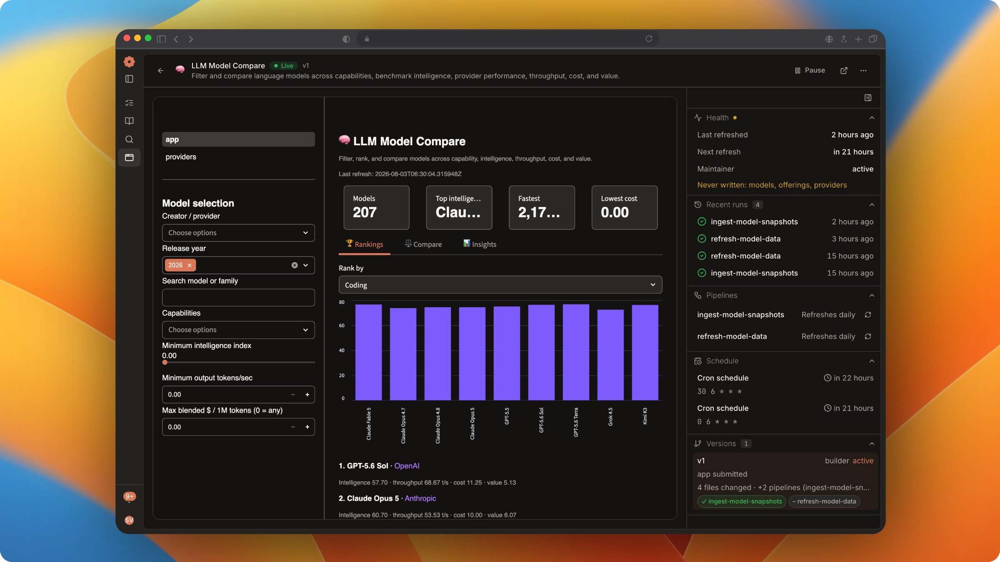
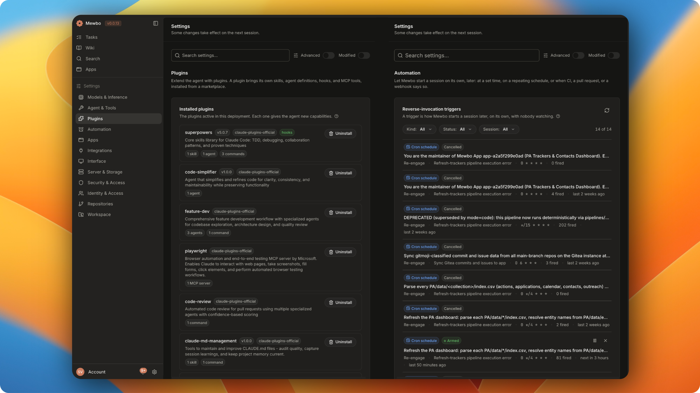
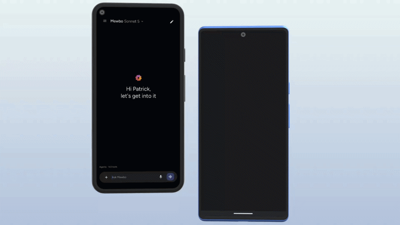

  

<h1 align="center">Mewbo</h1>

<strong>An open stack for agentic work, grounded in your own knowledge.</strong>

    
    
    
    
    
    
    

<em>Agentic task automation, memory-graph documentation and Q&amp;A, and search across every tool you connect. Any model, open source.</em>

## 🧭 Overview

Mewbo is an open stack for putting long running agents to work across enterprise systems, each one bounded, auditable and scoped to the person it runs for. Hosted assistants limit what connects and building past them takes engineering, so operators wait or move that data into an unapproved tool.

Whoever owns lead routing can put enrichment behind a schedule or a webhook. A support manager can stand up a live view over systems they already use without filing a ticket. Engineering gets the same session for a refactor or a migration, and anyone can ask a repository a question instead of reading it.

Permissions resolve ahead of the run rather than call by call, from the roles, teams and workspaces an owner defines. Every model call writes to one trace with token counts, so an audit answers who ran what and a failed step shows up instead of passing as done.

The wiki, the search, the apps and the task runner all run on one harness, so an improvement to the loop reaches all of them.

## ✨ Features

<table>
<tr>
<td width="50%" valign="middle">

### Agentic tasks

A long run is a fleet, not a chat. Approve the plan, then watch the tree and steer or stop any branch. Authority only narrows going down. Retries and model fallback absorb the failures, and one trace makes the result reviewable rather than merely finished.

[Docs →](https://docs.mewbo.com/latest/web/sessions/)

</td>
<td width="50%">
  
</td>
</tr>
<tr>
<td width="50%" valign="middle">

### Agentic Wiki and Q&A

Indexing lifts a repository's ASTs into a three layer memory graph, so pages are generated from structure rather than from a file by file read. Probe agents traverse the same graph at question time, and a cross module answer arrives cited to a path and line range.

[Docs →](https://docs.mewbo.com/latest/features-wiki-qa/)

</td>
<td width="50%">
  
</td>
</tr>
<tr>
<td width="50%" valign="middle">

### Agentic Search

No single index spans the systems that hold your answer. Attach them as APIs, databases or MCP servers, and probe agents route by a graph of reachability rather than content, each writing its route back.

[Docs →](https://docs.mewbo.com/latest/features-search/)

</td>
<td width="50%">
  
</td>
</tr>
<tr>
<td width="50%" valign="middle">

### Agentic Apps

The same harness builds an app against a structured playbook, then verifies it. Its frontend ships as WASM and runs in the browser sandbox, so you operate no new service. Triggers and schedules come out of the same build, so upkeep ships with the app.

[Docs →](https://docs.mewbo.com/latest/apps/)

</td>
<td width="50%">
  
</td>
</tr>
<tr>
<td width="50%" valign="middle">

### Plugins and automation

Plugins add skills, agent definitions, hooks, session tools and MCP servers to a session. Triggers start one with nobody watching, on a schedule, on CI, on a pull request or on a webhook.

[Plugins →](https://docs.mewbo.com/latest/features-plugins/) · [Triggers →](https://docs.mewbo.com/latest/api/triggers/)

</td>
<td width="50%">
  
</td>
</tr>
<tr>
<td width="50%" valign="middle">

### Mewbo Assistant on Android

The Android client runs the same sessions you have at your desk, registered as the device assistant so its orb answers over whatever app is in front of you. Voice goes in, and device tools act on the phone itself.

[Docs →](https://docs.mewbo.com/latest/android/)

</td>
<td width="50%">
  
</td>
</tr>
</table>

**Also in the box:**

- **[Open agent standards](https://docs.mewbo.com/latest/features-skills/).** Agent Skills, agent definitions and MCP servers load exactly as written, so what you already run elsewhere works here unchanged. Marketplaces ship all three.
- **[Identity and access](https://docs.mewbo.com/latest/authentication/).** Principals, roles, teams, grants and an audit trail, with OIDC, LDAP and SAML behind their own extras. Every agent action lands against a real identity, so an audit can answer who ran what.
- **[Sandboxed execution](https://docs.mewbo.com/latest/features-builtin-tools/).** A shell command is an opaque string, so Landlock confines the subprocess itself rather than trusting its arguments. On by default.
- **[Plan mode and permissions](https://docs.mewbo.com/latest/features-plan-mode/).** Approve the plan before anything runs. After that every write and every shell call clears a permission rule or a hook.
- **[Agent hypervisor](https://docs.mewbo.com/latest/features-agents/).** A spawn past the concurrency ceiling comes back rejected rather than queued, so a saturated fleet is visible instead of silent.
- **[Long-horizon context](https://docs.mewbo.com/latest/features-compaction/).** Compaction summarises older turns as the budget fills and restores the working set afterwards. Fork any message to replay that branch on a different model.
- **[Tracing and token accounting](https://docs.mewbo.com/latest/features-token-usage/).** Every model call writes a paired event onto the transcript and the session groups into one trace, with token counts split between the root agent and its children.
- **[Code intelligence](https://docs.mewbo.com/latest/features-lsp/).** Language servers are discovered automatically and rerun diagnostics after every edit, so a run sees the same errors your editor would.
- **[Web IDE](https://docs.mewbo.com/latest/web/ide/).** Each session can open its own code-server container, started on demand and reaped when its time to live runs out. Take the files over mid-run without leaving the browser.
- **[Any provider, every surface](https://docs.mewbo.com/latest/llm-setup/).** Bring the models you already pay for. The terminal, the console, Android, the REST API, an MCP server, Home Assistant, Nextcloud Talk and email all drive the same session.

## 🚀 Get started

See [docs.mewbo.com/latest/getting-started](https://docs.mewbo.com/latest/getting-started/) to install Mewbo and run a first session.

## 📚 Documentation

Full documentation lives at **[docs.mewbo.com](https://docs.mewbo.com/latest/)**.

| Section | Covers |
| --- | --- |
| [Get Started](https://docs.mewbo.com/latest/getting-started/) | Install, configure a model, run a first session. |
| [Terminal](https://docs.mewbo.com/latest/terminal/) | The terminal client, its interface, the agent fleet view, remote sync. |
| [Web](https://docs.mewbo.com/latest/web/) | Console sessions, search and wiki, the Web IDE, panels, widgets. |
| [Android](https://docs.mewbo.com/latest/android/) | Install, voice, chat and sessions, device tools. |
| [Agentic Apps](https://docs.mewbo.com/latest/apps/) | Building an app, and living with one once it runs. |
| [API](https://docs.mewbo.com/latest/api/) | Building a client, structured outputs, automation, triggers, REST reference. |
| [Client Integrations](https://docs.mewbo.com/latest/clients-mcp/) | MCP server, Home Assistant, email, Nextcloud Talk. |
| [Knowledge & Discovery](https://docs.mewbo.com/latest/features-wiki/) | Agentic Wiki and Agentic Search. |
| [Capabilities](https://docs.mewbo.com/latest/features-builtin-tools/) | Built-in tools, worktrees, code intelligence, sub-agents, skills, plugins, plan mode, permissions, compaction. |
| [Deploy](https://docs.mewbo.com/latest/deployment-docker/) | Docker Compose, storage backends, production setup, observability. |
| [Configure](https://docs.mewbo.com/latest/configuration/) | Model setup, project setup, identity providers, configuration reference. |
| [Develop](https://docs.mewbo.com/latest/core-orchestration/) | Architecture, session runtime, Python reference. |
| [Troubleshooting](https://docs.mewbo.com/latest/troubleshooting/) | Symptom to cause to fix for common failures. |
| [Releases](https://github.com/bearlike/Assistant/releases) | Release notes and upgrade history. |

## 🤝 Contributing

Bugs and feature requests on the [issue tracker](https://github.com/bearlike/Assistant/issues). For the architecture and the engineering rules a change is held to, see the [architecture overview](https://docs.mewbo.com/latest/core-orchestration/) and [`CLAUDE.md`](./CLAUDE.md).

## 📄 License

[MIT](LICENSE) © Krishnakanth Alagiri.
