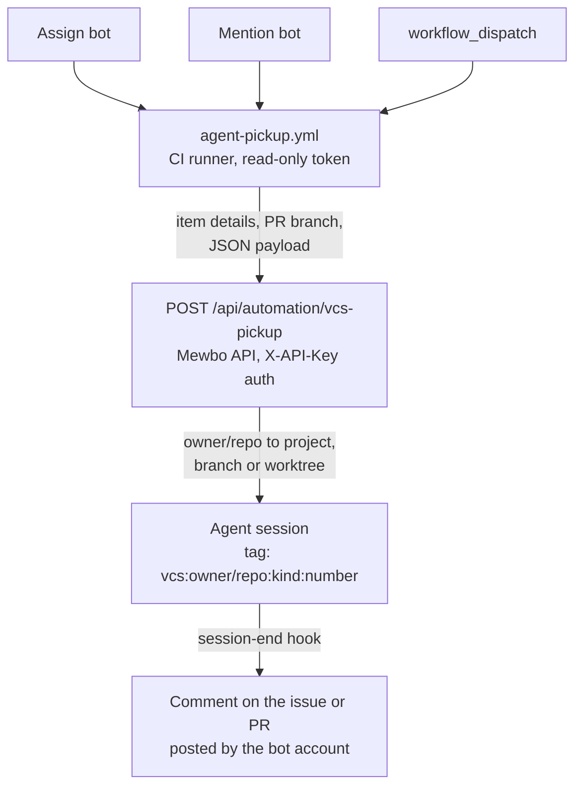

# Automation

## Hand an issue to an agent

Assign a bot account to an issue, or mention it in a comment, and Mewbo picks the item up in an agent session. One [`agent-pickup.yml`](repo:.github/workflows/agent-pickup.yml) workflow does this on both GitHub Actions and Gitea Actions, posting the item to [POST /api/automation/vcs-pickup](endpoint:POST /api/automation/vcs-pickup) on your Mewbo API.

## How it works



**Triggers.** The workflow fires on `issues: [assigned]`, `pull_request: [assigned]`, `issue_comment: [created]`, and manual `workflow_dispatch`. Dispatch takes a required `issue_number` and an optional `prompt`. A job guard then decides whether the run proceeds.

- **Assignment.** Runs when the just-assigned user is `AGENT_BOT_LOGIN`. It falls back to the item's full assignees list, which is what Gitea needs.
- **Comment.** Runs when the comment body contains `@<AGENT_BOT_LOGIN>` and the author is not the bot. That second condition stops the bot triggering itself in a loop.
- **Dispatch.** Always runs, as the manual override. The dispatch payload carries only a number, so the workflow fetches the item's title, body, and URL from the VCS API.

A concurrency group keyed on the item number serializes runs per issue or PR. Runs already in flight are never cancelled.

**Session continuity.** The session tag is `vcs:<owner/repo>:<kind>:<number>`, with kind `issue` or `pull_request`, so every trigger on one item lands in one conversation. A prompt that arrives while a run is active is enqueued as a steering message rather than starting a second run.

**Working directory.**

- **Pull request pickups** run in a managed git worktree on the PR head branch. The endpoint fetches the branch from `origin`, creates the tracking branch and worktree if either is missing, and fast-forwards to `origin/<branch>` where it can. The prompt tells the agent to commit and push from there, so the PR updates.
- **Issue pickups** run in an isolated worktree on a deterministic `mewbo/issue-<number>` branch cut from the default branch's latest commit, so concurrent pickups never collide. A repeat pickup reuses that branch. Mewbo owns it, so the session-end reaper deletes branch and worktree together.

An issue pickup degrades to the shared main checkout where the project has no managed parent or the worktree cannot be created. The agent is then told to cut its own feature branch.

## The pickup prompt closes the issue

For an issue pickup, the generated prompt instructs the agent to put a `Closes #<issue-number>` directive in its pull request description. Merging that pull request closes the issue through the forge's closing keyword convention.

Pull request pickups get no such directive. They already run on the PR's own branch, so the prompt tells the agent to update the existing PR. A full `prompt` override in the request body replaces the generated prompt entirely, and the `Closes #` directive goes with it.

## Setup, GitHub Actions

The workflow file ships in the repo at [`agent-pickup.yml`](repo:.github/workflows/agent-pickup.yml). Only the secrets and variables need configuring, under Settings, then Secrets and variables, then Actions.

**Repository secrets:**

| Secret | Required | Purpose |
|--------|----------|---------|
| `MEWBO_API_URL` | Yes | Base URL of your Mewbo API (for example `https://mewbo.example.com`). |
| `MEWBO_API_TOKEN` | Yes | A provisioned Mewbo API key, sent as `X-API-Key`. |

**Provisioning the API key.** Mint a dedicated key rather than using the master token. A key from the key store authenticates every route the API key gates, including [POST /api/automation/vcs-pickup](endpoint:POST /api/automation/vcs-pickup).

- In the console, open Settings, then API Keys, and create a key labeled for the repo.
- Over the API, call [POST /api/keys](endpoint:POST /api/keys) with the master token.

  ```bash
  curl -X POST "$MEWBO_API_URL/api/keys" \
    -H "X-API-Key: $MASTER_TOKEN" -H "Content-Type: application/json" \
    -d '{"label": "agent-pickup CI (owner/repo)"}'
  # -> {"id": ..., "key": "mk_..."}  the plaintext is shown exactly once
  ```

Store the returned `mk_...` value as the `MEWBO_API_TOKEN` repository secret. [DELETE /api/keys/{key_id}](endpoint:DELETE /api/keys/{key_id}) revokes it and immediately disables every workflow that uses it. The master token is untouched.

**Repository variables:**

| Variable | Required | Purpose |
|----------|----------|---------|
| `AGENT_BOT_LOGIN` | Yes | Bot account login to watch for (for example `mewbo-ai`). Without it, only `workflow_dispatch` triggers run. |
| `AGENT_PROJECT` | No | Mewbo project key override. Defaults to `owner/repo`. |
| `AGENT_MODEL` | No | LLM model override for the session. |
| `AGENT_MODE` | No | `plan` or `act`. |

**Token scope.** The workflow declares the least it needs, `contents: read`, `issues: read`, and `pull-requests: read`. The workflow token only GETs issue or PR details, for dispatch and comment pickups whose payload lacks that data. Nothing is written to the repository, because all the work happens inside the Mewbo session.

> [!IMPORTANT]
> GitHub does not expose repository secrets to workflows triggered from fork pull requests. Assignment pickup therefore works only for PRs from branches in the same repository. A fork PR's run fails the configuration check, because `MEWBO_API_URL` arrives empty.

## Setup, Gitea Actions

Gitea Actions reads the same [`agent-pickup.yml`](repo:.github/workflows/agent-pickup.yml), so nothing extra needs committing. Configure the same secrets and variables under repo Settings, then Actions, then Secrets and Variables.

The workflow handles three differences from GitHub inline.

- **Assignment payload.** Gitea's `assigned` event carries no `event.assignee` at the top level, so the guard falls back to the assignees list. A second assignment on an item the bot already holds can therefore re-fire the workflow. That is harmless, because the endpoint resolves the same tag and reuses the session.
- **API URL.** Gitea's `act_runner` may leave `github.api_url` empty, so the workflow derives `<server_url>/api/v1` itself. The `/repos/{owner}/{repo}/issues/{n}` and `/pulls/{n}` shapes are identical on both platforms, and both accept the workflow token via `Authorization: token ...`.
- **Provider field.** The payload's `provider` is set to `gitea` whenever `server_url` is not `https://github.com`. It is informational only.

A runner registered with the `ubuntu-latest` label must exist. Missing `jq` is installed via `apt-get` at run time.

## Server-side requirements

The Mewbo API maps the `owner/repo` string to a local project two ways.

- **Automatic.** A configured project whose git remote matches the repository. Resolution uses the same [`RepoIdentity`](repo:apps/mewbo_api/src/mewbo_api/repo_identity.py) alias matching as the worktree routes, so the repo resolves via its Gitea host URL, a GitHub mirror URL, `owner/repo`, or the bare repo name.
- **Explicit.** The `AGENT_PROJECT` repository variable overrides the `owner/repo` default with a Mewbo project key.

The project path must be a git clone with an `origin` remote that can fetch PR branches. PR pickups run `git fetch origin <branch>` in the parent clone before creating the worktree. A pickup whose branch cannot be fetched fails with `422`.

### Replies back to the issue or PR

When a pickup run ends, a session-end hook posts the final answer back to the originating issue or PR as a comment from the bot account. It needs a forge token for the bot under `channels.vcs` in the server config.

```json
"channels": {
  "vcs": {
    "tokens": { "git.example.com": "<bot PAT>", "api.github.com": "<bot PAT>" },
    "tls_verify": true
  }
}
```

- **Tokens are keyed by forge API host**, the hostname of the `api_url` the workflow sends. One Mewbo instance can therefore reply on several forges.
- **Token identity equals comment author.** Mint the PAT for the bot account. On Gitea, an admin can `POST /api/v1/users/<bot>/tokens` with basic auth and the scopes `read:user`, `write:issue`, and `write:repository`. On GitHub, use a fine-grained PAT with Issues write plus Pull requests write. The `/repos/{owner}/{repo}/issues/{n}/comments` endpoint and the `Authorization: token` scheme are identical on both.
- **The same tokens also log in the `tea` CLI.** The api image ships `tea` and `gh`. [`15-tea-setup.sh`](repo:docker/init.d/15-tea-setup.sh) adds a `tea` login per `channels.vcs.tokens` host at container start, falling back to `~/.git-credentials` for hosts without one. The agent then opens pull requests as the bot account. `tea login add` is what needs the `read:user` scope.
- **Without a token the reply leg is silently disabled.** Pickups still run and the answer stays visible only in the session.
- `tls_verify: false` opts out of certificate verification, for a forge behind an internal CA the API host does not trust. The Python client uses the system CA store, same as git.
- The bot's own comment never triggers a second pickup.
- Answers longer than roughly 60,000 characters are truncated to fit forge comment limits.

## Endpoint reference

### POST /api/automation/vcs-pickup

Authenticate with the standard API key in the `X-API-Key` header. The body is strict JSON and unknown fields are rejected.

| Field | Type | Required | Purpose |
|-------|------|----------|---------|
| `repository` | string | Yes | `owner/repo` of the triggering repository. |
| `kind` | `issue` or `pull_request` | Yes | Item kind. |
| `number` | int >= 1 | Yes | Issue or PR number. |
| `provider` | string | No | `github` or `gitea`. Informational. |
| `api_url` | string | No | Forge REST base URL. Enables posting the final answer back as a comment. |
| `event` | string | No | Triggering event, for example `issues` or `issue_comment`. |
| `url` | string | No | Item HTML URL. |
| `title` | string | No | Item title. |
| `body` | string | No | Item description (the workflow truncates at 20,000 chars). |
| `comment` | string | No | The mention comment text, when comment-triggered. |
| `comment_author` | string | No | Login of the comment author. |
| `assignee` | string | No | Login of the just-assigned user. |
| `bot_login` | string | No | Configured bot login, for self-trigger suppression. |
| `head_ref` | string | No | PR head branch. Its presence makes a PR pickup worktree-bound. |
| `base_ref` | string | No | PR base branch. |
| `project` | string | No | Project key override. Defaults to `repository`. |
| `model` | string | No | LLM model override. |
| `mode` | `plan` or `act` | No | Session mode. |
| `prompt` | string | No | Full override of the generated pickup prompt. |

**Self-trigger suppression.** When `bot_login` is set and equals `comment_author`, the endpoint returns `200 {"skipped": true, "reason": "comment author is the bot"}` without starting anything. The workflow guard blocks the same case before the request is made.

**Responses:**

| Status | Body | Meaning |
|--------|------|---------|
| `200` | `{"session_id", "session_tag", "run_id", "resumed", "worktree_id", "accepted": true}` | Run started. `resumed` is `true` when the tag matched an existing session. `worktree_id` is set for PR pickups and for issue pickups that got an isolated worktree, and `null` when an issue pickup degraded to the main checkout. |
| `202` | `{"session_id", "session_tag", "enqueued": true, "resumed": true}` | A run was already active for this item. The prompt was enqueued as a steering message. |
| `200` | `{"skipped": true, "reason": ...}` | Self-trigger suppressed. |
| `400` | `{"message": "Invalid input: ..."}` | Body failed validation. |
| `404` | error | `repository` or `project` did not resolve to a configured project. |
| `409` | `{"message": "Session is already running."}` | Concurrent-start race lost (rare; the active-run path normally returns `202`). |
| `422` | `{"message": "Failed to prepare branch/worktree ..."}` | PR branch could not be fetched, or the worktree could not be created. |

## Testing

Work up in four steps.

1. **Manual dispatch first.** Run the Agent Pickup workflow via `workflow_dispatch` with a test issue number. This skips the assignment guard entirely and validates secrets, API reachability, and project resolution. The job log prints the JSON response and the session id.
2. **Scratch issue and assignment.** Create a throwaway issue and assign the bot account. An Actions run starts and a session appears in the Mewbo console, tagged `vcs:<owner/repo>:issue:<n>`.
3. **Negative check.** Assign a user other than the bot to the same issue. The guard must skip the job, so no run starts.
4. **PR mention.** Comment `@<bot-login> <request>` on a pull request. A session should start in a managed worktree on the PR head branch. Mention again to confirm the same session continues.

Call the endpoint directly to bypass CI.

```bash
curl -X POST "$MEWBO_API_URL/api/automation/vcs-pickup" \
  -H "Content-Type: application/json" \
  -H "X-API-Key: $MEWBO_API_TOKEN" \
  -d '{
    "repository": "owner/repo",
    "kind": "issue",
    "number": 42,
    "provider": "gitea",
    "event": "workflow_dispatch",
    "title": "Scratch issue for agent pickup",
    "body": "Reply with a one-line acknowledgement.",
    "bot_login": "mewbo-ai"
  }'
```

A `200` with a `session_id` confirms the server side end to end. Repeat the call to see `"resumed": true`, or a `202` steering response if the first run is still active.

## Next steps

- [Building a Client](building-a-client.md) covers the session and event primitives a pickup run rides on.
- The [full API reference](../rest-api.md) carries every route, parameter, and response shape.
