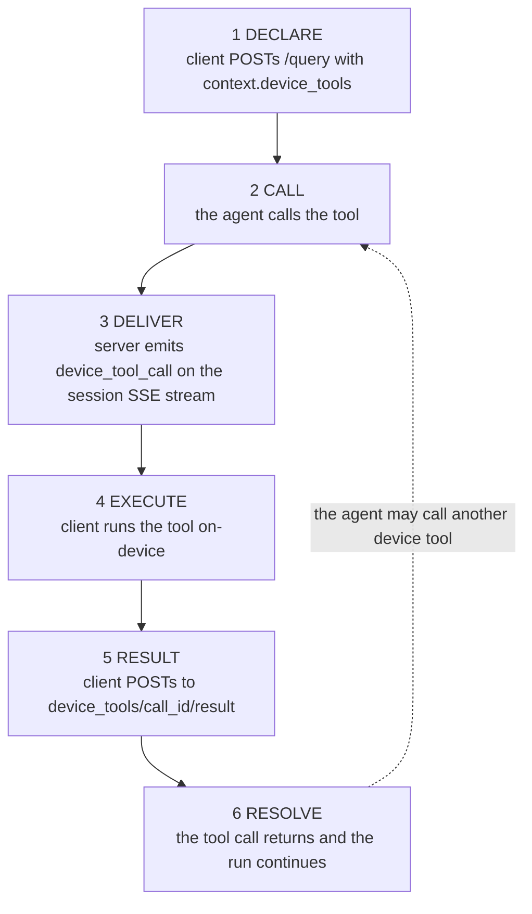

# Device Tool Bridge

## Run tools on the client device

A phone can send an SMS, read a sensor, or toggle a setting the server cannot reach. The device tool bridge lets a client declare tools like these to a session. To the agent, a device tool looks exactly like a built-in one.

## The flow



There is no separate registration endpoint and no polling endpoint. The bridge reuses the session stream you are already reading.

## 1. Declare the tools

Declare your device tools as an array in the `context.device_tools` field of a [POST /api/sessions/{session_id}/query](endpoint:POST /api/sessions/{session_id}/query) body:

```bash
curl -X POST "$MEWBO_API_URL/api/sessions/9e2d47c1a0b34f12/query" \
  -H "X-API-KEY: $MEWBO_API_KEY" \
  -H "Content-Type: application/json" \
  -d '{
    "query": "Text mom that I will be late.",
    "context": {
      "device_tools": [
        {
          "tool_id": "device_send_sms",
          "description": "Send an SMS to a phone number.",
          "parameters": {
            "type": "object",
            "properties": {
              "to":   { "type": "string" },
              "body": { "type": "string" }
            },
            "required": ["to", "body"]
          }
        }
      ]
    }
  }'
```

Each entry has three fields:

| Field | Required | Description |
|---|---|---|
| `tool_id` | yes | The tool name the agent calls. Must match the pattern `device_` followed by 1 to 48 lowercase letters, digits, or underscores. |
| `description` | yes | A non-empty description. This is what the agent reads to decide when to call the tool. |
| `parameters` | yes | A JSON Schema object describing the tool's arguments. It becomes the tool's function schema unchanged. If a `type` is present it must be `object`. |

The mandatory `device_` prefix is a namespace guard. It stops a tool the client declares from shadowing a built-in or plugin tool. A malformed spec, or two entries sharing a `tool_id`, is rejected with `400` before anything persists, so a bad declaration cannot poison the session.

You can also declare device tools on [POST /api/sessions](endpoint:POST /api/sessions) at create time, and they persist with the session. Validation and binding happen when you send a query, so resending the declaration each query keeps it current. Reengaging an idle session accepts a declaration persisted earlier rather than failing.

## 2. Receive the pending call

When the agent calls a declared tool, the server appends a `device_tool_call` event to the session. It arrives on the session's SSE stream, [GET /api/sessions/{session_id}/stream](endpoint:GET /api/sessions/{session_id}/stream), as a frame like this:

```
data: {"type": "device_tool_call", "payload": {
  "call_id": "3f9a1c2b7d5e4a6f",
  "call_token": "Q1sT9x...redacted",
  "tool_id": "device_send_sms",
  "args": { "to": "+15550001234", "body": "Running late, be there soon." },
  "expires_at": 1720000030.0
}}
```

The payload fields:

| Field | Description |
|---|---|
| `call_id` | Identifies this specific call. You put it in the result URL. |
| `call_token` | A single-use token you present when posting the result. It authorizes exactly this call. |
| `tool_id` | The declared tool the agent is calling. |
| `args` | The arguments the agent passed, matching your `parameters` schema. |
| `expires_at` | An epoch-seconds deadline. The server stops waiting for a result after this time. |

Note the field names. The arguments object is `args`, not `arguments`, and the tool name is `tool_id`, not `name`.

The call is delivered only if a client is attached to the session's SSE stream. If nobody is listening, the agent's tool call fails immediately with a `device_unavailable` error and no event is appended. Attach to the stream before you send a query that may call a device tool.

## 3. Execute and post the result

Run the tool on the device, then deliver the outcome to [POST /api/sessions/{session_id}/device_tools/{call_id}/result](endpoint:POST /api/sessions/{session_id}/device_tools/{call_id}/result).

On success, set `status` to `ok` and put the tool's return value in `result`:

```bash
curl -X POST "$MEWBO_API_URL/api/sessions/9e2d47c1a0b34f12/device_tools/3f9a1c2b7d5e4a6f/result" \
  -H "X-API-KEY: $MEWBO_API_KEY" \
  -H "Content-Type: application/json" \
  -d '{
    "call_token": "Q1sT9x...redacted",
    "status": "ok",
    "result": { "delivered": true, "message_id": "sms_88213" }
  }'
```

The agent's tool call resolves with your `result`, and the run continues.

On failure, post to the same route with `status` set to `error`. The `error` object needs a non-empty `code` or `message`:

```json
{
  "call_token": "Q1sT9x...redacted",
  "status": "error",
  "error": { "code": "permission_denied", "message": "The user denied SMS permission." }
}
```

The agent sees the call as a failed tool step and continues with that error in context.

### Returning an image

A result may carry one image, which the model sees as an image rather than as text. Put base64 data in `image_base64` inside your `result` object, and name its type in `image_media_type`:

```json
{
  "call_token": "Q1sT9x...redacted",
  "status": "ok",
  "result": {
    "image_base64": "/9j/4AAQSkZJRgABAQ...",
    "image_media_type": "image/jpeg",
    "screen_width": 1440,
    "screen_height": 3120
  }
}
```

The server lifts those two fields out of the JSON and attaches the image to the tool result the model reads. The rest of your `result` object arrives alongside it as text, so a caller can return both a picture and the facts that describe it.

Three things follow from that design:

- **The base64 never reaches the transcript.** It is removed from the JSON before the result is recorded, so a session's stored history does not grow by the size of every image, and reading that history back does not re-download them.
- **Send an image only with `status: "ok"`.** A failed result must be text. The model provider rejects a request whose failed tool result carries a non-text block, which fails the whole turn rather than just the call.
- **Send it already sized.** An image costs the model roughly a thousand tokens or more, in proportion to its dimensions. Scale and compress before encoding rather than sending a full-resolution capture.

Older images are removed from the conversation when it is compacted, leaving a note in their place that says the image can be requested again. The newest one is kept.

The result body fields:

| Field | Required | Description |
|---|---|---|
| `call_token` | yes | The single-use token from the `device_tool_call` event. |
| `status` | yes | `ok` or `error`. |
| `result` | when `ok` | The tool's return value. Any JSON. `image_base64` and `image_media_type`, if present, are lifted out and attached as an image. |
| `error` | when `error` | An object with `code` and `message`. At least one must be non-empty. |

### Response codes

| Status | Meaning |
|---|---|
| `200` | The result was delivered. The waiting tool call resolves. Body is `{"resolved": true}`. |
| `400` | The body was malformed, for example a missing `status`. |
| `403` | The `call_token` did not match the pending call. |
| `404` | No pending call with that `call_id`. It is unknown, expired, or already delivered. |
| `409` | A result was already delivered for this call. |

/// table-caption
What the result route answers, and what each answer means for the waiting tool call.
///

## Timeouts and single delivery

A pending call has a wait budget of 30 seconds. If no result arrives in time, the agent's tool call fails with a `device_timeout` error and the run continues without it. The `expires_at` field carries that deadline, so a client can decide whether answering is still worth it.

A result may be delivered exactly once. The first valid POST wins and resolves the call, and a second returns `409`. That rule guards against a repeated side effect out in the world, such as sending the same SMS twice.

## Security model

The `call_token` proves the caller can read the session's SSE stream, and it blocks replay of a delivered result. It is not a device identity. Any client viewing the stream receives the same token, so treat it only as a capability scoped to that one call. Verified identity for each device is a future phase.

The result route is a normal protected endpoint, so the caller also needs a valid API key, the same as every other session route.

## Implementation

The spec facing the client and the core dispatch seam are in [`client_tools.py`](repo:packages/mewbo_core/src/mewbo_core/tooling/client_tools.py). The registry of pending calls, the timeout constant, and the dispatcher are in [`device_tools.py`](repo:apps/mewbo_api/src/mewbo_api/device_tools.py). The result route and its request and response models are in [`backend.py`](repo:apps/mewbo_api/src/mewbo_api/backend.py).

The exact schemas for the result route are in the generated [REST API Reference](../rest-api.md).

## Next steps

- [Building a Client](building-a-client.md) covers the SSE stream that delivers these calls.
- [Device Tools on Android](../android/device-tools.md) shows the same bridge from the phone's side.
