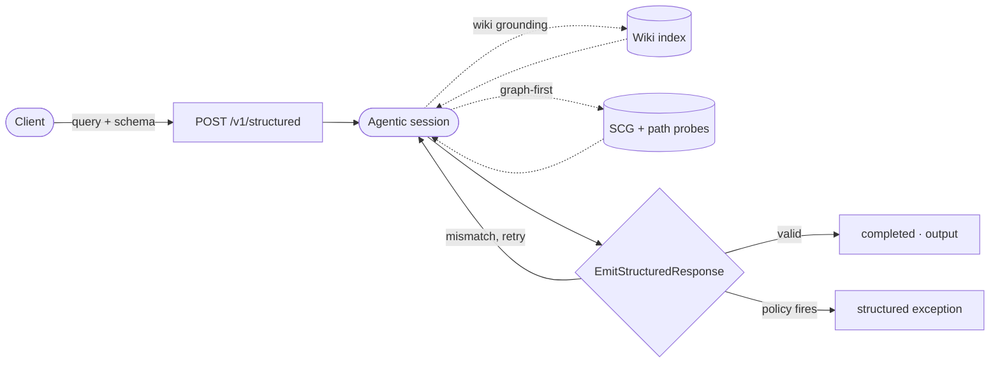

# Structured Outputs

## Get JSON that fits a schema



Structured Outputs runs an agentic Mewbo session constrained to a JSON Schema you provide. The session emits a validated object matching that schema instead of free text. Reach for it when a pipeline, another agent, or any consumer downstream needs machine readable output rather than prose.

Two endpoints plus a mode cover the latency spectrum. Pick by how much work the answer needs.

| Endpoint or mode | What you get | Profile |
|---|---|---|
| [POST /v1/structured](endpoint:POST /v1/structured) (default) | The full agentic run: tools, grounding, sub-agent probes, schema-validated output. | Async run handle. Seconds to minutes. |
| [POST /v1/structured](endpoint:POST /v1/structured) with `"mode": "synthesis"` | Retrieval-only synthesis: no tool use, one model round trip, schema-validated output plus citations. Returns inline. | Synchronous. Tuned for fast first tokens. |
| [POST /v1/draft/stream](endpoint:POST /v1/draft/stream) | A free-text draft answer streamed token by token over SSE. No schema. | Lowest latency. Tool-light by design. |

All three are session-backed. Every run leaves an auditable transcript and a Langfuse trace, keyed by a `session_id` you get back on the wire.

## How it works

POST a query and a JSON Schema to [/v1/structured](endpoint:POST /v1/structured). The session assembles the answer, then calls [EmitStructuredResponse](repo:packages/mewbo_core/src/mewbo_core/loop/structured_response.py) to validate it against your schema. A mismatch returns as an ordinary tool result and the model is asked to fix it, so no separate control mechanism sits underneath.

The POST returns a run handle right away. A run that finishes within a few seconds comes back inline with `status: "completed"` and the output attached. Everything else is polled from [GET /v1/structured/{run_id}](endpoint:GET /v1/structured/{run_id}) or watched over the live event stream.

**Request fields**

| Field | Required | Description |
|---|---|---|
| `query` | yes | The natural-language request. |
| `schema` | yes | JSON Schema the output object must validate against. |
| `workspace` | no | A wiki slug, or an Agentic Search workspace id or name. Enables grounding. |
| `tools` | no | Tool allowlist. Narrows what the run may call. It never widens the grant. |
| `model` | no | Any configured LiteLLM model id (for example `openai/gpt-5.4-nano`). Omit to use the configured default. |

**Extract all public API endpoints from a codebase**

Send a [POST /v1/structured](endpoint:POST /v1/structured).

```json
{
  "query": "List every public REST endpoint this project exposes, with its HTTP method and request body schema.",
  "schema": {
    "type": "object",
    "properties": {
      "endpoints": {
        "type": "array",
        "items": {
          "type": "object",
          "properties": {
            "path":   { "type": "string" },
            "method": { "type": "string", "enum": ["GET", "POST", "PUT", "PATCH", "DELETE"] },
            "body_schema": { "type": "object" }
          },
          "required": ["path", "method"]
        }
      }
    },
    "required": ["endpoints"]
  },
  "workspace": "my-api-codebase"
}
```

The run handle comes back immediately.

```json
{
  "run_id": "1f3a9c0db64e:r1",
  "status": "running",
  "workspace": "my-api-codebase"
}
```

Poll [GET /v1/structured/{run_id}](endpoint:GET /v1/structured/{run_id}) until `status` is `completed`, then read `output`.

```json
{
  "run_id": "1f3a9c0db64e:r1",
  "status": "completed",
  "output": {
    "endpoints": [
      { "path": "/v1/users", "method": "POST", "body_schema": { "type": "object" } }
    ]
  }
}
```

Failures always come back as a structured envelope, `{"error": {"code": ..., "reason": ...}}`, never a raw exception. An unknown run id is a clean 404 with the same envelope.

### Watching a run live

The run handle is `<session_id>:r<seq>`, so everything before the first colon is the backing session's id. Attach to [GET /api/sessions/{session_id}/stream](endpoint:GET /api/sessions/{session_id}/stream) instead of polling and the events arrive over Server-Sent Events as they happen, from tool calls and sub-agent probe fan-out through to the final output.

## Workspace grounding

Pass `workspace` and the session is grounded in your data rather than the model's general knowledge. You get the same provenance guarantees as [Agentic Search](../features-search.md), in a typed result validated against your schema. The value you pass picks the grounding mode.

**Wiki grounding.** A wiki slug grounds the run in that project's indexed sources through the default retrieval path. This is the baseline grounded run.

**Graph-first grounding.** Map an [Agentic Search](../features-search.md) workspace's sources into the Source Capability Graph and the run routes graph first, granted that workspace's slice of the graph and its connector tools. `scg_route` proposes pathways over those sources only. One `scg-path-probe` sub-agent fans out per pathway, and the probe results are aggregated into the emitted object.

Graph-first runs record their audit trail. [GET /v1/structured/{run_id}](endpoint:GET /v1/structured/{run_id}) carries an additive `provenance` block alongside the output.

```json
"provenance": {
  "recipes_routed": 2,
  "probes_run": 3,
  "probe_status": { "a1b2c3": "completed", "d4e5f6": "completed", "g7h8i9": "completed" }
}
```

A run that fans out no probes omits the block, so provenance rides the wire only when there is something to carry.

Eligibility is automatic. Graph-first needs `scg.enabled` on and at least one of the workspace's sources mapped. A wiki slug, an unmapped workspace, SCG off, or any resolution failure falls back silently to the default grounded path. The wire shape is identical either way.

> [!TIP] What makes an answer grounded
> Your indexed sources are traversed before a single token of the output object is written.

## Fast synthesis mode

Add `"mode": "synthesis"` to the request body. The server fetches grounding citations, issues one model call with the emit tool, and validates the result. One validation failure triggers one reask. A second returns a `422` with the structured error envelope.

`mode` joins the same `query` and `schema` the agentic path takes. `workspace` grounds it on a wiki slug.

```json
{
  "query": "List every public REST endpoint this project exposes.",
  "schema": { "type": "object", "properties": { "endpoints": { "type": "array" } }, "required": ["endpoints"] },
  "workspace": "my-api-codebase",
  "mode": "synthesis"
}
```

The response arrives inline, with no polling.

```json
{
  "run_id": "9e2d47c1c0a94d3b8f6a5e1b2c3d4e5f:r1",
  "status": "completed",
  "output": { "endpoints": [ { "path": "/v1/users", "method": "GET" } ] },
  "citations": [
    { "id": "p_142", "kind": "page", "snippet": "...", "score": 0.83, "source": "api/routes.md" }
  ],
  "workspace": "my-api-codebase"
}
```

`output` validates against the schema you provided and `citations` lists the grounding sources used. The `run_id` handle still resolves via [GET /v1/structured/{run_id}](endpoint:GET /v1/structured/{run_id}) if you need to re-fetch it.

Each synthesis run mints a real session, and the `run_id` prefix keys its transcript and Langfuse trace. The transcript is written behind the response, so session backing costs nothing on the latency path.

## Draft streaming

[POST /v1/draft/stream](endpoint:POST /v1/draft/stream) streams a free-text answer token by token over Server-Sent Events, for when you want a readable draft on screen and no schema. It makes one streaming model call, with no tool use and no agent loop. Pass a `workspace` wiki slug and the server retrieves grounding context once, before streaming begins.

The body takes a required `query`, an optional `workspace` wiki slug for grounding, and an optional `model` override.

The response is `text/event-stream`. Each token arrives as its own frame and a terminal frame closes the stream.

```
data: {"token": "The"}

data: {"token": " project"}

data: {"token": " exposes"}

data: {"done": true, "session_id": "9e2d47c1c0a94d3b8f6a5e1b2c3d4e5f"}
```

A stream that fails mid flight sends an error frame instead of the done frame.

```
data: {"error": "<reason>"}
```

The `session_id` also arrives up front in the `X-Mewbo-Session` response header, exposed for cross-origin reads so a browser client has it before the first token. The transcript persists after the last token, and a stream that died mid flight is recorded as `failed` rather than a false `completed`.

## Policy integration

Activate named [Policies](../features-policies.md) per request with the `policies` field.

```json
{
  "query": "...",
  "schema": { "..." },
  "policies": ["no-external-data-exfil"]
}
```

When a policy fires, the endpoint returns the structured exception in the response body instead of the schema output. Either path gives the caller a typed result it can parse, which is what makes this usable as a quality gate.

> [!NOTE] Terminal policies and structured outputs
> A policy with `isTerminal: true` ends the session immediately on a violation and surfaces the structured exception as the run's final output. See [Policies](../features-policies.md#terminal-violations) for details.

## Run lifecycle

| Status | Meaning |
|---|---|
| `running` | The agentic session is in progress. Keep polling, or attach to the session stream. |
| `completed` | The session emitted a valid object. `output` contains it. |
| `failed` | The session ended without emitting a valid object. |
| `canceled` | The run was canceled before it completed. |

A run that reaches a terminal state without a valid object answers [GET /v1/structured/{run_id}](endpoint:GET /v1/structured/{run_id}) with a `422` and the structured error envelope. The emit tool fires only on success, so an output present is proof the run completed.

## REST reference

Every field, response shape and error model for these four endpoints is in the [REST API Reference](../rest-api.md), generated from the live server.

## MCP tools

Two tools on the [MCP Server](../clients-mcp.md) expose this endpoint to agents on your fleet.

| Tool | Purpose |
|---|---|
| `structured_query(query, schema, workspace?, tool_ids?)` | Start a structured run. Returns a `run_id` immediately. |
| `get_structured_run(run_id)` | Fetch the current status and result of a run. Re-engage after a timeout. |

`structured_query` posts to the same [/v1/structured](endpoint:POST /v1/structured) endpoint, so workspace grounding and graph-first routing reach MCP callers unchanged. See [MCP Server](../clients-mcp.md) for authentication and setup.

## Enabling it

Structured Outputs ships in `mewbo-api`. Full workspace grounding needs the wiki extras.

```bash
uv sync --extra wiki
uv run mewbo-api
```

Without the extras the endpoint still serves schema-constrained sessions, and workspace grounding is silently skipped. Graph-first grounding additionally needs the Source Capability Graph. Enable `scg.enabled` and map at least one of the workspace's sources. See [Agentic Search](../features-search.md).

> [!NOTE] Going deeper
> A structured run is an ordinary agentic session on the same [ToolUseLoop](repo:packages/mewbo_core/src/mewbo_core/loop/tool_use_loop.py) and [Sub-agent](../features-agents.md) model. The schema constraint, `EmitStructuredResponse` and graph-first routing are layered on that one loop, not a second engine.

## Next steps

- [Building a Client](building-a-client.md) walks the full session lifecycle over HTTP.
- [Automation](automation.md) drives issue pickup and PR workflows through the API.
- The [full API reference](../rest-api.md) carries every route, parameter, and response shape.
