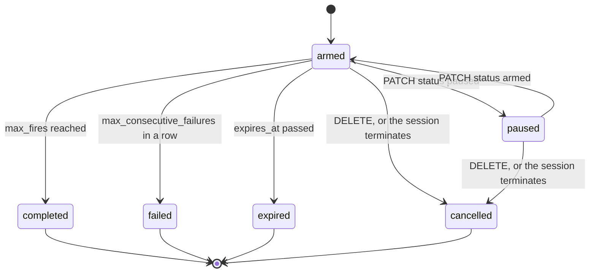

# Triggers

## Start a session on an event

A session doesn't have to stay open to wait for something. An agent can arm a **trigger**, a durable `wake me up` record, and end its turn. No session sits open and no tokens are spent meanwhile. When the condition is met, Mewbo reengages the session with the instruction the agent left for itself.

This is the reverse of [Automation](automation.md), which is the world pushing work *into* Mewbo. A trigger is a session reaching *out* to be woken later by a clock, a CI run, a pull request event, or a webhook.

## What an agent uses it for

Inside a running session, the model has a `schedule_trigger` tool. A deploy that takes twenty minutes does not need a session held open for twenty minutes. The agent arms a trigger against the CI run and ends the turn.

When the trigger fires, the orchestrator reinvokes the same session with the trigger's `wake_prompt`, the instruction the agent wrote for its future self. The session resumes with its full history intact.

`schedule_trigger` also lists and cancels the triggers the current session has armed. Arming is deliberately scoped to the session's own agent turn, never exposed as a general-purpose REST mutation. See [`session_tool.py`](repo:packages/mewbo_core/src/mewbo_core/triggers/session_tool.py).

## The five kinds

Every trigger declares one `kind`, with no custom scripting. The agent picks a kind and fills its fields, defined in [`spec.py`](repo:packages/mewbo_core/src/mewbo_core/triggers/spec.py).

| Kind | Fires when | Notes |
|---|---|---|
| `time.at` | A specific wall-clock instant passes | Fires exactly once. |
| `time.cron` | A cron schedule is due | Repeats, anchored on the last fire rather than now, so downtime never causes a catch-up burst; the missed slot fires once and re-anchors. |
| `ci.workflow` | A CI run on a repo completes | Matches a specific `run_id`, or the next completed run of a named `workflow`. Optionally filtered by `ref` or conclusion, such as `success` or `failure`. |
| `forge.pr` | A pull request reaches a lifecycle event | Events: `merged`, `review`, `comment`, `ci_status`; see the polling limitation below. |
| `webhook` | An inbound HTTP request presents the right secret | Fires on anything: a third-party service, a script, a manual `curl`. See the capability URL below. |

/// table-caption
The five trigger kinds and what wakes each one.
///

A trigger can cap its own fire count with `max_fires`. It also expires on its own at `expires_at` if nothing happens by then, defaulted per deployment when the agent sets none.

## Watching and managing triggers

Outside the session that armed them, triggers are visible over the REST API and the console:

| Action | Endpoint |
|---|---|
| List triggers, filterable by session, kind, or status | [GET /api/triggers](endpoint:GET /api/triggers) |
| List one session's triggers | [GET /api/sessions/{session_id}/triggers](endpoint:GET /api/sessions/{session_id}/triggers) |
| Pause or resume a trigger | [PATCH /api/triggers/{trigger_id}](endpoint:PATCH /api/triggers/{trigger_id}) with `{"status": "paused"}` or `{"status": "armed"}` |
| Cancel a trigger | [DELETE /api/triggers/{trigger_id}](endpoint:DELETE /api/triggers/{trigger_id}) — idempotent; calling it again on an already finished trigger just reports its status |

A trigger sits in one of six statuses. The four on the right are terminal and never run again.



Pausing keeps the trigger's state rather than resetting it, so resuming picks up where it left off. Only an armed trigger is swept for expiry, so a paused one does not expire while it waits.

The console's trigger dashboard is the same surface for a human operator.

<div style="display: flex; justify-content: center;">
  
</div>

The [MCP Server](../clients-mcp.md) exposes the read side to external agents through `list_triggers` and `cancel_trigger`. There is deliberately no MCP tool to *create* one.

## The webhook capability URL

A `webhook` trigger doesn't need an API key. Arming one mints a unique, unauthenticated URL:

```
POST /api/triggers/hook/{trigger_id}/{secret}
```

The id and secret together are the credential. Anything that can send an HTTP POST to that URL fires the trigger. An optional `hmac_header` adds a second check, a valid HMAC-SHA256 signature over the raw body, verified first.

A wrong secret, an unknown id, a paused or finished trigger, or the wrong kind all return the same `404`, with no way to tell which reason applies. A leaked URL hands out nothing about what exists.

## The forge-polling limitation

`ci.workflow` and `forge.pr` triggers poll the forge's REST API on a fixed cadence, `triggers.poll_interval_seconds`, rather than reading a live webhook feed. Polling detects **terminal, idempotent** state well, because rechecking the same state twice is harmless.

It deliberately does **not** synthesize `review` or `comment` events. Nothing tracks which comments a trigger has already seen, so reannouncing `a comment exists` on every poll would either spam the session or misreport what is new. A `forge.pr` trigger listing only `review` or `comment` in its `events` never fires from the poller.

Both events already have a home. A review or comment mentioning the bot account arrives through [Automation](automation.md)'s `vcs-pickup` mention path, or through a `webhook` trigger wired to the forge's webhook settings. Either one delivers the event immediately instead of waiting on a poll.

## Configuration

The whole subsystem is off by default, so a stock deployment pays nothing for it until an operator turns it on. These four keys are the ones you act on.

| Key | Default | Purpose |
|---|---|---|
| `triggers.enabled` | `false` | Master switch for the firing watcher. Management routes above still work when off; nothing fires until this is on. |
| `triggers.poll_interval_seconds` | `60.0` | Cadence for polling the forge REST API for `ci.workflow` / `forge.pr` triggers. |
| `triggers.max_armed_per_session` | `20` | Ceiling on triggers one session may hold armed at once. |
| `triggers.max_fires_cap` | `100` | Hard ceiling on a trigger's own `max_fires` at arm time. |

The watcher cadence, the failure ceiling, the default expiry, the cron floor, and the webhook body cap are documented with their defaults under [Triggers](../configuration.md#triggers) in the Configuration Reference. The admission limits mirror [`TriggerPolicy`](repo:packages/mewbo_core/src/mewbo_core/triggers/policy.py) field for field, and the firing pipeline lives in [`service.py`](repo:apps/mewbo_api/src/mewbo_api/triggers/service.py).

## Related resources

- [Building a Client](building-a-client.md) explains that terminating a session cancels its armed triggers.
- [REST API Reference](../rest-api.md) lists every trigger route, parameter, and response shape.
