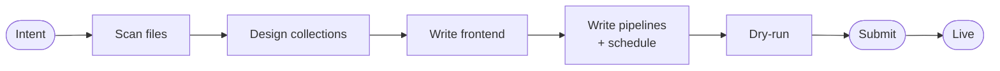

# Building an App

## Describe an app and build it

You build an app by describing it. The builder agent does the rest. One example runs through this page, a workspace of markdown trackers and a `job-applications.csv` under the intent *Visualize all the tracker files in my workspace*.

---

## Creating an app

Open the **Apps** tab, describe your app, and pick a workspace. That is either the app's own isolated space or an existing project whose files the builder should read. A building card tails progress in the gallery and flips live within minutes.

Over REST, create with [POST /api/apps](endpoint:POST /api/apps) and read state with [GET /api/apps/{app_id}](endpoint:GET /api/apps/{app_id}).

---

## What the builder does

The diagram below is the sequence. What each step guarantees is the part worth reading.

- **Files match by pattern, never by name.** New files of the same shape join on the next refresh.
- **Every document carries a natural key and a provenance field.** A refresh updates documents instead of duplicating them.
- **The Streamlit frontend renders whatever the pipelines last wrote**, read through the injected SDK.
- **Deterministic work becomes plain code with no model call.** The declared refresh is a cron schedule, `on_demand`, or agentic mode where it needs model inference.
- **The dry run writes nothing durable**, and the submit contract rejects an app that could never refresh.

The agent follows [`app-builder.md`](repo:apps/mewbo_api/src/mewbo_api/apps/plugin/agents/app-builder.md).

---

## Use cases

The running example is the simplest shape, one view over a folder. Four others are worth knowing.

**Tracker with a form.** The one case where an app writes as well as reads.

> A habit tracker where I log today's habits and see my streaks.

**Scheduled digest with a model step.** One bounded model call per item.

> Digest my unread email into a checklist every morning, grouped by urgency.

**On demand utility.** Refreshes on a button, not a clock.

> On demand, summarize the open issues in this repo grouped by area.

**Sync plumbed through the CLI.** Shelling out to `git`, `tea`, or `gh` stays plain code, and declares which vetted binary and remote host it needs.

> Every 6 hours, sync commit history and open issues from the Gitea remote.

---

## Writing a good intent

- **Name the data source.** A folder, a CSV, your email, a repo.
- **Say what live means.** `Every morning`, `whenever the files change`, or `only when I ask`. That phrase becomes the schedule.
- **Say if you want to enter data.** That adds a form pipeline.

All three at once, *Visualize all the tracker files in my workspace, refreshed whenever the files change.*

---

→ [Living with an App](operating.md): health, refreshes, versions, repair.

→ [Agentic Apps](index.md): the overview and the app-versus-widget distinction.
