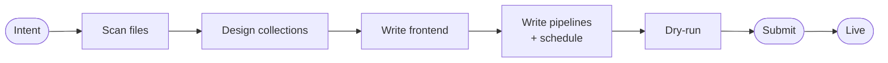

# Building an App

You build an app by describing it. The builder agent does the rest.

One example runs through this page: a workspace holding markdown tracker files and a job-applications CSV, with the intent *Visualize all the tracker files in my workspace*.

---

## Creating an app

Open the **Apps** tab and describe your app. The create dialog offers example intents as starting chips. Pick a workspace: the app's own isolated space, or an existing project whose files the builder should read.

Submit. A building card appears in the gallery, tails the builder's real progress, and flips to live a few minutes later.

Automation users can do the same over REST: create with [POST /api/apps](endpoint:POST /api/apps), read state with [GET /api/apps/{app_id}](endpoint:GET /api/apps/{app_id}).

---

## What the builder does

1. **Scans your real files.** It reads the workspace you chose. It matches files by pattern, so new files of the same shape join on the next refresh.
2. **Designs collections with stable keys.** Each document gets a natural key and a provenance field. A refresh updates documents instead of duplicating them.
3. **Writes the frontend.** A Streamlit page that reads collections through the injected SDK and just renders them.
4. **Writes the pipeline and declares its refresh.** Deterministic work becomes plain code the platform runs with no model call. The builder declares a cron schedule, `on_demand`, or agentic mode where a refresh requires model inference.
5. **Dry-runs, then submits.** It tests the pipeline without durable writes, inspects the result, and submits. The submit contract rejects an app that could never refresh.

The playbook the agent follows is [`app-builder.md`](repo:apps/mewbo_api/src/mewbo_api/apps/plugin/agents/app-builder.md).

---

## Use cases

**Workspace visualizer.** One view over a folder of files, re-globbed every refresh. Our running example.

> Visualize all the tracker files in my workspace.

**Records dashboard.** A CSV becomes a live dashboard. Stable keys mean a re-import updates in place.

> Track my job applications from applications.csv.

**Tracker with a form.** The one case where an app writes as well as reads. Form input is validated against the pipeline's schema, then lands in a collection.

> A habit tracker where I log today's habits and see my streaks.

**Scheduled digest with a model step.** A code pipeline makes one bounded model call per item, on a schedule.

> Digest my unread email into a checklist every morning, grouped by urgency.

**On-demand utility.** Refreshes on a button, not a clock.

> On demand, summarize the open issues in this repo grouped by area.

**CLI-plumbed sync.** A pipeline that shells out to `git`/`tea`/`gh` (commit history, issue lists) stays plain code, not agentic — it declares which vetted binary and which remote host it needs, and the platform runs it deterministically on a schedule.

> Every 6 hours, sync commit history and open issues from the Gitea remote.

---

## Writing a good intent

- **Name the data source.** A folder, a CSV, your email, a repo.
- **Say what live means.** "Every morning", "whenever the files change", "only when I ask". That phrase becomes the schedule.
- **Say if you want to enter data.** That adds a form pipeline.

For our example: *Visualize all the tracker files in my workspace, refreshed whenever the files change.*

---

→ [Living with an App](operating.md): health, refreshes, versions, repair.

→ [Agentic Apps](index.md): the overview and the app-versus-widget distinction.
