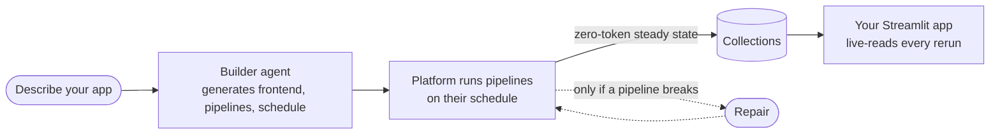

# Agentic Apps

Describe an app in one sentence. A builder agent reads your real files, derives the data model, writes a Streamlit frontend and the pipelines that feed it, then puts it online. From then on the platform keeps it fresh. You spend nothing to keep it running.

Inside the console the product is branded **Apps**. It is a peer of the Agentic Wiki and Agentic Search, built on the same orchestrator.

---

## How it works

- **You describe.** One sentence about the data you care about.
- **The builder generates.** From your actual files it derives collections, a frontend, pipelines, and a refresh schedule.
- **The platform runs.** Pipelines fire on schedule and write collections. Most are plain code: sub-second, zero model cost.
- **Your app live-reads.** Every rerun renders the current collections, never a frozen copy.
- **Model runs return only for repair.** A failed pipeline run starts a maintainer repair run. Nothing else does.

---

## What you get

- **A live Streamlit app**, in your browser and in the Android client.
- **Self-maintaining pipelines.** Code pipelines move and parse data deterministically. Agentic ones exist for work that cannot be expressed as deterministic code.
- **An honest health panel.** Freshness, per-pipeline schedules, and loud warnings. Silence never stands in for "fine".
- **Versioned history.** Every submit is a version. Rollback is one step.

---

## An app, not a widget

A **widget** is a snapshot: rendered once, frozen at creation. An **app** is alive: its pipelines keep running, so tomorrow it shows tomorrow's data.

Want a fixed picture? Make a widget. Want the current state? Make an app.

---

## What it costs

Building spends model effort once: a few minutes of agent time. After that:

- Code refreshes are free.
- An LLM step inside a pipeline runs only on changed input, within its declared budget.
- Agentic pipelines and repairs are the only recurring model spend.

An app that only moves and parses data costs nothing to keep alive.

---

## Where it lives

The **Apps** tab in the Mewbo Console, next to Tasks, Wiki, and Search. The same apps render in the Aura Android client. Surfaces that advertise the `apps` capability get the tab.

→ [Building an App](building.md): the create flow and what the builder does.

→ [Living with an App](operating.md): health, refreshes, versions, and repair.
