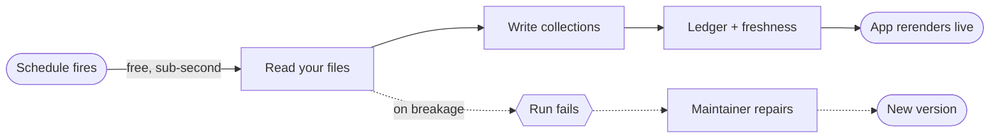

# Living with an App

## Keep a running app healthy

A live app keeps running after you stop looking at it. The [overview](index.md) and [build guide](building.md) carry the same running example.

---

## The refresh cycle

Each pipeline refreshes the app on the schedule it declared, and you never arm anything. The platform arms schedules at submit, pause or archive takes them down, and a repaired version carries on at the old cadence.

Agentic pipelines are the declared exception. Each fire is a full model run, so they exist only for refreshes no deterministic code can express.

---

## Reading the health panel

The health rail sits on the app's detail screen, condensed onto its gallery card. Freshness comes from the run ledger, in one of five states.

- **Fresh.** The last scheduled run succeeded and the next is due on time.
- **Stale.** The last success is older than the cadence implies. Check recent runs.
- **Never refreshed.** Live, but no pipeline has completed a run. Loud on purpose.
- **No schedule.** A pipeline that would never run on its own. Warned, never silent.
- **On demand.** Deliberately manual. Shown as a choice, not a fault.

Below that sit each pipeline's cadence and the recent runs with outcome and rows written. The whole panel is one call, [GET /api/apps/{app_id}/system](endpoint:GET /api/apps/{app_id}/system), so your own tooling can alert on staleness.

---

## Interacting with your app

- **Live reads.** The app reads collections on every rerun, so new pipeline output appears on your next interaction.
- **Instant filters.** Narrowing to *interview*-stage applications is a local read. No model, no rebuild.
- **Forms write back.** A **user-writable** pipeline accepts input. Bad input gets a clear error, not a silent no-op.

Everyone opening the app reads the same live collections, with no regenerate-and-resend step. Invoke a code pipeline directly with [GET /api/apps/{app_id}/pipelines/{name}](endpoint:GET /api/apps/{app_id}/pipelines/{name}).

---

## When something breaks

Someone renames the *stage* column in `job-applications.csv`, and the next run fails. The failure surfaces in the health panel with its error, and the repair policy starts a maintainer run. That run reproduces the break with a dry run, touching nothing durable, then fixes the pipeline and resubmits. Versions are append-only, so the fix stacks on history and the next scheduled fire refreshes normally.

Auto-repair fires only for scheduled runs. A manual invoke that fails is ledgered and visible, but never starts one.

Your levers.

- **Rollback** to any earlier version.
- **Pause** stops the schedule with the app, and paused reads as paused rather than stale. **Resume** restores the cadence.
- **Archive** retires the app.

---

## What refreshes cost

| What ran | What it costs |
|---|---|
| Scheduled code refresh | Free. Sub-second, no model call. |
| Read-through, sources unchanged | Nothing runs at all. |
| LLM step inside a code pipeline | Only on changed input, within its declared budget. |
| Agentic pipeline | A model run per fire, by design. |
| Repair | Model spend only on actual breakage. |

Default to code pipelines and read-through, and reach for the model only where the work needs it.

---

## On Android

The Android client renders the same served app against the same collections, so reads, filters, and freshness behave identically. Do form write-back from the web console.

---

→ [Agentic Apps](index.md): the overview. → [Building an App](building.md): change what the app is made of.
