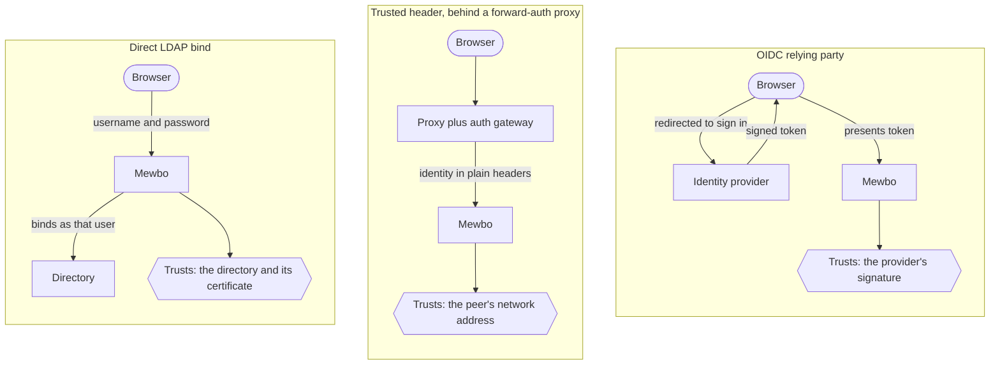
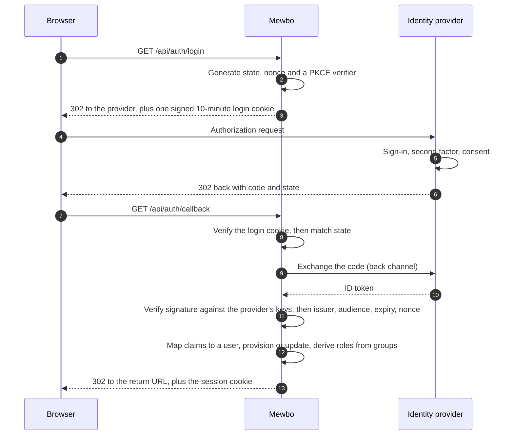

# Authentication & Access

## Add user accounts and roles

Mewbo can run with no authentication at all, with a single shared API token, or as a full single sign on deployment with per user accounts, roles, and an audit trail.

**Authentication is off by default. While it is off, the server applies no identity checks at all.** Turn it on and your identity provider stays the source of truth for who people are and what groups they hold. Mewbo maps groups to roles, and roles to permissions.

---

## Off by default, and that is a supported mode

Most deployments run with no `api.auth` block at all. Four things hold while authentication is off.

- There is no login screen and no user accounts.
- Every request resolves to one built in full power identity, so no permission check can refuse anything.
- No identity store is created and no `iam_*.json` file is written.
- The identity administration and SCIM routes are not registered, so they return 404 rather than an authorization error.

The shared `api.master_token` described in [Get Started](api/index.md#authentication) remains how requests are authorized, and minted API keys keep working.

One asymmetry matters if you script against this. An invalid `api.auth` block is a hard boot failure when authentication is **on**, and is logged then ignored when it is **off**. A deployment that never enabled authentication must not fail to boot over configuration it never uses.

## What turning it on gets you

```json title="configs/app.json"
"api": {
  "auth": {
    "enabled": true,
    "session": { "secret": "<random-32-bytes>" },
    "authenticators": [ ]
  }
}
```

You get real user accounts provisioned on first login, roles derived from the groups those users already hold, per-route permission enforcement, revocable service accounts, an audit trail, and optional SCIM provisioning.

> [!WARNING] Configure an authenticator before flipping the switch
> `enabled: true` with an empty `authenticators` list leaves nobody able to prove who they are. Add at least one authenticator in the same change.

### Where the settings are documented

The generated [Configuration Reference](configuration.md) lists every `api.auth` setting it can see. Five stop at `object`, namely `role_mappings`, `team_mappings`, `bootstrap`, `avatars` and `audit`. Their inner structure is validated at startup and documented here and in [`configs/app.schema.json`](repo:configs/app.schema.json), nowhere else.

---

## Three ways to connect your identity provider

The choice between them is a choice about **what Mewbo trusts**.



**OIDC is the right default.** A signature Mewbo verifies itself survives any network path, so a misconfigured network cannot forge an identity. **Trusted header mode trusts network position instead**, which is weaker and carries the precondition below. Choose it when a gateway already fronts your other internal services. **Direct LDAP bind** checks the password by binding to the directory as that user, so the credential goes to whoever answers. SAML 2.0 is a fourth option, shaped like OIDC and configured as another entry in the same list.

`authenticators` is ordered and every entry is live at once, so one deployment can offer OIDC to staff, LDAP to contractors, and API keys to automation.

### What a browser login actually does



Four properties the diagram cannot show explain several settings that otherwise look arbitrary.

- **The login cookie is authenticated with HMAC-SHA256 over your `session.secret`.** That is why the secret is mandatory the moment any non key authenticator is configured. Without it, the value proving a callback belongs to a login you started would be forgeable.
- **Signatures are checked against an asymmetric only allowlist**, RSA, ECDSA and RSA-PSS at 256, 384 and 512 bits. The `none` algorithm and the symmetric `HS*` family are rejected before any cryptography runs, closing the classic algorithm confusion attack by construction.
- **The issuer is pinned twice**, once against the discovery document and once against the token's own `iss` claim.
- **Provisioning happens just in time**, joined on the stable `(issuer, subject)` pair rather than on email. A returning user whose email or display name changed still links to the same account.

The callback stops at the first failure, and state is compared in constant time.

---

## Security preconditions

Two configurations are refused at startup rather than shipped broken.

### Trusted-header mode

Identity headers are forgeable by anyone who can reach the server directly, so this mode is an authentication-bypass class of feature when misconfigured.

- **`trusted_proxies` is required and must be non-empty.** Every entry is parsed as a CIDR network at startup, so an empty list or a malformed range stops the server rather than silently widening trust.
- **Headers from any other peer are ignored.** Mewbo probes only whether the identity header is *present*, never its value, so it can log the attempt and write a `login_failure` audit event with reason `untrusted_proxy_source`. The request continues as anonymous.
- **`X-Forwarded-For` is deliberately not parsed.** Picking a hop out of a client-appendable list is exactly where forward-auth deployments grow bypasses. The peer address comes strictly from the connection socket, which no header can spoof.
- **An explicit credential always outranks the proxy assertion.** Resolution runs four ordered channels, API key, then bearer token, then session cookie, then trusted header. A caller presenting a key is never re-identified as whoever the proxy says is browsing, and a presented but invalid key stops resolution outright rather than falling through to the header channel.

**The deployment constraint that follows.** The address you allowlist must be the peer that actually opens the TCP connection to Mewbo. If more proxies sit in front of your authenticating one, the connecting peer is the last of them, not the one that set the headers. Two options are correct and there is no third.

- Allowlist that real last hop.
- Rewrite `remote_addr` at the WSGI layer with werkzeug's hop counting `ProxyFix`, configured with the exact number of proxies.

Setting an over broad range such as `0.0.0.0/0` to make it work turns the feature into an open door.

### Cookie mode requires a pinned CORS origin

A browser will not send credentials to, nor accept a credentialed response from, a wildcard origin. So if any authenticator mints a session cookie, whether OIDC or SAML, and `CORS_ORIGIN` is `*`, the server refuses to boot. Set it to the console's exact origin.

```dotenv title=".env"
CORS_ORIGIN=https://console.example.com
```

`Access-Control-Allow-Credentials` is only sent for an exact origin, which is why the wildcard combination cannot work rather than merely being discouraged.

### Session cookies

Session cookies are `httpOnly`, `SameSite=Lax`, and marked `Secure` whenever the request is HTTPS, directly or via a proxy that sets `X-Forwarded-Proto`. They last `session.ttl_seconds`, eight hours by default. Generate the signing secret with `openssl rand -hex 32`. It is write-only through the configuration API and never returned.

### Avatars

`api.auth.avatars` picks a profile picture in a fixed order. First the picture the identity provider asserted, then Gravatar, then nothing.

```json title="configs/app.json"
"avatars": { "gravatar_enabled": true, "fallback": "identicon" }
```

`gravatar_enabled` is a privacy decision rather than a cosmetic one, because consulting Gravatar sends a hash of the user's email to a third party. `fallback` picks Gravatar's own placeholder, either `identicon`, `mp` or `404`. Resolving to no avatar is supported, and clients render initials.

---

## Roles and permissions

Authorization is a closed catalog of `<domain>.<verb>` permission ids. Roles are named bundles of those ids, and a role can only grant an id that exists in the catalog, validated when the role is defined.

### The five built-in roles

| Role | What it grants |
|---|---|
| `admin` | Everything, including identity governance. Bypasses every access check. |
| `operator` | Runs every workload, but cannot manage users, teams, roles or configuration, and cannot read the audit log. |
| `member` | Creates and uses their own sessions, wiki, search, apps and triggers. Manages their own API keys, git credentials and registered repositories. No administration, no cross-tenant reads. |
| `viewer` | Read-only across the surfaces they can see. |
| `service` | A service-account template holding no permissions of its own. |

The seam separating a member from an operator is `sessions.read_all`, the cross tenant session list. Built-in roles are immutable. Administrators can define additional roles over the same catalog, validated at definition, so an unknown permission id is a clean error rather than a grant that silently never applies.

### Your identity provider is authoritative, and stays authoritative

Each time a federated user signs in, their roles are derived afresh from the group mapping plus the bootstrap rule, and the stored record is overwritten with the result. Only the user's id, creation time and enabled status carry across logins. Remove someone from a group at the provider and the role goes with it at their next sign-in.

One consequence is easy to miss. **A role granted by hand through the administration surface does not survive that user's next login** unless the group mapping also produces it. That bites hardest on a provider supplying no groups at all, such as Google, where the mapping always resolves to `default_role`. There, `bootstrap.admin_subjects` is the permanent list of administrators rather than a cold start convenience.

> [!TIP] For browser sessions, revocation takes effect on the next request
> The session cookie carries no roles. Every request re-resolves the caller's roles and status from the stored record, so disabling an account or changing its roles takes effect on the **next request**, with no window where an already-issued cookie keeps stale privileges.
>
> An API key instead carries its own roles on the key record, so revoke the key itself rather than relying on the owner's account status. See [Known limits](#known-limits).

### Roles reach inside the session, not just the route

For a caller bound by role, the tool allowlist becomes authoritative, so the model never sees a tool the role may not use. A viewer class principal also drops to a read only capability tier, and execution time deny rules catch anything that slips the binding gate. An administrator, or authentication turned off, skips all of it.

### Mapping groups to roles

```json title="configs/app.json"
"role_mappings": {
  "default_role": "viewer",
  "rules": [
    { "match": "mewbo-admins", "target": "admin" },
    { "match": "eng-.*", "match_kind": "regex", "target": "operator" }
  ]
}
```

Rules are evaluated in order and every match contributes, so a user can land with several roles. `match_kind` is `exact` for case-insensitive equality, or `regex` for case-insensitive, full string matching, compiled at startup so a bad pattern fails to boot. **`default_role` means resolution never returns empty.** `team_mappings` works the same way for team slugs, with no default, because belonging to no team is a valid state.

### Bootstrapping the first administrator

Before anyone can be granted the admin role through the console, an administrator has to exist.

```json title="configs/app.json"
"bootstrap": {
  "admin_group": "mewbo-admins",
  "admin_subjects": ["a1b2c3d4-e5f6-7890-abcd-ef1234567890"]
}
```

Matching either the group or an explicit subject confers admin, and the rule reapplies at every login, not just the first. If your provider supplies groups, move administrators into a mapped group and drop the rule. If it supplies none, the rule stays the only durable way to hold an administrator.

---

## Service accounts coexist with single sign-on

- Keys are minted through [POST /api/keys](endpoint:POST /api/keys), labelled and individually revocable.
- Key management sits behind the master token, so a leaked key cannot mint more keys even if it carries every permission.
- A key can carry roles, an owning subject and an expiry, making it a real service account rather than a second full power credential.
- Rotation mints a replacement carrying the original's owner, roles, scopes, team and expiry, revokes the original, and returns the new value once.

> [!WARNING] Grant `keys.mint_own` conservatively
> A user holding `keys.mint_own` mints keys for themselves, always stamped with their own subject as owner. Self service minting does not reliably contain a caller from minting a key more powerful than themselves. Treat the grant as privileged and prefer master token minting for anything that matters. The built-in `member` role does carry it.

> [!IMPORTANT] Scopes do not gate endpoints
> A key's `scopes` are carried faithfully end to end and visible on the principal, but the **only** place they gate anything is self mint containment. A key cannot mint one more powerful than itself. Endpoint authorization is decided entirely by roles and their permissions, so a narrowly scoped key is not restricted in which endpoints it may call.

---

## SCIM provisioning

With `api.auth.scim.enabled` set, Mewbo serves a SCIM 2.0 endpoint under `/api/scim/v2/` so an identity provider can push users and groups rather than waiting for each person to log in. It authenticates on `api.auth.scim.secret` in an `Authorization: Bearer` header, compared in constant time, and separate from the API key.

Mewbo implements `ServiceProviderConfig`, plus full create, read, replace, patch and delete on `Users` and `Groups`. Users join on the provider's `externalId` when one is sent, falling back to `userName`. Group membership is persisted, and an unresolvable member id is skipped with a warning rather than failing the whole batch.

Know these three things before pointing a connector at it.

- **There are no `ResourceTypes` or `Schemas` endpoints.** Some connectors probe these during setup and may report the endpoint as unsupported.
- **Filtering supports only `attr eq "value"`**, on `userName`, `externalId` and `displayName`. Anything else returns 501 deliberately rather than an empty result, because an empty result reads to a syncing provider as `no match, safe to create a duplicate`.
- **The delete verbs are asymmetric.** `DELETE /Users/{id}` **disables** the account so its audit history and any ownership it stamped stay resolvable. `DELETE /Groups/{id}` really deletes the team.

Deprovisioning a user, whether by SCIM or by disabling them in the console, revokes every API key they own. **It does not terminate their live sessions**, which survive until they end on their own.

---

## The audit trail

`api.auth.audit.enabled` defaults to on once authentication is enabled. Reading the trail requires `audit.read`, which only `admin` holds among the built-in roles.

| Recorded today | Declared but never written |
|---|---|
| Login failure | Login **success** |
| Access denied by a permission guard | API key minted |
| Role changed | API key revoked |
| User status changed | Team changed |
| SCIM provisioned and deprovisioned | |

The four on the right are defined in the event model but have no emitting call site. Login success is the consequential one. **The trail cannot answer who signed in, and when**, so do not treat it as a complete access log. Writes are best-effort, and a failed write logs a warning rather than breaking the request.

---

## Known limits

Stated plainly so nobody plans around a capability that is not there.

- **Ownership and sharing grants are declared, not enforced.** The decision model, ownership stamps and grant stores exist, but no route consults them, no resource is stamped with an owner, and there is no grants endpoint. Isolation rests on roles and permissions.
- **Scopes do not gate endpoints**, as above.
- **Four audit event kinds are never emitted**, as above.
- **Deprovisioning does not terminate live sessions**, as above.
- **Disabling an account does not by itself neutralise keys that account already holds.** A key resolves from its own stored record without consulting the owner's current status. Deprovisioning revokes the keys it can find by owner, but an account disabled by some other route leaves its keys live. Revoke keys explicitly when disabling someone.
- **SAML replay protection is per process.** Consumed assertion ids live in a bounded in memory set that several workers do not share, so a replay routed to a different worker inside the assertion's validity window is not caught. Service provider request signing and encrypted assertions are deliberately not implemented.
- **Route permission coverage is not checked at boot.** A strict mode that refuses to boot on an undeclared route exists but runs only in the test suite. Undeclared would not mean unguarded regardless, since most such routes are guarded inline.
- **Password login has no rate limit.** With no lockout or throttle plane, your directory's own lockout policy is the only brake on password guessing. A per-attempt delay is not an option, because it blocks a worker thread and turns the login route into a cheap way to deny service. Throttle at the reverse proxy instead.
- **The authentication, identity administration and SCIM routes are not in the [REST reference](rest-api.md).** They are Flask blueprints rather than part of the framework the OpenAPI specification is generated from, so regenerating it does not help. They are documented in prose here and in the [provider guides](authentication-providers.md).

---

## Now set up your provider

[Identity Providers](authentication-providers.md) carries the mode decision table, the per-provider quirks that cost the most debugging time, and the walkthrough for each of Keycloak, Authentik, Authelia, Microsoft Entra ID, Google, AWS and LDAP.

See also [Production Setup](deployment-production.md) for TLS, CORS and token rotation, and [Permissions & Hooks](features-permissions-hooks.md) for the separate per-tool-call policy layer. That layer governs what an agent may execute inside a session rather than who the caller is.
