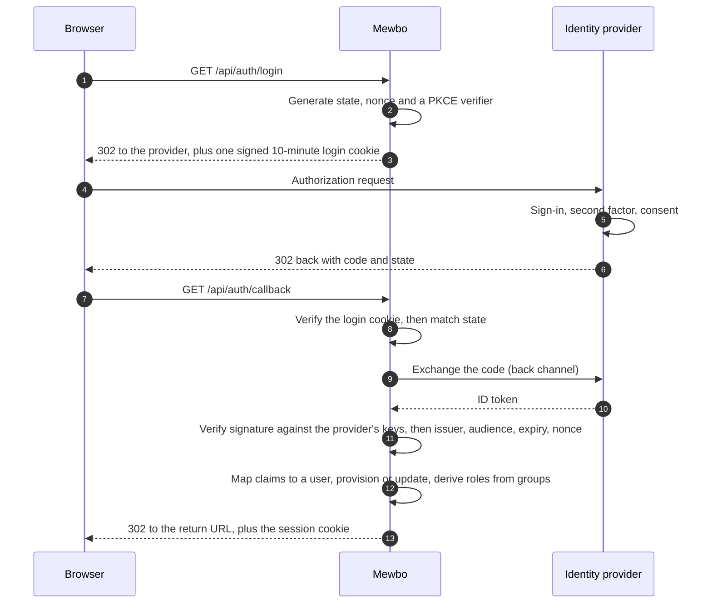

# Authentication & Access

Mewbo can run with no authentication at all, with a single shared API token, or as a full single-sign-on deployment with per-user accounts, roles, and an audit trail.

The through-line of this page: **authentication is off by default, and while it is off the server applies no identity checks at all. When you turn it on, your existing identity provider stays the source of truth for who people are and which groups they are in, and Mewbo maps groups to roles and roles to permissions.** Everything else here is detail hanging off that spine.

When you already know which provider you are connecting, jump to [Identity Providers](authentication-providers.md) for the guide.

---

## Off by default, and that is a supported mode

Most deployments run with no `api.auth` block at all, and nothing on this page is required to use Mewbo. While authentication is off:

- There is no login screen and no user accounts.
- Every request resolves to one built-in full-power identity, so no permission check can refuse anything.
- No identity store is created and no `iam_*.json` file is written.
- The identity administration and SCIM routes are not registered at all, so they return 404 rather than an authorization error.

The shared `api.master_token` described in [Get Started](api/index.md#authentication) remains how requests are authorized, and minted API keys keep working. Turning identity management on is an opt-in step for deployments that need per-user accounts. It is not an upgrade everyone has to make.

One asymmetry worth knowing if you script against this: an invalid `api.auth` block is a hard boot failure when authentication is **on**, and is logged then ignored when it is **off**. A deployment that never enabled authentication must not fail to boot over configuration it does not use.

## What turning it on gets you

```json
"api": {
  "auth": {
    "enabled": true,
    "session": { "secret": "<random-32-bytes>" },
    "authenticators": [ ]
  }
}
```

Real user accounts provisioned from your identity provider on first login, roles derived from the groups those users already belong to, per-route permission enforcement, service accounts that are scoped and individually revocable, an audit trail, and optional SCIM provisioning.

> [!WARNING] Configure an authenticator before flipping the switch
> `enabled: true` with an empty `authenticators` list leaves nobody able to prove who they are. Add at least one authenticator in the same change.

### Where the settings are documented

The generated [Configuration Reference](configuration.md) lists every `api.auth` setting it can see, nested ones included, such as `auth.session.secret` and `auth.scim.enabled`.

Five stop at `object`: `role_mappings`, `team_mappings`, `bootstrap`, `avatars` and `audit`. Those are carried in the core configuration model as open objects on purpose, so that core never imports the identity kernel that defines their real shape, and they are validated in full against that kernel at startup instead. Their inner structure is documented here and nowhere else. The validated schema also lives in [`configs/app.schema.json`](repo:configs/app.schema.json).

---

## Three ways to connect your identity provider

The choice between them is really a choice about **what Mewbo trusts**, which is what the diagram below compares.


**OIDC is the right default.** What Mewbo trusts is a cryptographic signature it verifies itself, so the trust survives any network path. It works whether or not a proxy sits in front, and a misconfigured network cannot forge an identity.

**Trusted-header mode trusts network position instead**, which is a weaker thing to trust and the reason it carries the precondition below. Choose it when a gateway already fronts your other internal services and you want Mewbo to inherit that session with no second login.

**Direct LDAP bind** gives you a username and password form. Mewbo verifies the password by binding to the directory as that user, which is why the directory's TLS certificate matters so much: the credential is sent to whoever answers.

SAML 2.0 is supported as a fourth option, shaped like OIDC (a browser redirect ending in a signed assertion) and configured as another entry in the same list.

`authenticators` is an ordered list and every entry is live at once, so one deployment can offer OIDC to staff, LDAP to contractors, and API keys to automation.

### What a browser login actually does

Worth reading once, because it explains several settings that otherwise look arbitrary.



The detail behind those steps:

- **State, nonce and the PKCE verifier all ride in one signed cookie** valid for ten minutes, authenticated with HMAC-SHA256 over your `session.secret`. That is why the secret is mandatory the moment any non-key authenticator is configured: without it, the value proving a callback belongs to a login you started would be forgeable.
- **The callback verifies in a fixed order** and stops at the first failure: the code must be present, the login cookie must be authentic, unexpired and of the right type, the state must match by constant-time comparison, the authenticator must be known, and only then is the code exchanged.
- **Token signatures are checked against an asymmetric-only algorithm allowlist** (RSA, ECDSA and RSA-PSS at 256, 384 and 512). The `none` algorithm and the symmetric `HS*` family are rejected before any cryptography runs, which closes the classic algorithm-confusion attack by construction.
- **The issuer is pinned twice:** the discovery document's issuer must equal the one you configured, and so must the token's own `iss` claim.
- **Provisioning is just-in-time.** A user who has never signed in gets a record on first login, joined on the stable `(issuer, subject)` pair rather than on email, so a returning user whose email or display name changed still links to the same account.

---

## Security preconditions

Two configurations are refused at startup rather than shipped broken.

### Trusted-header mode

Identity headers are forgeable by anyone who can reach the server directly, so this mode is an authentication-bypass class of feature when misconfigured.

- **`trusted_proxies` is required and must be non-empty.** Every entry is parsed as a CIDR network at startup, so an empty list or a malformed range stops the server rather than silently widening trust.
- **Headers from any other peer are ignored.** Mewbo probes only whether the identity header is *present*, so it can log and audit the attempt, and never reads its value. The request continues as anonymous.
- **`X-Forwarded-For` is deliberately not parsed.** Picking a hop out of a client-appendable list is exactly where forward-auth deployments grow bypasses. The peer address comes strictly from the connection socket, which no header can spoof.

**The deployment constraint that follows.** The address you allowlist must be the peer that actually opens the TCP connection to Mewbo. If more proxies sit in front of your authenticating one, the connecting peer is the last of them, not the one that set the headers. Two correct options, and no third: allowlist that real last hop, or rewrite `remote_addr` at the WSGI layer with werkzeug's hop-counting `ProxyFix`, configured with the exact number of proxies. Setting an over-broad range such as `0.0.0.0/0` to make it work turns the feature into an open door.

### Cookie mode requires a pinned CORS origin

A browser will not send credentials to, nor accept a credentialed response from, a wildcard origin. So if any authenticator mints a session cookie (OIDC or SAML) and `CORS_ORIGIN` is `*`, the server refuses to boot. Set it to the console's exact origin:

```dotenv
CORS_ORIGIN=https://console.example.com
```

`Access-Control-Allow-Credentials` is only sent for an exact origin, which is why the wildcard combination cannot work rather than merely being discouraged.

### Session cookies

Session cookies are `httpOnly`, `SameSite=Lax`, and marked `Secure` whenever the request is HTTPS, directly or via a proxy that sets `X-Forwarded-Proto`. They last `session.ttl_seconds`, eight hours by default. Generate the signing secret with `openssl rand -hex 32`; it is write-only through the configuration API and never returned.

### Avatars

`api.auth.avatars` decides where a profile picture comes from, in a fixed order: the picture the identity provider asserted, then Gravatar, then nothing.

```json
"avatars": { "gravatar_enabled": true, "fallback": "identicon" }
```

`gravatar_enabled` is a privacy decision rather than a cosmetic one, because consulting Gravatar sends a hash of the user's email to a third party. `fallback` picks Gravatar's own placeholder (`identicon`, `mp`, or `404`). Resolving to no avatar is a supported outcome: clients render initials instead of a broken image.

---

## Roles and permissions

Authorization is a closed catalog of `<domain>.<verb>` permission ids. Roles are named bundles of those ids, and a role can only grant an id that exists in the catalog, validated when the role is defined.

### The five built-in roles

| Role | What it grants |
|---|---|
| `admin` | Everything, including identity governance. Bypasses every access check. |
| `operator` | Runs every workload, but cannot manage users, teams, roles or configuration, and cannot read the audit log. |
| `member` | Creates and uses their own sessions, wiki, search, apps and triggers. Manages their own API keys, git credentials and registered repositories. No administration, no cross-tenant reads. |
| `viewer` | Read-only across the surfaces they can see. |
| `service` | A service-account template holding no permissions of its own. |

The `operator` and `member` split is the one to think about. An operator deliberately lacks the identity-governance verbs, which is what makes the role safe to hand out broadly: they run everything but do not govern identity or read the security log. The seam separating a member from an operator is `sessions.read_all`, the cross-tenant session list.

Built-in roles are immutable; the store refuses to update or delete them. Administrators can define additional roles over the same catalog, validated against it at definition, so an unknown permission id is a clean error rather than a grant that silently never applies.

### Your identity provider is authoritative, and stays authoritative

Each time a federated user signs in, their roles are derived afresh from the group mapping plus the bootstrap rule, and the stored record is overwritten with the result. Only the user's id, creation time and enabled status carry across logins.

This is the behaviour you want when groups drive roles: remove someone from a group at the provider and the role goes with it at their next sign-in, with no second step in Mewbo. It has one consequence that is easy to meet the hard way. **A role granted by hand through the administration surface does not survive that user's next login** unless the group mapping also produces it. For a federated user, change the group, not the user.

This matters most on a provider that supplies no groups at all, such as Google: there the mapping always resolves to `default_role`, so a manually promoted user is recomputed straight back down. On that path `bootstrap.admin_subjects` is not a cold-start convenience but the permanent list of administrators.

> [!TIP] For browser sessions, revocation takes effect on the next request
> The session cookie carries no roles. Every request re-resolves the caller's roles and status from the stored record, so disabling an account or changing its roles takes effect on the **next request** that browser makes. There is no window in which an already-issued cookie keeps stale privileges until it expires.
>
> This property is specific to cookie-borne sessions. An API key carries its own roles on the key record, so revoke the key itself rather than relying on the owner's account status. See [Known limits](#known-limits).

### Roles reach inside the session, not just the route

A caller's role also governs which tools their sessions bind. For a role-bounded caller the tool allowlist becomes authoritative, so the model never sees a tool the role may not use; a viewer-class principal drops to a read-only capability tier; and execution-time deny rules cover anything that slips the binding gate. An administrator, or a deployment with authentication off, skips all of it.

### Mapping groups to roles

```json
"role_mappings": {
  "default_role": "viewer",
  "rules": [
    { "match": "mewbo-admins", "target": "admin" },
    { "match": "eng-.*", "match_kind": "regex", "target": "operator" }
  ]
}
```

Rules are evaluated in order and every match contributes, so a user can land with several roles. `match_kind` is `exact` (case-insensitive equality) or `regex` (case-insensitive, full-string, compiled when the configuration is validated so a bad pattern is a startup error). **`default_role` means resolution never returns empty**, so every user lands with a defined, least-privilege role.

`team_mappings` works the same way for team slugs, with one deliberate difference: no default, because belonging to no team is a valid state.

### Bootstrapping the first administrator

Before anyone can be granted the admin role through the console, an administrator has to exist.

```json
"bootstrap": {
  "admin_group": "mewbo-admins",
  "admin_subjects": ["a1b2c3d4-e5f6-7890-abcd-ef1234567890"]
}
```

Matching either the group or an explicit subject confers admin, and the rule is re-applied at every login rather than only the first. Whether you can retire it afterwards depends on your provider: if yours supplies groups, move administrators into a mapped group and drop the rule; if it supplies none, the rule is the only durable way to hold an administrator, so keep it.

---

## Service accounts coexist with single sign-on

Single sign-on does not retire key authentication, and the two are meant to run together.

- Keys are minted through [POST /api/keys](endpoint:POST /api/keys), labelled and individually revocable.
- Key management sits behind the master token, so a leaked key cannot mint more keys even if it carries every permission.
- A key can carry roles, an owning subject and an expiry, making it a real service account rather than a second full-power credential.
- Rotation mints a replacement carrying the original's owner, roles, scopes, team and expiry, revokes the original, and returns the new value exactly once.
- Users holding `keys.mint_own` can mint keys for themselves. A self-minted key is always stamped with the caller's own subject as owner; it cannot be minted on someone else's behalf.

> [!WARNING] Grant `keys.mint_own` conservatively
> Self-service minting does not reliably contain a caller from minting a key more powerful than themselves, so treat `keys.mint_own` as a privileged grant rather than a routine one and prefer master-token minting for anything that matters. The built-in `member` role does carry it.

> [!IMPORTANT] Scopes do not gate endpoints
> A key's `scopes` are carried faithfully end to end and are visible on the principal, but the **only** place they gate anything is self-mint containment: a key cannot mint a key more powerful than itself. Endpoint authorization is decided entirely by roles and their permissions, so a narrowly-scoped key is not restricted in which endpoints it may call.

---

## SCIM provisioning

With `api.auth.scim.enabled` set, Mewbo serves a SCIM 2.0 endpoint under `/api/scim/v2/` so an identity provider can push users and groups rather than waiting for each person to log in. It authenticates with an `Authorization: Bearer` header carrying `api.auth.scim.secret`, compared in constant time, and is a separate credential from the API key.

Implemented: `ServiceProviderConfig`, plus full create, read, replace, patch and delete on `Users` and `Groups`. Users join on the provider's `externalId` when one is sent, falling back to `userName`.

Group membership is persisted: members pushed on create, replace or patch are stored, and reading a Group back returns the real roster. A member id that does not resolve to a known user is skipped with a warning rather than failing the whole batch, because identity providers retry membership syncs aggressively and one unknown id should not stall the rest.

Three things to know before pointing a connector at it:

- **There are no `ResourceTypes` or `Schemas` endpoints.** Some connectors probe these during setup and may report the endpoint as unsupported.
- **Filtering supports only `attr eq "value"`**, on `userName`, `externalId` and `displayName`. Anything else returns 501 deliberately rather than an empty result, because an empty result reads to a syncing provider as "no match, safe to create a duplicate".
- **The delete verbs are asymmetric.** `DELETE /Users/{id}` **disables** the account so its audit history and any ownership it stamped stay resolvable; `DELETE /Groups/{id}` really deletes the team.

Deprovisioning a user, whether by SCIM or by disabling them in the console, revokes every API key they own. **It does not terminate their live sessions**, which survive until they end on their own.

---

## The audit trail

`api.auth.audit.enabled` defaults to on once authentication is enabled. Reading the trail requires `audit.read`, which only `admin` holds among the built-in roles.

Be precise about what it captures, because the gap matters if you are enabling it for compliance:

| Recorded today | Declared but never written |
|---|---|
| Login failure | Login **success** |
| Access denied by a permission guard | API key minted |
| Role changed | API key revoked |
| User status changed | Team changed |
| SCIM provisioned and deprovisioned | |

The four on the right are defined in the event model but have no emitting call site, so nothing produces them. Login success is the consequential one: **the trail cannot answer "who signed in, and when"**, so do not treat it as a complete access log.

Audit writes are best-effort. A failed write logs a warning and never breaks the request that triggered it.

---

## Known limits

Stated plainly so nobody plans around a capability that is not there.

- **Ownership and sharing grants are declared, not enforced.** The decision model, ownership stamps and grant stores all exist and are complete, but no route consults them, no resource is stamped with an owner, and there is no grants endpoint. Ownership-based access control is not a shipped capability, and isolation between users rests on roles and permissions.
- **Scopes do not gate endpoints**, as above.
- **Four audit event kinds are never emitted**, as above.
- **Deprovisioning does not terminate live sessions**, as above.
- **Disabling an account does not by itself neutralise keys that account already holds.** A key resolves from its own stored record, which carries its roles, without consulting the owner's current status. Deprovisioning revokes the keys it can find by owner, so the usual path is covered, but an account disabled by some other route leaves its keys live. Revoke keys explicitly when disabling someone.
- **SAML replay protection is per process.** Consumed assertion ids are held in a bounded in-memory set, which a multi-worker deployment does not share, so a replay routed to a different worker inside the assertion's validity window is not caught. Service-provider request signing and encrypted assertions are deliberately not implemented.
- **Route permission coverage is not checked at boot.** Mewbo can partition its own route map into permission-bound, deliberately public and undeclared routes, and has a strict mode that would refuse to boot on an undeclared one. Neither runs: the report has no call site outside the test suite. Undeclared would not mean unguarded in any case, since most such routes are guarded inline.
- **Password login is not rate-limited.** There is no lockout or throttle plane, so your directory's own lockout policy is the only brake on password guessing. A per-attempt delay is not an option here: it blocks a worker thread, turning the login route into a cheap denial-of-service lever.
- **The authentication, identity administration and SCIM routes are not in the [REST reference](rest-api.md).** They are served as Flask blueprints rather than through the framework the OpenAPI specification is generated from, so the generator cannot see them and regenerating it does not help. Those surfaces are documented in prose here and in the [provider guides](authentication-providers.md) instead. Every other API route is in the reference as usual.

---

## Now set up your provider

[Identity Providers](authentication-providers.md) has the decision table for picking a connection mode, the per-provider quirks that cost the most debugging time, and a link to the full walkthrough for each of Keycloak, Authentik, Authelia, Microsoft Entra ID, Google, AWS and LDAP.

See also [Production Setup](deployment-production.md) for TLS, CORS and token rotation, and [Permissions & Hooks](features-permissions-hooks.md) for the separate per-tool-call policy layer, which governs what an agent may execute inside a session rather than who the caller is.
