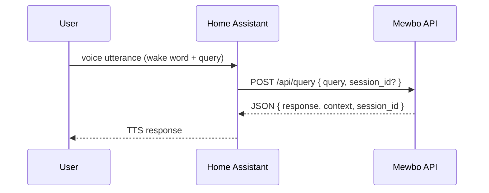

# Home Assistant Voice (HA Assist)

<figure><figcaption>Sensor information surfaced in HA Assist</figcaption></figure>

<figure><figcaption>Controlling entities by voice</figcaption></figure>

The Home Assistant integration lives in [`apps/mewbo_ha_conversation/`](repo:apps/mewbo_ha_conversation) and forwards voice requests to the API. It is built for hands-free voice control. Home Assistant handles wake words and intent capture, then passes the transcript to the API for orchestration and a spoken reply.

See [Get Started](getting-started.md) to run the API that this integration talks to.

## How it works

The Home Assistant Assist pipeline captures the wake word and the utterance. It hands the transcript to the Mewbo conversation agent. The agent sends the text to the Mewbo API and speaks the reply back through text to speech.

Each turn is a single synchronous call to [`POST /api/query`](endpoint:POST /api/query), the legacy query endpoint. The agent posts the utterance as the `query` field and reads one JSON response back. That response carries the reply text, the run `context`, and a `session_id`. Nothing is streamed.

The agent tracks each conversation in memory rather than through server-side session tags. It keeps a per-conversation history map, keyed by the Home Assistant conversation id that it mints as a ULID on the first turn. Each entry stores the `session_id` and `context` from the last response. That is how the integration holds the Mewbo session for a conversation, without any server-side tags.

## Install the custom component
1. Make sure the Mewbo API is running and reachable. See the [API overview](api/index.md) for its base URL and authentication.
2. Copy the contents of [`apps/mewbo_ha_conversation/`](repo:apps/mewbo_ha_conversation) into Home Assistant under
   `custom_components/mewbo_conversation/`.
3. In Home Assistant, add the "Mewbo" conversation integration and set:
   - Base URL: the API base URL, for example `http://host:5125`. The Docker stack publishes the API on host port 5125. A local `uv run mewbo-api` dev server listens on 5124.
   - API key: the key you enter is stored with the config entry and sent as the `X-API-KEY` header on every request. It must match a token your server accepts — the server's `api.master_token`, or a revocable key minted via [`POST /api/keys`](endpoint:POST /api/keys). Legacy entries created before the key was wired carry no stored key; they fall back to the old placeholder token and log a deprecation warning, so re-add the integration to set your key.
   - Timeout: how long to wait for a reply, in seconds.

## Optional: enable the Home Assistant tool
This is separate from the conversation integration above. It lets Mewbo control Home Assistant entities directly from any client.

- Install the extra: `uv sync --extra ha`.
- Set `home_assistant.enabled` to `true` in [`configs/app.json`](repo:configs/app.example.json).
- Provide the Home Assistant URL and token under `home_assistant.*`.
