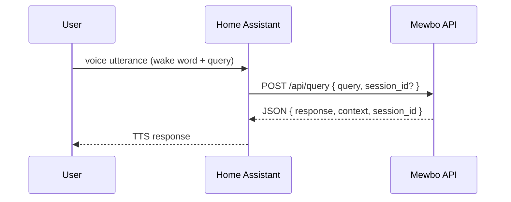

# Home Assistant Voice (HA Assist)

## Mewbo inside Home Assistant

<figure><figcaption>Sensor information surfaced in HA Assist</figcaption></figure>

<figure><figcaption>Controlling entities by voice</figcaption></figure>

Speak to Mewbo through the Home Assistant Assist pipeline. The custom component in [`apps/mewbo_ha_conversation/`](repo:apps/mewbo_ha_conversation) forwards the captured transcript to the API and speaks the reply back through text to speech.

See [Get Started](getting-started.md) to run the API that this integration talks to.

## How it works

Each turn is one synchronous call to [`POST /api/query`](endpoint:POST /api/query). Nothing streams.

The component holds the Mewbo session across turns in memory rather than in a server-side tag. It keys a history map on the Home Assistant conversation id and stores the `session_id` and `context` from the last response against it. Restarting Home Assistant therefore starts a fresh conversation.

## Install the custom component
1. Get the Mewbo API running and reachable. See the [API overview](api/index.md).
2. Copy the contents of [`apps/mewbo_ha_conversation/`](repo:apps/mewbo_ha_conversation) into Home Assistant under
   `custom_components/mewbo_conversation/`.
3. In Home Assistant, add the Mewbo conversation integration and set these fields.
   - **Base URL** points at the API, for example `http://host:5125`. The Docker stack publishes port 5125. A local `uv run mewbo-api` dev server listens on 5124.
   - **API key** goes out as the `X-API-KEY` header on every request. It must be either `api.master_token` or a key minted via [`POST /api/keys`](endpoint:POST /api/keys). With no stored key the entry falls back to a default token and logs a warning. Add the integration again to fix it.
   - **Timeout** sets how long to wait for a reply, in seconds.

## Optional: enable the Home Assistant tool
This is separate from the conversation integration above. It lets Mewbo control Home Assistant entities from any client.

- Install the extra with `uv sync --extra ha`.
- Set `home_assistant.enabled` to `true` in [`configs/app.json`](repo:configs/app.example.json).
- Provide the Home Assistant URL and token under `home_assistant.*`.
