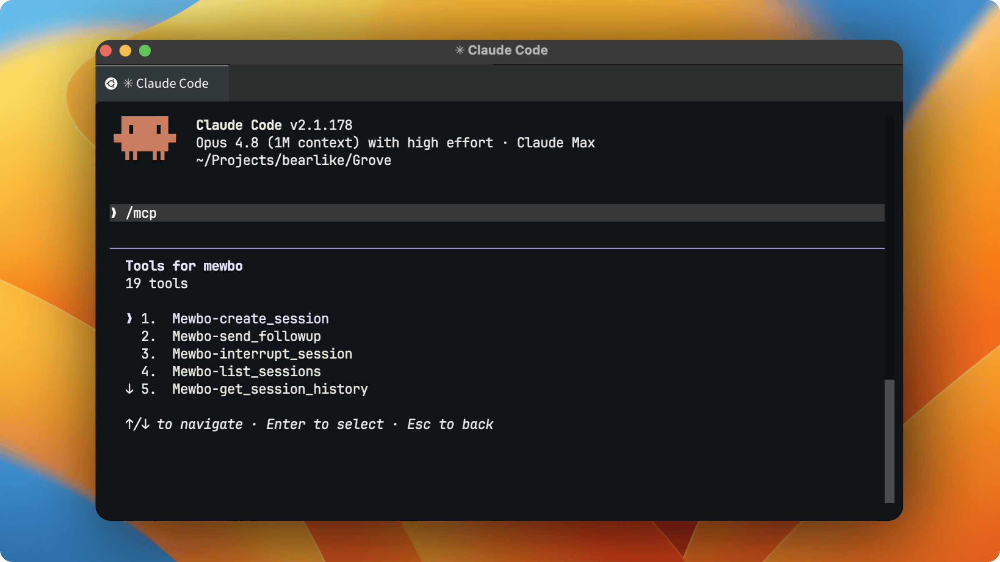

# Mewbo as an MCP Server

## Let other agents call Mewbo

Mewbo runs as an **MCP server**, so the rest of your agent fleet can call it as a tool. Claude Code, Codex, Cursor, Windsurf and another Mewbo all qualify.



> [!IMPORTANT] One key, issued and revoked by you
> The MCP surface is curated, but the key behind it is not. Read [Authentication](#authentication-required) before you hand one out.

## What is MCP?

The [Model Context Protocol](https://modelcontextprotocol.io) (MCP) is an open standard that lets AI applications connect to tools and data through one interface. Mewbo speaks it in both directions, and this page covers the inbound half. [External Tools (MCP)](features-mcp.md) covers the other.

## The Mewbo MCP server

You host Mewbo yourself, so the MCP server runs inside your deployment as the `mewbo-mcp` service.

**Endpoint:** `https://<your-mewbo-host>/mcp` (Streamable HTTP)

The Docker Compose deployment serves it on port **5127**. Locally, `uv run mewbo-mcp` serves `http://127.0.0.1:5127/mcp`.

### Authentication required

Every connection needs an API key that you issue from Mewbo.

1. Open the console and go to **Settings → API Keys**.
2. Create a key and label it after the agent that will use it. **The key is shown once.** Copy it before leaving the page.
3. Add it to your MCP client config as a `Bearer` token. See [Connect your client](#connect-your-client).

One key authenticates both the REST API and the MCP server, and stays valid until you revoke it from the same panel. Sessions created over MCP are tagged `surface:mcp` in Langfuse traces.

| Token | Prefix | Use |
|---|---|---|
| **Issued API key** | `mk_` | Per-agent credential created in **Settings → API Keys**. Valid on the REST API and the MCP server, and revocable. **Recommended for agents.** |
| **Master token** | operator-set string (default `msk-strong-password`) | Break-glass admin credential, and the one that mints and revokes keys. No prefix is enforced. Never hand it to an external agent. |

> [!WARNING] Issue keys only to agents you trust
> An issued key authorizes the full REST API, which can run shell commands, edit files, and spawn agents on your machine. Give each agent its own labelled key and revoke it the moment it is no longer needed.

## Available tools

### Sessions: create & control

| Tool | Description |
|---|---|
| **`create_session`** | Start a session from a prompt. Provisions a fresh git worktree and branch off the repo's base by default, so the work is isolated. Pass an explicit `branch`/`worktree` to target an existing one, and optionally set integrations, a title, or tags. |
| **`send_followup`** | Send a follow-up or steering message into a running or finished session. |
| **`interrupt_session`** | Interrupt the session's current step so the session can be steered or resumed afterwards. |
| **`terminate_session`** | Permanently terminate a session. Irreversible. Run, steer, recover and fork are blocked from then on, and every armed trigger is cancelled. The transcript stays readable and repeat calls are idempotent. |

### Sessions: read at the detail you need

| Tool | Description |
|---|---|
| **`get_session_history`** | Read a session at one of four tiers, so you spend only the context you need. `overview` gives title, status, counts and tokens. `turns` gives one row per exchange. `steps` gives per-step tool and result previews for a turn. `full` gives complete step logs plus the sub-agent tree. |
| **`list_sessions`** | List and filter sessions by project, status, or recency. |
| **`get_agent_tree`** | Inspect a session's sub-agent hierarchy and lifecycle state. |

### Wiki: query, ask & teach

| Tool | Description |
|---|---|
| **`list_wiki_projects`** | List the repositories indexed in the [Agentic Wiki](features-wiki.md). |
| **`read_wiki_structure`** | Get a project's knowledge-graph structure. |
| **`list_wiki_pages`** | List a project's generated pages as `{id, title}` rows, optionally narrowed by a title substring. This is the index `read_wiki_page` consumes. |
| **`read_wiki_page`** | Fetch a single wiki page. |
| **`graph_neighbors`** | Walk a project's code graph outward from one node, reading stored edges with no model call. Answers what calls a symbol, what it contains, and what imports it. Find a `node_id` with `read_wiki_structure(detail="nodes")`. |
| **`ask_wiki`** | Ask a natural-language question about an indexed project and get a cited answer. See [Question Answering](features-wiki-qa.md). |
| **`get_wiki_answer`** | Fetch a wiki answer by its `answer_id`. Use it when `ask_wiki` returns `status: "running"`. |
| **`submit_insight`** | Teach the wiki a durable fact about the codebase. The server condenses it into atomic notes, anchors each to the code it describes, and merges it against what is already stored. The [code memory graph](features-wiki-graph.md#grounded-by-a-code-memory-graph) compounds as your agents work. |

### Search: workspace queries

| Tool | Description |
|---|---|
| **`list_search_workspaces`** | List your saved [Agentic Search](features-search.md) workspaces with id, name, connected sources and recent query count. An optional `query` narrows the listing by case-insensitive substring. |
| **`search`** | Pass a workspace id or name and a question, and get back a synthesised, cited answer with ranked source results. Optionally scope to one project or choose `detail="full"` for per-result snippets. A run longer than the bounded wait returns a `run_id` with `status: "running"`. |
| **`get_search_run`** | Fetch a search run by its `run_id`, to resume a running search or replay a past result. |

### Structured Query: schema-constrained synthesis

| Tool | Description |
|---|---|
| **`structured_query`** | Describe what you want in plain English, pass a JSON Schema, and get back a validated object matching it. Optionally ground the run in a search workspace or enable tool integrations. Returns `{run_id, status, output}`. Grounding and graph-first routing behave as they do on [Structured Outputs](api/structured-outputs.md). |
| **`get_structured_run`** | Fetch a structured query run by `run_id`, to resume a running query or replay a past result. |

### Triggers: read and cancel

| Tool | Description |
|---|---|
| **`list_triggers`** | List [reverse-invocation triggers](api/triggers.md) as compact rows, optionally scoped by session, kind, or status. |
| **`cancel_trigger`** | Cancel a trigger by id. Idempotent, so a repeat call just reports its status. |

Nothing here arms a trigger. That stays a capability a session exercises on itself, for the reason [Triggers](api/triggers.md) gives.

### Discovery

| Tool | Description |
|---|---|
| **`list_projects`** | List the projects registered in your deployment with their names, git identity (`host/owner/repo`) and aliases. Pass a name or alias to `create_session`'s `project` argument. |
| **`list_integrations`** | List the tools and plugins a client can switch on when it creates a session. |

## Wire protocol

Any MCP client that speaks HTTP works.

> [!NOTE] It's a network service
> Unlike a local stdio MCP server, this one is reached over the network. Put it behind the same TLS and reverse proxy as the rest of your deployment.

## Connect your client

### Claude Code

```bash
claude mcp add -s user -t http mewbo https://<your-mewbo-host>/mcp -H "Authorization: Bearer <API_KEY>"
```

### Codex, Cursor, Windsurf, and other clients

```json
{
  "mcpServers": {
    "mewbo": {
      "serverUrl": "https://<your-mewbo-host>/mcp",
      "headers": {
        "Authorization": "Bearer <API_KEY>"
      }
    }
  }
}
```

> [!TIP] Fill in your own values
> `https://mewbo.example.com/mcp` in production, `http://localhost:5127/mcp` locally, and your issued key for `<API_KEY>`.

## What you can do with it

- **Drive Mewbo from your IDE agent.** Ask it to run a migration on a fresh branch and report back when the tests pass. `create_session` isolates the work on a new worktree and `get_session_history` reads back the result.
- **Ground other agents in your code.** Another agent calls `ask_wiki` for a cited answer from your codebase before it writes a line.
- **Let your fleet teach the wiki.** An agent that learned something durable about the code calls `submit_insight`. The next `ask_wiki`, from any client, is built on it.
- **Orchestrate a fleet.** One agent fans work out to several Mewbo sessions and polls `get_session_history` at the `overview` tier to track them all.

## Two directions of MCP

Mewbo sits at both ends of the protocol.

| | [External Tools (MCP)](features-mcp.md) | MCP Server (this page) |
|---|---|---|
| **Direction** | Mewbo is the **client**, calling out to other servers | Mewbo is the **server**; other agents call in |
| **You configure** | `mcp.json`: the servers Mewbo connects to | An **API key** other agents authenticate with |
| **Result** | Mewbo gains more tools | Other agents gain Mewbo as a tool |

## Related resources

- [REST API](api/index.md) is the surface the MCP server wraps.
- [Agentic Wiki](features-wiki.md) is what `ask_wiki` and `read_wiki_*` query.
- [Connecting remote MCP servers to Claude](https://support.anthropic.com/en/articles/11175166-about-custom-integrations-using-remote-mcp) and [OpenAI's guide to remote MCP](https://platform.openai.com/docs/guides/tools-remote-mcp) cover client setup for other ecosystems.
