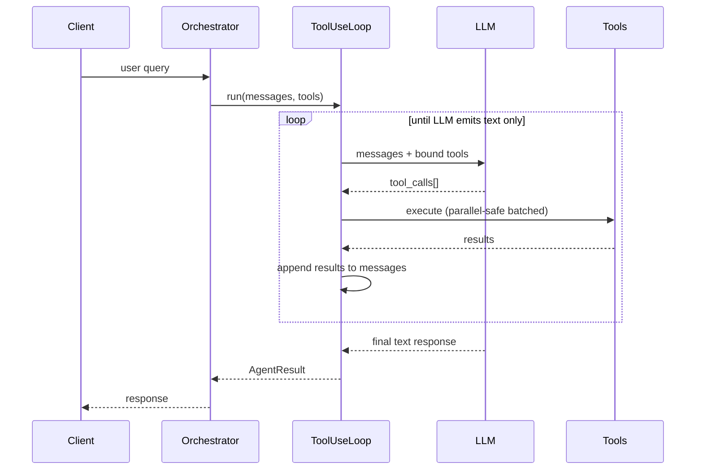
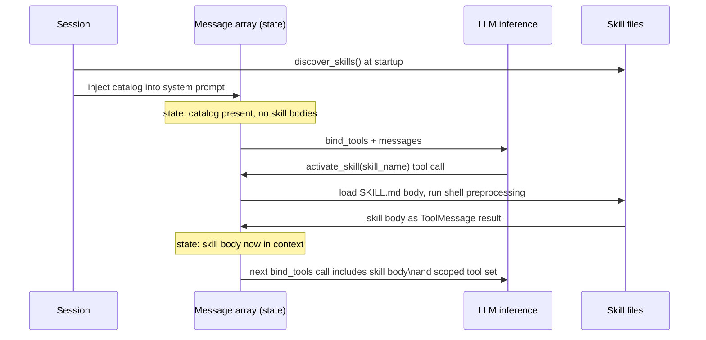
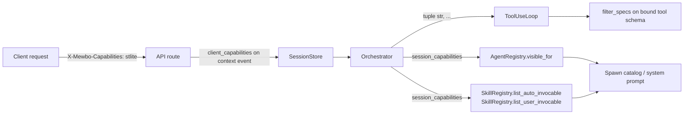
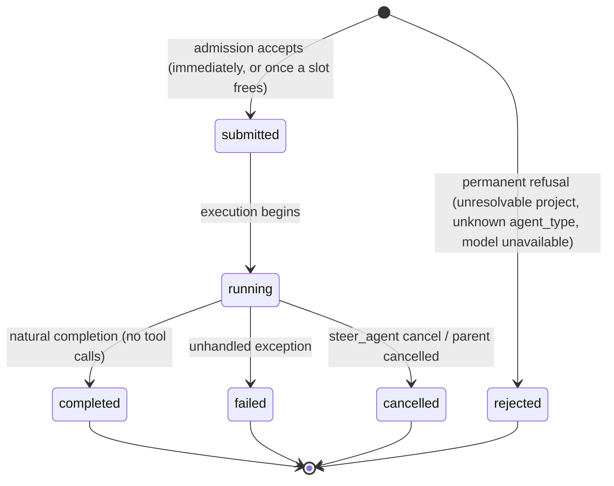
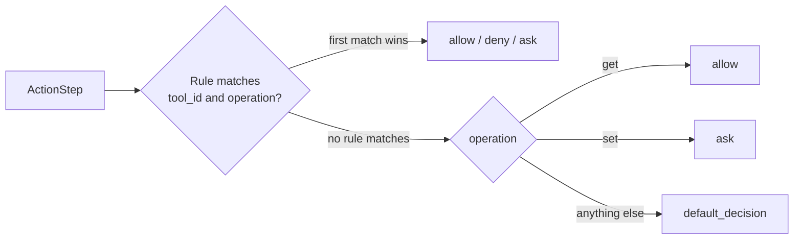
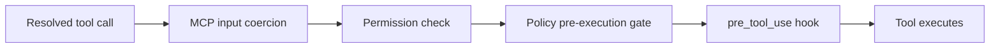
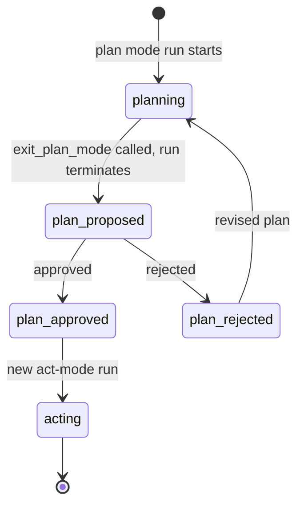
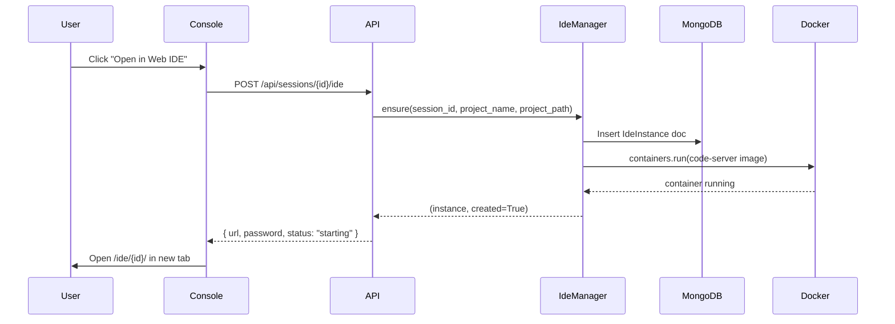
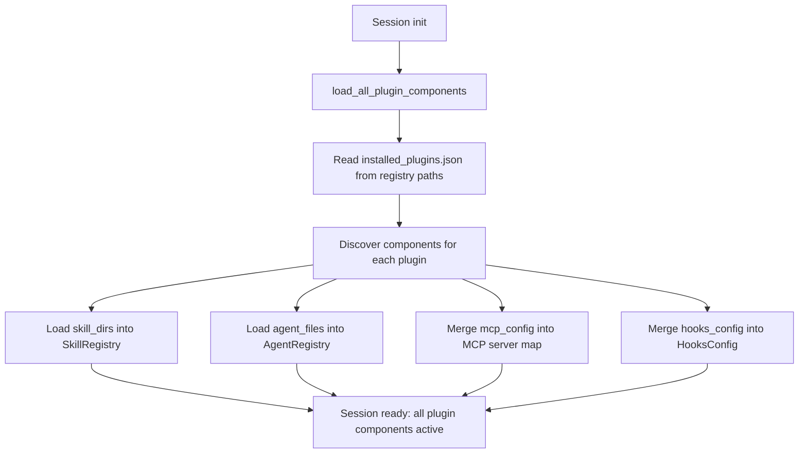

# Architecture Overview

## How the engine runs a session

This page is the internals reference for Mewbo. It names the module that owns each behaviour and the
state that survives compaction and restart. Setup lives in [Get Started](getting-started.md) and
feature descriptions in [Capabilities](features-builtin-tools.md).

---

## Execution model

One async engine runs every agent at every depth, and that engine is `ToolUseLoop`. There is no
separate planner, executor, or synthesiser. The LLM selects tools through native `bind_tools`, and
the orchestration layer steps the message array forward.

The loop runs until the LLM emits a text response with no tool calls. Budget warnings are injected as
`SystemMessage` entries as the session approaches limits. The loop is never force-killed.



**Tool concurrency.** Tools are partitioned into concurrent-safe batches and exclusive calls.
Concurrent-safe tools run in parallel through `asyncio.gather` and exclusive tools run alone. Each
tool carries its own timeout, 120 seconds by default, and a timeout does not cancel sibling calls.

### Core components

| Component | Role |
|-----------|------|
| `Orchestrator` | Session lifecycle, context building, and mode resolution. |
| `ToolUseLoop` | Async tool-use conversation loop. The single execution engine at every depth. |
| `AgentContext` | Immutable per-agent state propagated through the hierarchy. |
| `AgentHypervisor` | Control plane: admission control, lifecycle tracking, cancellation, cleanup. |
| `SpawnAgentTool` | Sub-agent creation with tool scoping (allowlist/denylist filtered before binding). |
| `Planner` | Plan generation via LLM (plan mode only). |
| `SessionRuntime` | Shared facade used by both CLI and API. |
| `SessionStore` | Transcript and summary storage. |
| `ToolRegistry` | Local tools plus external MCP tools, with `filter_specs()` for allow/deny. |

/// table-caption
The modules that own each part of a session.
///

### Execution flow

The orchestrator builds a context snapshot from the summary, recent events, and selected history.
Results are written to the session transcript.

---

## Instruction loading {#instruction-loading}

`discover_all_instructions()` walks **upward** from the current working directory to the git root or
the filesystem root, loading instruction files in priority order. Higher priority wins.

| Priority | Path | Scope |
|----------|------|-------|
| 10 | `~/.claude/CLAUDE.md` | User-global, all projects |
| 20–29 | `CLAUDE.md` / `.claude/CLAUDE.md` walking up from CWD | Project hierarchy; CWD = 20, parent = 21, … |
| 30 | `.claude/rules/*.md` (all files, sorted) | Project-local rule set |
| 40 | `CLAUDE.local.md` | Machine-local override (gitignore this) |

The full text of every file is concatenated into the system prompt before the first LLM call, each
source under its own heading so content stays traceable. Where `CLAUDE.md` and `AGENTS.md` sit at the
same path, `CLAUDE.md` takes precedence.

`discover_subtree_instructions()` walks **downward** from CWD to a maximum depth of 5, scanning for
`CLAUDE.md`, `AGENTS.md`, and `.claude/CLAUDE.md`. It injects paths, never content. The system prompt
receives an index.

```
# Sub-package instruction files
- packages/mewbo_core/CLAUDE.md
- apps/mewbo_console/CLAUDE.md
```

A later tool call under `packages/mewbo_core/` produces a `read_file` call that pulls the matching
`CLAUDE.md` in as a tool result. Only the instructions that apply occupy the active context.

`node_modules`, `__pycache__`, `.venv`, `venv`, and every dotfile directory are never walked. A
`<!-- mewbo:noload -->` marker on line 1 excludes a file from both passes.

`get_git_context()` collects branch, working-tree status, and recent commits. Each integration
decides whether to include it.

---

## Skill loading {#skill-loading}



A skill that sets `allowed-tools` replaces the full tool list on activation, through the same
`filter_specs()` mechanism sub-agent spawning uses. Shell preprocessing with `` !`command` `` runs
each matched command under a 30 second timeout and substitutes stdout into the body. Errors become
`[ERROR: ...]` placeholders.

The registry compares file modification times and reloads changed files between sessions. A skill
directory added while the server runs is picked up on the next scan.

---

## Capability overlay {#capability-overlay}

Capabilities are opaque string ids advertised by the client, such as `stlite`. They gate which agents
and skills are visible to a session. A gated entry never reaches the model, so its tool schema is not
bound, its agent definition stays out of the spawn catalog, and its skill catalog line is omitted.

### Data flow



The header is a comma separated list. Its value persists on the session's context event as
`client_capabilities` rather than in the LLM message array, which is why it survives compaction.

`Orchestrator` normalises it once per session through `parse_capabilities()` and threads an immutable
`tuple[str, ...]` onward. The registry methods above apply the filter on every catalog render.

### Filter implementation

[`capabilities.py::filter_by_capabilities`](repo:packages/mewbo_core/src/mewbo_core/capabilities.py)
is the single filter. An item is included when its `requires_capabilities` tuple is a subset of the
session's set, and an empty tuple is always included. Comparison uses set semantics, so order and
duplication do not matter.

| Function | Purpose |
|---|---|
| `parse_capabilities(raw)` | Normalise a header value, frontmatter field, or manifest field into a sorted, deduped, trimmed `tuple[str, ...]`. Accepts `None`, `str`, or `list[str]`; other shapes return `()`. |
| `filter_by_capabilities(items, session_capabilities)` | Return the subset of items visible to the session. |
| `overlay_capabilities(spec, extra)` | Return a copy of `spec` with `extra` unioned into its `requires_capabilities`. Used to fan a plugin-level capability out over every contributed agent and skill. |

### Sources of `requires_capabilities`

Three levels can declare a capability, and discovery unions them through `overlay_capabilities()`,
so an author never repeats a bundle capability file by file.

| Source | Where it lives | Scope |
|---|---|---|
| `AgentDef` frontmatter | `---\nrequires-capabilities: [stlite]\n---` block in an `agents/*.md` file | Single agent |
| `SkillSpec` frontmatter | Same block in a `SKILL.md` file | Single skill |
| Plugin manifest | `"requires-capabilities": ["stlite"]` in `plugin.json` | Every agent and skill the plugin contributes |

### Tool gating

A session tool bound to a gated agent is hidden with it. Without `stlite` advertised, the
`st-widget-builder` agent stays out of the spawn catalog and the `submit_widget` session tool is
never instantiated. The agent gate sits upstream of binding, so `filter_specs()` does no work on this
path.

---

## Sub-agents and the hypervisor {#sub-agents}

Every session has one `AgentHypervisor`, shared across the entire agent tree. It works in two layers.

**Reflexes.** A code-level watchdog checks every running agent every 30 seconds. An agent with no
tool call inside the stall threshold, 120 seconds by default, receives a `SystemMessage` warning in
its queue. Budget enforcement is graduated the same way as `session_step_budget` is approached, and
no hard kill follows, which preserves accumulated context.

**Brain.** The second layer is a global view. The root agent's system prompt is rebuilt each step
around `render_agent_tree()`, a compact live view of the whole tree carrying status, steps completed,
last tool, progress notes, and the per-agent counters `compaction_count` and `last_compacted_at`.
`check_agents` reads it at any time with no extra LLM call.

### Lifecycle



Admission runs before a child is registered and has exactly two outcomes.

An **accepted** spawn is registered immediately. It receives an `agent_id` and starts in `submitted`
whether or not a slot is free, stays visible to `check_agents` throughout, and moves to `running`
once a sibling completes and releases a slot. A parent waiting on that result holds no slot. Only a
`running` agent does.

A **rejected** spawn is never registered at all. Rejection covers refusals that would be identical on
retry, meaning an unresolvable `project`, an unknown `agent_type`, or a model this deployment cannot
serve. Reaching `agent.max_concurrent` is never one of them. It only delays the move to `running`.

Agents run until the model returns a text response with no tool calls. That is **natural
completion**, and there is no hard step limit. Safety comes from `agent.llm_call_timeout`, stall
detection, and `agent.session_step_budget`.

### Spawning semantics

| Caller depth | Call | Returns |
|---|---|---|
| 0 (root) | Does not block | An envelope with an `agent_id` and `status: "submitted"`, whether or not a slot was free. `_run_child_lifecycle` stores the `AgentResult` on the `AgentHandle` when the child finishes. |
| 1 and deeper | Blocks | An `AgentResult` JSON payload inline, once the child reaches a terminal state. The wait includes any time the child spent `submitted`. |

/// table-caption
Spawn behaviour by the depth of the calling agent.
///

A permanently refused root spawn returns `status: "rejected"` with no `agent_id` instead. Capacity
never fails a blocking spawn.

`task` is the only required parameter of `spawn_agent`. The optional ones are `model`,
`allowed_tools`, `denied_tools`, `acceptance_criteria`, `agent_type`, `project`, `retry`,
`summary_kind`, `capability_mode`, `workspace_mode`, `approval_policy`, `contract`, and
`verification`. `max_steps` is accepted but not enforced.

Sub-agents inherit the parent's `approval_callback`, so write, edit, and shell tools work in API and
headless contexts. `spawn_agents(tasks=[...])` fans several independent sub-agents out of one call.
See [Sub-agents → Spawning multiple sub-agents at
once](features-agents.md#spawning-multiple-sub-agents-at-once) for the batch outcome shape.

### AgentResult

| Field | Type | Description |
|---|---|---|
| `content` | string | Primary output text |
| `status` | string | `completed`, `failed`, `partial`, `cannot_solve`, or `cancelled` |
| `steps_used` | integer | Number of tool steps executed |
| `summary` | string | Compressed summary (≤ 500 chars) for parent context |
| `warnings` | array | Non-fatal issues encountered |
| `artifacts` | array | File paths touched by the agent |

/// table-caption
The result envelope a sub-agent returns to its parent.
///

### Depth roles

Each depth level receives a distinct behavioural role in its system prompt through
`_build_depth_guidance()`.

| Depth | Role | Behaviour |
|---|---|---|
| 0 (root) | Hypervisor / orchestrator | Direct execution by default; async delegation when spawning; steer / cancel running agents; synthesize results |
| 1–4 (mid) | Sub-orchestrator | Bounded scope; may further delegate |
| 5 (leaf) | Executor | Complete task directly; self-terminate; admit failure explicitly |

At depth 5 the `spawn_agent` tool is removed from the schema entirely, so no further delegation can
be attempted.

### Messaging

| Direction | Mechanism |
|---|---|
| Parent → child | `steer_agent` (root only) or `send_message(agent_id, text)` |
| Child → parent | Automatic on completion via `send_to_parent(child_id, text)` |
| System → agent | Hypervisor injects budget warnings and stall nudges as `HumanMessage` |
| User → root | `message_queue` (thread-safe `queue.Queue`), `interrupt_step` (`threading.Event`). Drained between steps as `HumanMessage`. Exposed via `/message` and `/interrupt`. Created in `RunRegistry.start()`. |

/// table-caption
Every route by which a message reaches a running agent.
///

A drain happens between tool steps, so nothing interrupts an in-flight tool call.

### Compaction resilience

Sub-agent state survives compaction because it lives outside the LLM conversation history. The tree
is rebuilt into the root system prompt each step from live `AgentHandle` state, `check_agents` reads
`AgentHandle` directly in memory, and completed child results sit on `AgentHandle.result` for
re-injection afterwards.

### Cleanup and structured errors

Cleanup runs in three phases. Cancel, wait with a timeout, then force-mark as cancelled.
`await_lifecycle_managers(timeout)` runs before event-loop teardown, and sub-agent cleanup cascades
to children before unregistering. `AgentError` captures `agent_id`, `depth`, `task`, `message`,
`last_tool`, and `steps`.

When the root hits its step limit with children still pending, a 2 second grace period applies before
completed results are injected as a `SystemMessage` for synthesis. Agents still running are named in
the warning prompt.

---

## Permission policy {#permission-policy}

Every tool call is an `ActionStep` carrying a `tool_id` and an `operation` such as `get` or `set`.
`PermissionPolicy.decide()` walks the list of `PermissionRule` entries before the tool runs, matching
`fnmatch` glob patterns on both fields.



`permissions.approval_mode` overrides the policy file for a whole session. It accepts `allow`,
`deny`, or `ask`, and `ask` is the default. `auto`, `approve` and `yes` alias `allow`. `never` and
`no` alias `deny`.

---

## Policies {#policies}

Policies hook into the **pre-execution gate** inside the tool-use loop. No tool executes without
passing through it.



A resolved tool call matching an active policy's greylist goes through four steps.

1. The fully resolved call is captured.
2. An **isolated single-turn LLM invocation** starts with only the policy body and the
   exception-structure tool available. The session's conversation history is not in that context.
3. A checker returning nothing lets the call proceed. A checker calling the exception tool blocks it,
   and the exception text is returned to the agent as the tool result.
4. With `isTerminal: true`, a violation ends the session immediately after the exception is
   delivered.

Policies matching the same call run concurrently. Every check must clear for execution to proceed, so
one violation blocks the call.

`PolicyRegistry` mirrors `SkillRegistry`. A catalog is advertised at session start, bodies load
lazily, and policy files share the skill scan paths.

---

## Monitors {#monitors}

Monitors are spawned in the `on_session_start` hook and torn down in `on_session_end`. Each is a
**restricted tool-use loop session** that the hypervisor tracks as a peer of regular sub-agents, with
its own `AgentHandle`, lifecycle states, and token accounting. Monitors never appear in the agent
tree the root agent sees.

A monitor's tool set is hard-restricted at the tool-registry level before its session is constructed.
Only `inject_message`, `interrupt_session`, and the definition's own `allowed-tools` are registered.
Each tick of the periodic invocation loop delivers a read-only snapshot of the full agent tree as a
structured `SystemMessage`.

| Tool | Mechanism |
|------|-----------|
| `inject_message` | Routes through `AgentHypervisor.send_message()` to the target agent's queue; drained between tool steps |
| `interrupt_session` | Sets a checked signal on the target loop's step boundary; never interrupts an in-flight tool call |

/// table-caption
The two tools a monitor can call against the session it watches.
///

A crashed monitor is respawned after a short backoff. One that crashes repeatedly is marked `failed`
and not retried for the rest of the session. `MonitorRegistry` mirrors `PolicyRegistry` and
`SkillRegistry`, with definitions shipping as files in the standard scan paths.

---

## Hook manager {#hook-manager}

`HookManager` dispatches hooks at lifecycle points and around individual tool calls. Every invocation
is wrapped in `try/except`, so a failing hook logs a warning and never blocks execution.
`HookManager.load_from_config()` wires `HooksConfig` entries into the manager, and the API server
calls it at startup and passes `hook_manager` into every `start_async()` call.

There are two hook types.

- **Command hooks.** A shell subprocess. `_session_env()` provides `MEWBO_SESSION_ID`,
  `MEWBO_ERROR`, `MEWBO_TOOL_ID`, `MEWBO_OPERATION`, and the first 2 000 characters of
  `MEWBO_TOOL_RESULT`. The manager waits up to `timeout` seconds, 30 by default, then moves on.
- **HTTP hooks.** A fire-and-forget JSON POST to an external URL from a daemon thread. Nothing blocks
  on it and failures are logged.

An optional `matcher` fnmatch pattern restricts which tool ids fire the hook. `matcher: "mcp__*"`
restricts to all MCP tools, and omitting it matches every call.

Lifecycle events are `on_session_start`, `on_session_end`, `pre_tool_use`, and `post_tool_use`.
`on_compact` fires programmatically from the compaction path. It cannot be configured through
`HooksConfig` but can be registered in code.

---

## Plan mode signals {#plan-mode}

In plan mode the LLM binds read-only tools plus the `exit_plan_mode` signal, and writes are blocked.
Free text feedback on a rejection reaches the model as context for a revision.



Plan approval is **episodic**. Approval and rejection events persist in the session transcript and
survive a process restart, and `SessionRuntime.resolve_session()` checks for unresolved
`plan_proposed` events before starting a new run.

Each `exit_plan_mode` call increments a per-session counter stored at `<plan_dir>/revision.txt`. The
revision number rides on `plan_proposed` events, so a UI can tell a first draft from a revision.

### Shell allowlist

Exploration runs against the shell allowlist `agent.plan_mode_shell_allowlist`. Only commands whose
first token matches a configured prefix are permitted, and prefixes match at word boundaries, so
`"git log"` matches `"git log --oneline"` and not `"git logger"`.

A command carrying an unquoted pipe `|`, redirect `>` or `<`, chain `&` or `;`, variable expansion
`$`, or backtick substitution is rejected regardless of the allowlist. An empty list blocks shell
access entirely.

MCP tools are never mode-filtered in plan mode. Mewbo cannot classify a third-party MCP tool's
effect, so the filter admits every MCP tool unconditionally rather than guessing.

---

## Compaction pipeline {#compaction}

Compaction has two modes.

- **`PARTIAL`** is the default for auto-compact. The most recent `context.recent_event_limit` events
  stay verbatim, 8 of them by default, and everything older is summarised.
- **`FULL`** summarises the entire transcript, recent events included, from a clean-slate prompt.

The compaction LLM receives the raw event transcript and returns two XML sections.

```xml
<analysis>
  [Reasoning about what to preserve vs discard. Removed before storing.]
</analysis>

<summary>
## Primary Request
## Key Technical Concepts
## Files and Code
## Errors and Fixes
## Current State
## Pending Tasks
</summary>
```

Only the `<summary>` block is stored.

Mewbo then scans the summarised events for file paths referenced by tool calls and re-reads up to 5
of those files back into the compacted context, up to 5 000 tokens each. A recently edited file lands
as literal content, so editing continues without a re-read.

Setting `compaction.caveman_mode` to `true` activates a terse summarisation prompt. It drops
articles, filler phrases, and hedging, while code blocks, file paths, URLs, commands, and error
strings survive verbatim. Output tokens drop by roughly 30 to 60 percent on prose-heavy sessions,
with the XML structure unchanged.

Each compaction emits a `context_compacted` event carrying
`{model, tokens_before, tokens_saved, events_summarized}`. The console timeline renders it as a
distinct pill, and the context-window bar popover gains a **Compactions** row once one has run.

Auto-compact fires when the most recent root prompt size crosses
`token_budget.auto_compact_threshold`, 0.8 of the model's context window by default. The threshold is
evaluated after every LLM call against the `input_tokens` the provider reported, not a
character-count estimate.

---

## Token tracking {#token-tracking}

Mewbo tracks usage separately for the root agent at depth 0 and for all sub-agents below it. Input
tokens carry three distinct semantics.

| Semantic | Fields | When to use |
|----------|--------|-------------|
| Context fill (now) | `root_last_input_tokens` | Current window pressure. Drives the fill bar and "until compact" display. |
| Context pressure (peak) | `root_peak_input_tokens`, `sub_peak_input_tokens` | Worst-case historical pressure. Popover secondary stat. |
| Billable (cost) | `*_input_tokens_billed` | Cumulative sum across all calls. Cost dashboards. |

Do **not** sum `input_tokens` across calls within a turn. Each step re-sends the full context as tool
results accumulate, so summing double-counts the baseline. Use the peak or the last value. Output
tokens are always additive, because each one is produced once.

Prompt caching is enabled automatically through LiteLLM for models that report support, with no
configuration. Mewbo queries `litellm.utils.supports_prompt_caching` for the model name.

Behind a proxy, meaning `llm.api_base` is set, the proxy must expose `/v1/model/info` advertising
each model's capabilities. Mewbo fetches that endpoint once per process at startup and registers the
results with LiteLLM, so `supports_prompt_caching` answers accurately for proxy-routed custom model
names. Without it, caching falls back to disabled for those models.

---

## MCP connection pool {#mcp}

MCP server definitions come from four layers, deep-merged deepest-first so later layers win on key
conflicts.

| Layer | Source | Priority |
|-------|--------|----------|
| 1 | Plugin-contributed servers | Lowest |
| 2 | Global: `configs/mcp.json` or `$MEWBO_HOME/mcp.json` | Middle |
| 3 | Subtree `.mcp.json` files, deepest-first | Middle |
| 4 | CWD `.mcp.json` | Highest |

The session's project directory is passed to `MCPToolRunner` as `cwd`. Each `connect_all` call
re-runs `get_merged_mcp_config(cwd)` and hashes the result with SHA-256. Changed and new servers
reconnect, removed servers disconnect, and unchanged servers keep their connections.

### Config normalization

Every `.mcp.json` file is normalised before merging.

| Input field | Normalized to | Notes |
|-------------|---------------|-------|
| `mcpServers` | `servers` | Claude Code / VS Code schema compatibility |
| `type` | `transport` | Both removed after normalization to avoid leaks |
| `http_headers` | `headers` | Key rename |
| `transport: "http"` | `transport: "streamable_http"` | Accepted alias |
| `command` present, no `transport` | `transport: "stdio"` | Inferred |
| `${VAR}` / `$VAR` in values | Expanded from process environment | Unresolved vars left as-is |

### Pool behaviour

| Behaviour | Detail |
|-----------|--------|
| Persistent connections | One `MultiServerMCPClient` per server, reused across all requests. |
| Auto-reconnect | After 3 consecutive call errors on a server, the pool invalidates it and attempts a single reconnect before retrying the failed call. |
| Connect timeout | 30 seconds per server. |
| Call timeout | 60 seconds per tool invocation. |
| Concurrent connects | Up to 5 servers connect in parallel at startup. |

/// table-caption
How the pool holds connections open and recovers from a failing server.
///

A one-shot client is the fallback when the pool is unavailable.

---

## LSP tool {#lsp}

`lsp_tool` is backed by `pygls` and `lsprotocol`. Without those optional dependencies it is silently
disabled on startup rather than raising.

Servers are auto-discovered through `shutil.which` and spawned lazily per session on the first
request for a matching file type. One that fails to start joins a `_failed` set and is not retried
for the lifetime of the session. `shutdown_all()` terminates running servers at session end.

The manager walks up from CWD for each server's `root_markers`, falling back to CWD itself when no
marker appears within 20 directory levels.

Passive diagnostics run through an `_append_lsp_feedback` hook inside `ToolUseLoop` after every file
edit and are appended to the context as a tool result. Type errors and lint warnings reach the model
in the same turn as the edit, with no explicit `lsp_tool` call. Set `agent.lsp.enabled` to `false` to
disable this.

A custom server under `agent.lsp.servers` specifies `command` and `extensions`, and optionally
`root_markers` and `language_id`. Disable a built-in server with `{"pyright": {"disabled": true}}`.

---

## Web IDE manager {#web-ide}

`IdeManager` runs one code-server container per session. State is persisted in the `ide_instances`
MongoDB collection, so the IDE survives API restarts and multiple browser tabs. The Web IDE requires
MongoDB as the storage backend, and the API container needs the Docker socket at
`/var/run/docker.sock` to spawn sibling containers. The Docker Compose stack wires that up.



The project directory is mounted at `/home/coder/project` and a deadline file at `/mewbo/deadline`.
The container's internal watchdog reads the deadline every 15 seconds and self-terminates once the
epoch passes. `POST /api/sessions/{session_id}/ide/extend` overwrites the file and updates MongoDB.
`DELETE` force-removes the container, the deadline file, and the MongoDB document.

---

## Built-in tools {#built-in-tools}

### read_file cache

`read_file` maintains a per-session cache keyed by `(path, offset, limit)`. A repeated call on the
same slice with no intervening edit returns from cache, without re-reading the file or re-emitting
content into the context window. In real sessions this cuts 60 to 99 percent of the context spent on
repeated reads of one large file.

### Tool output schemas

Each built-in tool returns a JSON payload tagged with `kind`.

```json
// read_file
{"kind": "file", "path": "...", "text": "1\t...", "total_lines": 42}

// aider_shell_tool
{"kind": "shell", "command": "...", "cwd": "...", "exit_code": 0,
 "stdout": "...", "stderr": "", "duration_ms": 423}

// aider_list_dir_tool
{"kind": "dir", "path": "...", "entries": ["..."]}

// aider_edit_block_tool / file_edit_tool
{"kind": "diff", ...}
```

### Edit tool selection

Both edit backends share
[`edit_common.py`](repo:packages/mewbo_tools/src/mewbo_tools/integration/edit_common.py) and emit
`{"kind": "diff", ...}`. `AgentConfig.edit_tool` selects `search_replace_block` or
`structured_patch`. Left empty, the default, `ToolUseLoop._configured_edit_tool_id()` auto-selects
from model identity through `llm.model_prefers_structured_patch()`. The tool schema, the prompt
instructions, and the backend all switch together, bundled in one `ToolSpec` registration.

`llm.structured_patch_models` extends which models receive the structured-patch backend and accepts
wildcards, for example `["my-custom-model*", "openai/gpt-5"]`.

---

## Plugin loading {#plugins}



`load_all_plugin_components()` runs during session initialisation. Its result is cached by
registry-file mtime, so repeated calls within one process are free unless a plugin was installed or
uninstalled. `${CLAUDE_PLUGIN_ROOT}` inside a plugin's `.mcp.json` or
`hooks/hooks.json` is substituted at discovery time with the plugin's installation directory.

**Precedence.** A plugin skill never overrides a personal skill in `~/.claude/skills/` or a
project-local one in `.claude/skills/` with the same name. Plugin MCP servers merge additively, and a
later plugin does not overwrite an earlier one for the same server name. Plugin hooks are
format-translated and merged into the live `HooksConfig`.

`PluginsConfig` lives in `config.py` and defines `enabled`, `enabled_plugins`, `marketplaces`,
`marketplace_default_host`, and `install_path`. The CLI exposes `/plugins`. The API exposes
`GET/POST /api/plugins`, `GET/POST /api/plugins/marketplace`, and
[`DELETE /api/plugins/{plugin_name}`](endpoint:DELETE /api/plugins/{plugin_name}). The console
renders `PluginsView`. See [Session tools](#session-tools) for plugin-contributed per-agent stateful
tools.

### Built-in plugin scan path

A fourth scan source sits alongside the registry-driven paths. Any plugin checked in under
[`packages/mewbo_core/src/mewbo_core/builtin_plugins/`](repo:packages/mewbo_core/src/mewbo_core/builtin_plugins)
is discovered through the **same** pipeline as a user-installed or marketplace-installed one. It is
byte-for-byte a normal plugin, with a manifest, `agents/`, `skills/`, `hooks/hooks.json`, `.mcp.json`
and `session_tools`, and it needs no `installed_plugins.json` entry.

The path resolves at runtime through `importlib.resources.files("mewbo_core") / "builtin_plugins"`,
so discovery behaves identically for editable installs, wheels, and zipapps. The scanner iterates
every immediate subdirectory containing a `.claude-plugin/plugin.json`. `widget_builder/` is the only
bundle today and declares `requires-capabilities: ["stlite"]`. Another needs no discovery code
change, only a plugin-shaped directory beside it.

### Path substitution

A plugin-owned agent body or skill body can reference three placeholders. Substitution is a single
linear `str.replace` pass per placeholder, with no template engine and no expression language, so a
body with no placeholders comes out byte-identical.

| Placeholder | Resolved at | Value |
|---|---|---|
| `${CLAUDE_PLUGIN_ROOT}` | Plugin discovery | Absolute path to the plugin's install directory on disk |
| `${SESSION_ID}` | Agent spawn | The current session's id |
| `${MEWBO_WIDGET_ROOT}` | Agent spawn | Widget-builder output root; supports `:-` default syntax |

`${CLAUDE_PLUGIN_ROOT}` is also substituted inside `.mcp.json` and `hooks/hooks.json` at discovery
time. The other two are agent-body only and resolve inside `spawn_agent`, just before the body
reaches the child `ToolUseLoop`.

---

## Session tools {#session-tools}

A **session tool** is a per-agent stateful tool whose lifecycle is coupled to one agent instance
rather than to the global `ToolRegistry`. Its handler holds state across calls within that agent's
run, declares its own OpenAI function schema, and can signal clean loop termination independently of
the model's final text response.

The core `ExitPlanModeTool` is one. So is the widget-builder's `SubmitWidgetTool`, contributed by a
plugin. The protocol lives in
[`session_tools.py`](repo:packages/mewbo_core/src/mewbo_core/tooling/session_tools.py).

### Protocol

```python title="packages/mewbo_core/src/mewbo_core/tooling/session_tools.py"
class SessionTool(Protocol):
    tool_id: str
    schema: dict[str, object]
    modes: frozenset[str]

    async def handle(self, action_step: ActionStep) -> MockSpeaker: ...
    def should_terminate_run(self) -> bool: ...
```

| Member | Role |
|---|---|
| `tool_id` | Dispatch key. Must match the name the LLM sees in the bound schema. |
| `schema` | OpenAI function schema (identical shape to any other bound tool). |
| `modes` | Frozenset of orchestration modes (`"plan"` / `"act"`) the tool is valid in. Plugin tools default to `DEFAULT_SESSION_TOOL_MODES` = `{"act"}`; `ExitPlanModeTool` overrides to `{"plan"}`. |
| `handle(action_step)` | Executes the call, returns a `MockSpeaker` with the tool result (consumed like any `ToolMessage`). |
| `should_terminate_run()` | Returns `True` (once, consuming the flag) when the loop should exit cleanly after the current step. |

/// table-caption
The five members a session tool declares.
///

### Registry and factories

`SessionToolRegistry` holds one `SessionToolFactory` per `tool_id`. A factory is
`Callable[[session_id, event_logger], SessionTool]`, and construction is cheap and happens once per
agent.

```mermaid
sequenceDiagram
    participant Plugin as "plugin.json"
    participant Core as Session init
    participant Reg as SessionToolRegistry
    participant Loop as ToolUseLoop
    participant Tool as SessionTool instance

    Core->>Plugin: read session_tools[] entries
    loop for each entry
        Core->>Reg: load_entry({tool_id, module, cls})
        Reg->>Reg: importlib.import_module + getattr<br/>register SessionToolFactory
    end
    Note over Reg: factories populated, no instances yet
    Loop->>Reg: build_for(agent.allowed_tools, session_id, event_logger)
    Reg->>Tool: factory(session_id, event_logger)
    Tool-->>Loop: SessionTool instance
    Loop->>Loop: inject schema, wire dispatch,<br/>check should_terminate_run each step
```

### Plugin contract

A plugin contributes session tools through a `session_tools` array in `plugin.json`.

```json title="plugin.json"
{
  "session_tools": [
    {
      "tool_id": "submit_widget",
      "module": "mewbo_core.builtin_plugins.widget_builder.submit_widget",
      "class": "SubmitWidgetTool"
    }
  ]
}
```

`SessionToolRegistry.load_entry()` imports the class at session start and registers a factory.
`build_for(allowed_tools, …)` instantiates one instance per agent when an agent spawns with a
matching `tool_id` in its `allowed_tools`. A broken plugin is logged and skipped, whether a field is
missing, the import fails, or the constructor raises. It never crashes the host session.

### Loop integration

Inside `ToolUseLoop`, schema injection, dispatch, and termination all iterate a single
`list[SessionTool]`, so core and plugin tools share the same three call sites with no widget-specific
branch. The only asymmetry is the built-in set, just `ExitPlanModeTool` today, against the
plugin-loaded set.

A gated agent never reaches `build_for`, so a session tool on a hidden agent is never instantiated.
See [Capability overlay](#capability-overlay) for the gate itself.

---

## Channel adapters {#channel-adapters}

A chat-platform adapter implements the `ChannelAdapter` protocol in
[`channels/base.py`](repo:apps/mewbo_api/src/mewbo_api/channels/base.py).

| Method / property | Purpose |
|---|---|
| `verify_request` | Authenticate an inbound request (HMAC for webhooks) |
| `parse_inbound` | Produce a normalised `InboundMessage` |
| `send_response` | Deliver the final answer back to the channel |
| `system_context` | Injected into the LLM system prompt. Makes the model aware it is communicating through this adapter |

`ChannelRegistry` lookup and `DeduplicationGuard` replay protection are shared. The webhook endpoint
`POST /api/webhooks/<platform>` authenticates with HMAC rather than an API key. A poll-driven channel
such as Email calls `_process_inbound()` from its own poller instead.

The shared `_process_inbound()` pipeline in
[`routes.py`](repo:apps/mewbo_api/src/mewbo_api/channels/routes.py) runs dedup, mention gate, session
resolve, commands, and the LLM, for every channel. An adapter may implement
`requires_mention(message)` for dynamic mention gating. Email uses it to drop the `@Mewbo`
requirement on threads between two participants.

Channel sessions are standard API sessions, created via `session_store.create_session()`, mapped
through session tags, and visible in the console and in Langfuse. The completion callback reads
`source_platform` from the transcript context event and dispatches the final answer through the
adapter.

Two adapters ship today. Nextcloud Talk in
[`nextcloud_talk.py`](repo:apps/mewbo_api/src/mewbo_api/channels/nextcloud_talk.py) uses HMAC-SHA256,
ActivityStreams 2.0, and the OCS Bot API. Email in
[`email_adapter.py`](repo:apps/mewbo_api/src/mewbo_api/channels/email_adapter.py) polls IMAP, replies
over SMTP, and renders markdown to HTML with `mistune` and a Jinja2 template.

---

## Extensibility points

- **Tools.** Implement `AbstractTool` or register an MCP server with a schema.
- **File edit tool.** Set `agent.edit_tool`, or leave it empty for auto-selection.
- **Plugins.** See [Plugins & Marketplace](features-plugins.md).
- **Web IDE.** Opt in per session through `agent.web_ide`. See [Web IDE](web/ide.md).
- **Hooks.** See [Permissions & Hooks](features-permissions-hooks.md).
- **Interfaces.** Reuse `SessionRuntime` and the event transcript model.
- **Chat platforms.** Implement `ChannelAdapter` and register it in `init_channels()`. See
  [Nextcloud Talk](clients-nextcloud-talk.md) and [Email](clients-email.md).
- **LSP.** Add a custom server under `agent.lsp.servers`.

## Further reading

- [Session Runtime](session-runtime.md) is the shared facade used by CLI and API.
- [Building a Client](api/building-a-client.md) walks through embedding the core.
- [API Reference](reference.md) is the mkdocstrings reference for every module.
