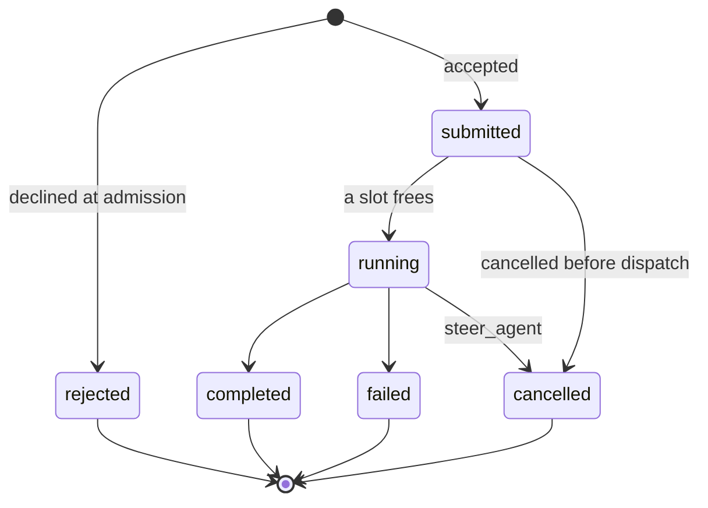

# Sub-agents

## Run subtasks in parallel

Mewbo spawns child agents to run independent subtasks in parallel. The root agent delegates bounded
work and writes the final answer from what comes back. A sub-agent inherits the parent's permission
policy, tool registry and session context, so its tool calls need no fresh authorisation.

For setup and installation, see [Getting Started](getting-started.md).

---

## Spawning a sub-agent

Call the `spawn_agent` tool with a task description.

```json
{
  "task": "Run the full test suite and report any failures",
  "model": "anthropic/claude-haiku-4-5",
  "allowed_tools": ["read_file", "aider_shell_tool"],
  "acceptance_criteria": "Exit code 0 and no FAILED lines in output"
}
```

| Parameter | Type | Required | Description |
|---|---|---|---|
| `task` | string | Yes | Full description of what the sub-agent should do |
| `model` | string | No | Override the model for this agent; must be in `agent.allowed_models` if that list is set |
| `allowed_tools` | array | No | Tool IDs the sub-agent may use; empty means all tools |
| `denied_tools` | array | No | Tool IDs explicitly blocked for this sub-agent |
| `acceptance_criteria` | string | No | How to verify the task is complete (appended to the task description) |
| `agent_type` | string | No | Name of a registered agent definition (e.g. `feature-dev:code-reviewer`); loads a pre-built system prompt, tool scope, and model |

/// table-caption
The `spawn_agent` schema. Only `task` is required.
///

Agent definitions are `.md` files with YAML frontmatter, registered from `~/.claude/agents/`,
`.claude/agents/`, and any installed plugin's `agents/` directory. A frontmatter
`requires-capabilities` entry keeps the definition out of the `agent_type` catalog unless the session
advertises a matching capability. See
[Plugins & Marketplace → Capability gating](features-plugins.md#capability-gating).

### Blocking vs. non-blocking

**A spawn from the root agent returns immediately.** It hands back an agent ID whether or not a
concurrency slot is free.

```json
{
  "agent_id": "a1b2c3d4-...",
  "status": "submitted",
  "task": "Run the full test suite...",
  "message": "Agent spawned. Use check_agents to monitor progress and collect results."
}
```



/// figure-caption
Every sub-agent walks this. Four of the six states are terminal.
///

An agent is visible to `check_agents` from the moment it is `submitted`. Reaching
`agent.max_concurrent` defers a spawn rather than failing it. `rejected` is reserved for a decision
identical on retry, so it means an unresolvable `project`, an unknown `agent_type`, or a model this
deployment cannot serve. The response names which one. Only a running agent consumes a slot, so a
parent blocked on a child holds none.

**A spawn from inside a sub-agent blocks instead.** The deeper call waits for a terminal state and
returns the result inline. The same three reasons refuse it.

A sub-agent runs until the model returns text with no further tool calls. There is no step limit. A
timeout on every model call, stall detection and the session step budget bound it instead.

---

## Spawning multiple sub-agents at once

`spawn_agents` fans a batch of independent sub-agents out from one call. Each entry takes the same
fields as `spawn_agent`.

```json
{
  "tasks": [
    {"task": "Summarize module A"},
    {"task": "Summarize module B"},
    {"task": "Summarize module C"}
  ]
}
```

Acceptance is atomic. Either the whole batch is admitted or none of it is, and capacity never decides
which. The response below is a 26-entry batch against the default `agent.max_concurrent` of 20.

```json
{
  "kind": "agent_batch",
  "text": "Spawned 26/26 agent(s). Use check_agents to monitor progress and collect results.",
  "agents": [
    {"index": 0, "agent_id": "a1b2c3d4-...", "status": "submitted", "task": "Summarize module A"},
    {"index": 1, "agent_id": "e5f6a7b8-...", "status": "submitted", "task": "Summarize module B"}
  ],
  "agent_ids": ["a1b2c3d4-...", "e5f6a7b8-..."],
  "accepted": 26,
  "spawned": 26,
  "dispatched": 20,
  "deferred": 6,
  "rejected": 0
}
```

`dispatched` and `deferred` are scheduling counts, never a per-agent `status`, so no client learns a
seventh state. A rejected entry carries `agent_id: null` and a `reason` without affecting its
siblings. `agent_ids` preserves order, so index `i` always names `tasks[i]`.

---

## Checking and steering agents (root only)

A sub-agent can neither watch nor steer its siblings.

### check_agents

Returns the full agent tree with status, progress notes, and completed results.

| Parameter | Type | Default | Description |
|---|---|---|---|
| `wait` | boolean | `false` | Block until at least one running agent finishes |
| `timeout` | number | `30` | Maximum seconds to wait when `wait=true` |

**Example response, abbreviated.**

```
Agents: 2 running, 1 completed | Budget: 47/500 steps

- [a1b2c3d4] running: "Run the full test suite..." (12 steps, last: aider_shell_tool
  | progress: step 12: aider_shell_tool -> pytest 5 passed...)
- [e5f6g7h8] completed: "Summarise CHANGELOG for v2.1" (3 steps -> success
  | result(completed): Added 14 changelog entries...)
```

### steer_agent

Sends a message to a running agent, or cancels it.

| Parameter | Type | Required | Description |
|---|---|---|---|
| `agent_id` | string | Yes | Full agent ID or unique 8-char prefix |
| `action` | string | Yes | `"message"` to inject natural-language feedback; `"cancel"` to stop the agent |
| `message` | string | Conditionally | Required when `action="message"` |

A steering message is queued and delivered between the agent's next two tool steps. It never
interrupts a tool call already in flight.

---

## What a sub-agent returns

| Field | Type | Description |
|---|---|---|
| `content` | string | Primary output text |
| `status` | string | `completed`, `failed`, `partial`, `cannot_solve`, or `cancelled` |
| `steps_used` | integer | Number of tool steps executed |
| `summary` | string | Compressed summary (≤ 500 chars) for the parent's context |
| `warnings` | array | Non-fatal issues encountered |
| `artifacts` | array | File paths the agent touched |

/// table-caption
The one structured object a finished sub-agent returns to its parent.
///

The cap on `summary` is what lets the root agent hold many finished children in context at once.

---

## Configuration

| Key | Type | Default | Description |
|---|---|---|---|
| `agent.max_depth` | integer | `5` | Maximum nesting depth (minimum `1` = no sub-agents) |
| `agent.max_concurrent` | integer | `20` | Maximum number of agents that may be **running** at the same time |
| `agent.default_sub_model` | string | `""` | Default model for sub-agents; inherits root model when empty |
| `agent.allowed_models` | array | `[]` | Allowlist of models sub-agents may use; empty = unrestricted |
| `agent.llm_call_timeout` | float | `120.0` | Per-call timeout in seconds for a single model invocation |
| `agent.llm_call_retries` | integer | `2` | Retries on the primary model before cascading to `llm.fallback_models` |
| `agent.default_denied_tools` | array | `[]` | Tool IDs denied to all sub-agents globally |

/// table-caption
Every key lives under `agent` in [`configs/app.json`](configuration.md#agent).
///

The concurrency pool is per run rather than global, so two sessions never contend over it.

**Example.** Cap concurrency and pin sub-agents to a fast model, where the LLM gateway or the host is
the binding constraint rather than wall clock time. Raise the same knob instead when a workload's
natural fan-out beats the default, as a wide review batch does.

```json title="configs/app.json"
{
  "agent": {
    "max_concurrent": 5,
    "default_sub_model": "anthropic/claude-haiku-4-5",
    "allowed_models": ["anthropic/claude-haiku-4-5", "anthropic/claude-sonnet-4-6"]
  }
}
```

At `agent.max_depth`, `spawn_agent` is dropped from the tool schema, so no deeper spawn can be
requested at all.

---

> [!NOTE] How it works internally
> See [Architecture Overview → Sub-agents and the hypervisor](core-orchestration.md#sub-agents).
