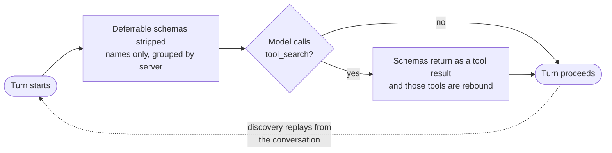

# External MCP Tools

## Connect external tool servers

Model Context Protocol (MCP) tools extend Mewbo with external tool servers. Any server that speaks
MCP plugs in through a config file, including file systems, databases, APIs, code execution
environments, and search engines. Its tools land in the registry alongside the built-in ones and
are available to every session.

> [!TIP] Compatible with Claude Code and VS Code
> Mewbo reads the same `.mcp.json` or `mcp.json` schema, and environment variable expansion follows
> the same `${VAR}` convention. An existing MCP config from another tool works unchanged. See the
> official [Model Context Protocol](https://modelcontextprotocol.io) specification.

## Configuring MCP servers

Servers are defined in `configs/mcp.json` at the repo root, or `$MEWBO_HOME/mcp.json` for a global
install.

```json title="configs/mcp.json"
{
  "servers": {
    "codex_tools": {
      "transport": "streamable_http",
      "url": "http://127.0.0.1:6783/mcp/Codex-Tools",
      "headers": {
        "Authorization": "Bearer ${MY_MCP_TOKEN}"
      }
    },
    "filesystem": {
      "transport": "stdio",
      "command": ["mcp-filesystem", "--root", "/home/user/projects"]
    }
  }
}
```

`${VAR_NAME}` and `$VAR_NAME` patterns are expanded from the process environment at load time. Both
`servers` and `mcpServers` are accepted as the top-level key, the second matching Claude Code and
VS Code.

## Supported transports

| Transport | Config keys | Use case |
|-----------|-----------|---------|
| `streamable_http` | `url`, `headers` | Remote HTTP servers (recommended for persistent services) |
| `http` | `url`, `headers` | Alias for `streamable_http`, accepted for compatibility |
| `stdio` | `command` | Local subprocess (binary on `PATH`) |

## Tool discovery

At session start Mewbo connects to each configured server, fetches its tool schema, and registers
the tools. Connections persist, so no request pays a reconnect cost.

## Deferred tool-schema loading (tool search)

Every MCP tool carries a JSON schema, and binding all of them to the model on **every** turn is
expensive. A fleet of MCP servers can add tens of thousands of tokens of tool definitions to each
request. Mewbo loads schemas only when they are needed.



Deferral covers MCP tool schemas and any tool explicitly marked deferrable. The names arrive in a
compact `<available-mcp-servers>` block, and the model fetches what it needs by calling the
built-in **`tool_search`** tool, either `select:tool_a,tool_b` for a direct fetch or keywords for a
fuzzy search. Replay is what makes the mechanism survive compaction.

The round trip happens on the client, since the schemas come back as a normal tool result. It works
through any LLM proxy and needs no provider support for tool reference blocks.

Configure it under `agent.tool_search` in `app.json`.

| `mode` | Behaviour |
|--------|-----------|
| `on` *(default)* | Always defer MCP / deferrable tools. No MCP tool occupies the context window until the model asks for it. |
| `auto` | Defer only when the number of deferrable tools exceeds `auto_threshold` (default `25`). |
| `off` | Never defer. Every schema is bound on turn one. |

```json title="configs/app.json"
{
  "agent": {
    "tool_search": { "mode": "on" }
  }
}
```

`on` costs a session with no MCP servers nothing. Deferral only engages when the deferrable set is
non empty, so `on` and `off` bind an identical list there.

`auto` differs only in the range 1 to `auto_threshold` tools, where it binds every schema verbatim
on every turn. The gate is a tool count, so adding or removing a server can move a deployment
across the cliff in either direction. That is why the adaptive mode is not the default.

`tool_search` is exempt from `allowed_tools` scoping, so even a tightly scoped sub-agent can still
reach its deferred tools. A model that cannot reliably issue a `tool_search` call sees no MCP tools
for that turn, which degrades rather than errors.

## Choosing which tools a session sees

- **Console.** The config menu has a tool selector for the current session.
- **API.** Pass `allowed_tools` in the session create payload or the query body.
- **CLI.** Run `/mcp select` to interactively pick servers and tools.

## Per-project MCP config

Drop a `.mcp.json` at your project root and its servers merge with the global `configs/mcp.json`
when a session starts inside that project. Files placed deeper in the tree scope their servers to
that subtree.

```json title=".mcp.json"
{
  "servers": {
    "project_db": {
      "transport": "stdio",
      "command": ["mcp-sqlite", "--db", "./dev.db"]
    }
  }
}
```

See [Project Configuration](project-configuration.md#project-level-mcp-configuration) for the full
merge reference.

## Troubleshooting

### "MCP server 'X' not found in config"

The session started without the project directory set, so the project-level `.mcp.json` was never
picked up. Check that the session has a valid `project` and that the path is mounted in Docker or
reachable on the host.

### Tool not available after a config change

Edits to `mcp.json` are picked up on the next session start. Restart the API to propagate a change
to every running session.

### Common error signatures

| Symptom | Cause |
|---------|-------|
| `ERROR: Connection refused` | Server URL unreachable or the process isn't running. |
| Tool schema validation error at startup | Server returned a schema Mewbo cannot parse; check server version compatibility. |
| `Tool 'X' not found on server 'Y' after reconnect` | The tool was removed from the server between sessions. |
| Session starts but MCP tools missing | An `allowed_tools` filter excluded them; check the console tool selector or the API payload. |

See also [Troubleshooting](troubleshooting.md) for the general debugging methodology.

---

> [!NOTE] How it works internally
> See [Architecture Overview → MCP connection pool](core-orchestration.md#mcp).
