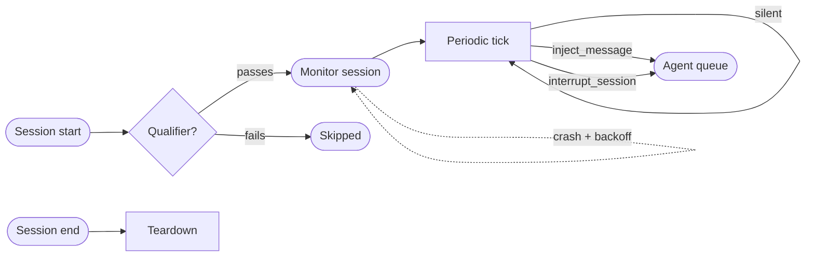

# Monitors

## Watch the entire agent tree



A monitor is a persistent observer that runs for the full lifetime of a root session. Where a [policy](features-policies.md) selects one tool call and checks it, a monitor evaluates the entire agent tree, root agent plus every sub-agent, at any point across the session's life. It can inject a message into the queue, interrupt the active agent with a directive, or terminate the session with a typed exception.

At each periodic tick the monitor receives a live snapshot of that tree, covering state, message history, token usage, and recent tool calls, and resolves to an action or to silence.

> [!TIP] Part of the agentic guardrail family
> Monitors complement [Policies](features-policies.md) and [Permissions & Hooks](features-permissions-hooks.md). Use a monitor for a session wide behavioral invariant such as budget enforcement, liveness, deadline compliance, or drift across agents. See [Monitors vs. policies](#monitors-vs-policies) for the full comparison.

---

## Writing a monitor

Create a file at `.claude/monitors/<name>.md`. It starts with a YAML frontmatter block, followed by the natural language body evaluated at each invocation.

```markdown title=".claude/monitors/<name>.md" linenums="1"
---
name: scope-enforcer
description: Interrupt and redirect the agent if it attempts actions outside the declared project scope.
qualifier: "Does this session involve file-system or code-modification tasks?"
interval: 8
allowed-tools: []
isTerminal: false
model: anthropic/claude-haiku-4-5
exception-structure:
  name: scope_violation
  description: Return only when the agent is acting outside its declared scope.
  parameters:
    type: object
    properties:
      violation: { type: string, description: "What the agent tried to do" }
      scope:     { type: string, description: "What the declared scope is" }
      message:   { type: string }
    required: [violation, scope, message]
---

You are a scope-enforcement monitor. Each invocation gives you a snapshot of
every active agent and its recent tool calls. If any agent invoked a tool
outside the project directory, call `scope_violation` describing what happened,
then `interrupt_session` with action `continue` and a redirect message.
Otherwise, return nothing.
```

The body must direct the monitor to return **nothing** when everything is within bounds. A monitor that fires on normal operation degrades every session it spawns in.

---

## Frontmatter reference

| Key | Type | Required | Default | Description |
|---|---|---|---|---|
| `name` | string | Yes | (required) | Lowercase, hyphens allowed (`^[a-z0-9][a-z0-9-]*$`). Must be unique across all discovery paths. |
| `description` | string | Yes | (required) | Short catalog description shown in the monitor list. |
| `qualifier` | string | No | (none) | Natural-language Boolean query evaluated **once at session start** via a cheap isolated classification call. Absent means the monitor always spawns. Present means it spawns only on `true`. Reevaluated on respawn. |
| `interval` | integer (seconds) | No | `5` | Minimum seconds between periodic invocations. The monitor is invoked once at session start and once at session end regardless. |
| `allowed-tools` | string or list | No | `[]` | Additional tool IDs (exact or regex) beyond the built-in `inject_message` and `interrupt_session`. **No file-read or file-write tools are included by default.** They are accessible only when listed here. |
| `exception-structure` | object | No | (none) | The typed exception tool the monitor calls when interrupting with termination. Same JSON-Schema format as [policy exception structures](features-policies.md#exception-structures). Required when `isTerminal: true`. |
| `isTerminal` | boolean | No | `false` | When `true`, `interrupt_session` with `action: terminate` ends the entire session and returns the structured exception as the terminal result. |
| `model` | string | No | configured monitor model | Model used at each periodic invocation. A fast, inexpensive model is the right choice. |
| `enabled` | boolean | No | `true` | Toggle the monitor without deleting the file. |
| `requires-capabilities` | string or list | No | `[]` | Capability gating: the monitor is invisible to sessions that do not advertise all listed capabilities. Same mechanism as [Skills → Capability gating](features-skills.md#capability-gating). |

---

## The qualifier: spawn-gating

A monitor is a full session running for the duration of the parent session, so an unconditional monitor carries ongoing token cost. The `qualifier` is how you stop paying it on sessions the monitor would never fire in.

At session start, before the first agent step, Mewbo runs a **cheap isolated classification call** for each monitor that declares one. The call receives the session's opening context, covering the initial task description, configured tools and agent type, plus the qualifier as a Boolean question. A `true` spawns the monitor. A `false` skips it for that session at zero further cost.

```yaml
qualifier: "Does this session involve making external API calls or network requests?"
```

On a respawn after a crash, the qualifier is reevaluated against the current agent tree snapshot rather than the original session context. A monitor without a qualifier always spawns.

---

## Monitor actions

A monitor session has exactly two tools by default. Anything else must be named in `allowed-tools`.

### inject_message

Appends a message to the active agent's incoming message queue. Delivery happens at the next turn boundary and never interrupts a tool call already in flight. Use it for a low urgency correction or for context that can wait a turn.

| Parameter | Type | Required | Description |
|---|---|---|---|
| `message` | string | Yes | The message to deliver to the agent. |
| `priority` | string | No | `"normal"` (default) or `"high"`. High-priority messages are prepended to the queue rather than appended. |

### interrupt_session

Signals the active agent to pause between its current and next tool step. Unlike `inject_message`, an interrupt takes effect at the very next step boundary, not at the next turn.

| Parameter | Type | Required | Description |
|---|---|---|---|
| `action` | string | Yes | `"continue"` suspends, delivers the message, and resumes. `"terminate"` ends the session with the structured exception. |
| `message` | string | Yes | The directive to deliver. On `continue`, injected at high priority before the agent resumes. On `terminate`, included in the terminal output alongside the exception. |
| `exception` | object | Conditionally | Required when `action: terminate`. Must conform to the `exception-structure` schema declared in the frontmatter. |

---

## Persistence and respawn

A monitor must not permanently exit before the root session ends, and Mewbo enforces that.

When a monitor session reaches a terminal state, whether a crash, an LLM error, a timeout, or an unexpected completion, session lifecycle hooks surface it. After a configurable backoff, 2 seconds by default, a **new monitor session** spawns with the same frontmatter config and a current agent tree snapshot. Every monitor is torn down in the `on_session_end` cleanup pass when the root session terminates.

---

## How monitors work

Mewbo scans every `MONITOR.md` file from all discovery paths after the `on_session_start` hook fires, then spawns the monitors that qualify. Each is an **independent session** on the same substrate as sub-agents, and its periodic invocation loop runs until the root session ends.

The tool restriction is enforced at the tool registry level, before the monitor's session is constructed, so a call to anything outside `inject_message`, `interrupt_session` and `allowed-tools` fails immediately with a permission error. [Architecture Overview → Monitors](core-orchestration.md#monitors) covers the hypervisor side.

---

## Exception structures and terminal monitors

A monitor's `exception-structure` uses the same format as a [policy's](features-policies.md#exception-structures).

When `isTerminal: true` and the monitor calls `interrupt_session(action: terminate, exception: {...})`, the session ends immediately and the exception object becomes the terminal output. A caller cannot distinguish that from a normal structured output response with a typed error schema. That is what lets a budget or an SLA be enforced across a whole session behind a structured endpoint.

---

## Monitors vs. policies

Both share the `exception-structure` format and `isTerminal` semantics. They differ in scope, lifetime, trigger, and the kind of check each runs.

| | Policies | Monitors |
|---|---|---|
| **Scope** | One tool call at a time | Full session, all agents |
| **Lifetime** | Milliseconds (one gate-check per matching call) | Full root session lifetime |
| **Trigger** | Tool ID matches greylist | Periodic tick |
| **Context** | Single resolved tool call + coerced arguments | Full agent-tree snapshot (state, history, token usage) |
| **Action** | Block call / terminate session | Inject message / interrupt + continue / interrupt + terminate |
| **Spawn cost** | Zero unless a greylisted tool is called | One session per monitor (qualifier gates this) |
| **Best for** | Semantic argument validation on specific tools | Session-wide trajectory, budget, liveness, cross-agent drift |

---

## Where monitors live

Monitors are discovered from these directories.

| Path | Scope | Priority |
|---|---|---|
| `~/.claude/monitors/<name>.md` | User-global (all projects) | Lowest |
| `.claude/monitors/<name>.md` | Project-local (CWD) | Overrides personal |

Plugins can ship monitors. A plugin's monitor never overrides a personal or project local monitor with the same name, and it follows the same `requires-capabilities` gating as skills, agents, and policies.

---

## REST API

Every frontmatter field except `name` and the monitor body is controllable over REST. A monitor registered against a running session spawns immediately.

```http
GET    /v1/monitors               # List monitors and their live state for the current session
GET    /v1/monitors/{name}        # Read config + current invocation state + last action taken
POST   /v1/monitors               # Register a monitor from a JSON payload
PUT    /v1/monitors/{name}        # Update config fields (unset fields keep their defaults)
DELETE /v1/monitors/{name}        # Deactivate and tear down the running monitor session
POST   /v1/monitors/{name}/pause  # Pause periodic invocation without deactivating
POST   /v1/monitors/{name}/resume # Resume a paused monitor
```

REST monitors and file monitors share one registry. A REST monitor overrides a file based one of the same name and takes precedence until deleted.

---

## Configuration

Monitor defaults live under `monitor` in `configs/app.json`.

| Key | Type | Default | Description |
|---|---|---|---|
| `monitor.enabled` | boolean | `true` | Global enable/disable for all monitors. |
| `monitor.default_model` | string | session model | Default model when a monitor does not set `model`. |
| `monitor.default_interval` | integer | `5` | Default interval in seconds when a monitor does not set `interval`. |
| `monitor.llm_call_timeout` | float | `30.0` | Per-invocation timeout in seconds. On timeout the current invocation is skipped; the monitor continues at the next interval. |
| `monitor.respawn_backoff` | float | `2.0` | Seconds to wait before respawning a crashed monitor. |
| `monitor.qualifier_timeout` | float | `5.0` | Timeout for the qualifier classification call. On timeout, the monitor spawns (fail-open). |

---

## Hot-reload

Mewbo picks up changes to monitor files automatically, applying them on the **next monitor respawn**. A running monitor finishes its current invocation with the prior config first. To reload without waiting for the respawn cycle, call `DELETE /v1/monitors/{name}` then `POST /v1/monitors/{name}`, or add and remove `enabled: false` in the frontmatter.

---

> [!NOTE] How it works internally
> Each monitor is a restricted [ToolUseLoop](repo:packages/mewbo_core/src/mewbo_core/loop/tool_use_loop.py) session tracked by [AgentHypervisor](repo:packages/mewbo_core/src/mewbo_core/agents/hypervisor.py) as a peer of regular sub-agents, on the same [AgentHandle](repo:packages/mewbo_core/src/mewbo_core/agents/hypervisor.py) lifecycle from submitted to running to terminal. `inject_message` routes through `AgentHypervisor.send_message()`. `interrupt_session` sets a checked signal on the target loop's step boundary. See [Architecture Overview → Monitors](core-orchestration.md#monitors).
