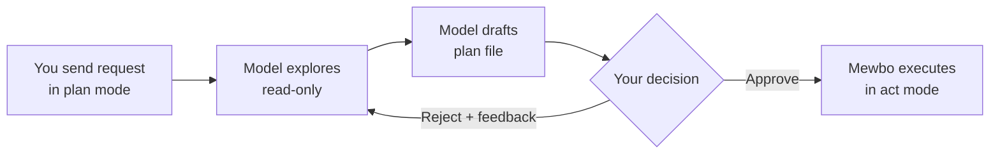

# Plan Mode

## Approve the plan first

<div style="display: flex; justify-content: center;">
  
</div>

Mewbo runs in **act mode** by default, so each tool call executes as soon as the model generates it. That fits quick, low risk work. Switch to **plan mode** for anything destructive, complex or unfamiliar. Plan mode explores your workspace with read only tools, drafts a plan to a file scoped to the session, and pauses for your approval before any write or shell command runs. It puts a checkpoint between the request and the first change to your files.

**Quick example.** Switch the CLI to plan mode.

```
/mode plan
```

Then send your request. Accept the plan in the CLI's approval prompt, type `/continue`, or click Approve in the console.

---

## Switching modes

Mode is state held per session, and it resets to `act` when you start a new session. Change it from the CLI, the web console or the REST API.

### CLI

```
/mode act      # default; tools run immediately
/mode plan     # explore then wait for approval
```

Running `/mode` on its own prints the current mode.

### Console

The **ConfigMenu**, the gear icon in the input bar, carries an **Act / Plan** toggle. It takes effect on the next query in the current session.

### REST API

Pass `mode` in the query body.

```json
POST /api/sessions/{session_id}/query
{
  "query": "Refactor the auth module",
  "mode": "plan"
}
```

---

## How the approval flow looks

A plan mode turn has three phases.

1. **Exploration.** The model reads files, lists directories and runs read only shell commands. Write tools are blocked, so nothing on disk changes.
2. **Proposal.** The plan is drafted to a scratch file scoped to the session, readable from the console or the session directory. The CLI and the console then show it and wait.
3. **Decision.** On approval Mewbo switches to act mode and carries the plan out. On rejection you can add written feedback, which the model receives as context for a revised plan.



Approval is **episodic**. Your decision is recorded in the session transcript and survives a restart, so quitting between the draft and the execution step still resumes cleanly. Revisions are tracked too, and a second draft after rejection stays distinct from the first.

---

## Shell commands during exploration

Plan mode enforces a **shell allowlist** so exploration stays read only. Only commands whose first word matches a configured prefix run. Anything carrying a dangerous operator such as `|`, `>`, `$`, or command substitution is rejected outright, regardless of the allowlist. That second check is independent of the first, so a permitted command chained into something destructive is still blocked by the operator filter.

The default allowlist covers common read only tools such as `ls`, `cat`, `grep`, `rg`, `find`, `git status`, `git log`, `git diff` and `git show`. Prefix matches are word boundary safe, so `git log` matches `git log --oneline` but not `git logger`. Customise the list with `agent.plan_mode_shell_allowlist`, or set it to `[]` to block shell access in plan mode entirely.

MCP tools are always permitted during exploration. Mewbo cannot classify a third party MCP tool's effect, so plan mode does not filter them by mode.

---

## Recovery: /retry and /continue

Both commands recover a failed or stalled session without starting fresh. They are available in the CLI and as per message buttons in the web console.

### /retry

`/retry` replays the last user turn from a clean slate. Mewbo removes the failed exchange from the transcript and resubmits your original query, so the model never sees the failure. Reach for it after wrong tool calls or a transient error, where a clean rerun is likely to succeed.

### /continue

`/continue` keeps the failed state in the transcript and appends a prompt to pick up from where the turn stopped. The model sees what already happened and does not repeat completed work. Reach for it when partial work succeeded and only the tail failed.

---

## Configuration

`agent.plan_mode_shell_allowlist` sets the exploration allowlist and `agent.edit_tool` overrides the file editing mechanism. Both are documented in [Configuration → Agent](configuration.md#agent), along with the rest of the `agent` section.

> [!NOTE] How it works internally
> See [Architecture Overview → Plan mode signals](core-orchestration.md#plan-mode).
