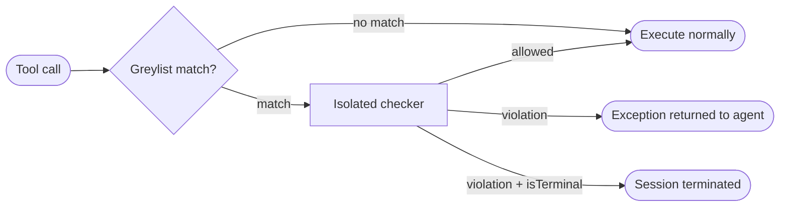

# Policies

## Block calls that break a rule



A policy is a natural language guardrail that intercepts a tool call before it executes. You describe what counts as a violation in plain English, and Mewbo runs an isolated LLM check against that description each time a greylisted tool is about to fire. On a violation Mewbo blocks the call and returns a **structured exception** to the agent in place of the tool result.

Policies sit on the semantic layer above `allowed-tools` and `denied-tools`. Those are binary lists. A policy selects a call and evaluates its *content*, such as amounts, targets, user intent and argument shape, against a natural language rule, and it does so for any tool from any MCP server.

> [!TIP] Part of the agentic guardrail family
> Policies complement [Plan Mode](features-plan-mode.md), which gates edits by path, and [Permissions & Hooks](features-permissions-hooks.md), which set structural allow or deny rules and lifecycle hooks. For a guardrail that watches the full session across many steps and many agents, see [Monitors](features-monitors.md).

---

## Writing a policy

Create a file at `.claude/policies/<name>.md`. It starts with a YAML frontmatter block, followed by the natural language body that tells the isolated checker what counts as a violation.

```markdown title=".claude/policies/<name>.md" linenums="1"
---
name: no-destructive-deletes
description: Block file or database deletion calls that target paths outside the project sandbox.
greylisted-tools:
  - delete_file
  - mcp__fs__.*
  - mcp__database__drop_.*
isTerminal: false
model: anthropic/claude-haiku-4-5
exception-structure:
  name: policy_violation
  description: Return ONLY when a deletion is out of sandbox.
  parameters:
    type: object
    properties:
      code:    { type: string, enum: [out_of_sandbox, destructive_db_drop] }
      message: { type: string, description: Operator-facing reason the call was blocked. }
    required: [code, message]
---

Block any file-deletion tool call whose target path is not inside `/home/user/project/`.
Block any database tool call that would drop or truncate a table.
If the call is within policy, return nothing.
Otherwise call `policy_violation` with a `code` and a clear `message`.
```

The body must direct the checker to call the exception tool **only on a violation** and to return **nothing** on a clean call. An exception that fires on an allowed call blocks legitimate tool use.

---

## Frontmatter reference

| Key | Type | Required | Default | Description |
|---|---|---|---|---|
| `name` | string | Yes | (required) | Lowercase, hyphens allowed (`^[a-z0-9][a-z0-9-]*$`). Must be unique across all discovery paths. |
| `description` | string | Yes | (required) | Short catalog description used for REST-based discovery and the policy list. |
| `greylisted-tools` | string or list | Yes | (required) | Tool IDs that trigger this policy. See [Greylist matching](#greylist-matching). Same ID namespace as `allowed-tools`. |
| `exception-structure` | object | Yes | (required) | The structured-exception tool the isolated checker may call on violation: `name`, `description`, and a JSON-Schema `parameters` block. This is the only tool available to the checker. |
| `isTerminal` | boolean | No | `false` | When `true`, a violation **terminates the entire session** and returns the structured exception as the terminal result. When `false`, only the matching tool call is blocked and the exception is returned to the agent in-place. |
| `model` | string | No | configured policy model | Model for the isolated checker invocation. A fast, inexpensive model is the right choice. |
| `enabled` | boolean | No | `true` | Toggle the policy on or off without deleting the file. |
| `requires-capabilities` | string or list | No | `[]` | Capability gating: the policy is invisible to sessions that do not advertise all listed capabilities. Same mechanism as [Skills → Capability gating](features-skills.md#capability-gating). |

---

## Greylist matching

Each entry is matched as a regex against the **resolved tool ID**, the full namespaced identifier Mewbo uses after MCP resolution. An exact tool name is a degenerate regex that matches only itself.

```yaml
greylisted-tools:
  - issue_refund              # exact match on a built-in tool
  - mcp__payments__.*         # all tools from the 'payments' MCP server
  - mcp__fs__(delete|unlink)  # two specific operations on the 'fs' server
```

Greylists are evaluated per tool call. Every active policy matching that call runs in parallel. A violation by any one blocks the call, and a terminal violation by any one terminates the session.

---

## The gate-check: how a policy runs

Policies hook into the tool use loop at the gate before execution. That gate sits after MCP input coercion and the permission check, and before the `pre_tool_use` hook fires and the tool itself executes. This is the fixed order for every tool call.

A greylist match starts an **isolated LLM invocation**. It is a single turn call carrying the policy body, the resolved tool call with its coerced arguments, and the exception-structure tool as the only callable tool. The checker has no access to the agent's conversation history and can call nothing else.

The checker returns one of two things. **Nothing** means the policy holds and the call proceeds. **A call to the exception-structure tool** means it was violated. The original call is blocked and the exception is injected into the agent's message history as a tool error result, so the agent can work around the block on its next turn. Under `isTerminal: true` the session instead ends immediately with that exception as its terminal output.

---

## Exception structures

The `exception-structure` key follows the same JSON Schema tool definition format used throughout Mewbo.

```yaml
exception-structure:
  name: refund_blocked
  description: Return only when a refund violates policy. Include the reason and the amount.
  parameters:
    type: object
    properties:
      code:    { type: string, enum: [over_ceiling, no_matching_order, unauthorized_scope] }
      message: { type: string }
      amount:  { type: number }
    required: [code, message]
```

The exception object reaches the agent verbatim in the tool result slot. Keep `code` values machine readable and stable across policy updates so an agent can match on them.

---

## Terminal violations

A terminal violation does not just block the call. It ends the session, and the structured exception becomes the session's final result, delivered through the same terminal result path as a structured output response.

That fits **structured output endpoints** such as [/v1/structured](endpoint:POST /v1/structured), where a request must produce a valid structured response or fail cleanly with a typed exception. Naming a policy in a structured request activates it for that call.

```http
POST /v1/structured
Content-Type: application/json

{
  "prompt": "Issue a refund for order #1234",
  "schema": { ... },
  "policies": ["no-refunds-over-policy"]
}
```

If the named policy fires, the endpoint returns the structured exception in the response body rather than the schema output. Either path gives the caller a typed, parseable result.

---

## Where policies live

Policies are discovered from these directories.

| Path | Scope | Priority |
|---|---|---|
| `~/.claude/policies/<name>.md` | User-global (all projects) | Lowest |
| `.claude/policies/<name>.md` | Project-local (CWD) | Overrides personal |

Plugins can ship policies. A plugin's policy never overrides a personal or project local policy with the same name, and it follows the same `requires-capabilities` gating as skills and agents.

---

## REST API

Every frontmatter field except `name` and the policy body is controllable over REST, so you can activate, tune or disable a policy from code without touching a file on disk.

```http
GET    /v1/policies               # List all active policies and their resolved config
GET    /v1/policies/{name}        # Read the resolved config for a specific policy
POST   /v1/policies               # Register a policy from a JSON payload
PUT    /v1/policies/{name}        # Update config fields (unset fields keep their defaults)
DELETE /v1/policies/{name}        # Remove a REST-registered policy
```

REST policies and file policies share one registry and one greylist matching pipeline. A REST override of a file based policy takes precedence until deleted.

---

## Configuration

Policy check defaults live under `policy` in `configs/app.json`.

| Key | Type | Default | Description |
|---|---|---|---|
| `policy.enabled` | boolean | `true` | Global enable/disable for all policy gate-checks. |
| `policy.default_model` | string | session model | Default checker model when a policy does not set `model`. |
| `policy.llm_call_timeout` | float | `15.0` | Per-check timeout in seconds. On timeout: fail-closed for `isTerminal: true` policies; fail-open for non-terminal ones. |
| `policy.cache_verdicts` | boolean | `true` | Cache identical (policy, tool, args) verdicts within a session to avoid redundant checker calls. |
| `policy.fail_open` | boolean | `false` | When `true`, checker errors on non-terminal policies resolve as "no violation" rather than blocking the call. Has no effect on terminal policies, which always fail-closed. |

---

## Hot-reload

Mewbo picks up a changed policy file automatically, with no restart. The new version applies to the next matching tool call. A check already in flight finishes with the prior version.

---

> [!NOTE] How it works internally
> The gate is `ToolUseLoop._execute_tool_call()` in [packages/mewbo_core/src/mewbo_core/tool_use_loop.py](repo:packages/mewbo_core/src/mewbo_core/loop/tool_use_loop.py), before `run_pre_tool_use`. The isolated checker is a minimal single turn LiteLLM call, not a full ToolUseLoop session, bound to the exception-structure tool only. See [Architecture Overview → Policies](core-orchestration.md#policies).
