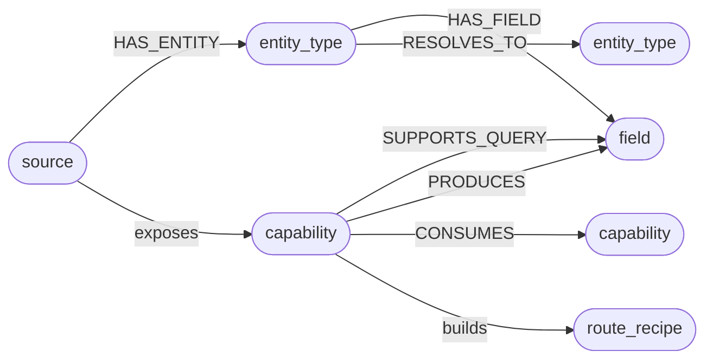

# The Source Capability Graph

## Route a query to a source

The **Source Capability Graph** is a reachability index of what each connected source *can answer*,
built from its schemas and tool definitions. No credentials and no record values enter it. Its only
job is to route a query before any data is fetched.

`SCG` is the short form. It is the routing engine behind [Agentic Search](features-search.md).

---

## What the graph contains

**Nodes**

| Node | What it represents |
|---|---|
| `source` | A connected MCP server or API |
| `entity_type` | A schema type the source exposes, such as a Jira Issue or a database table |
| `field` | A property on an entity type |
| `capability` | An executable operation: an MCP tool, an OpenAPI endpoint, a database procedure |
| `route_recipe` | A precomputed pathway through capabilities, answering a class of question |

**Edges**

| Edge | Meaning |
|---|---|
| `HAS_ENTITY` | Source exposes this schema type |
| `HAS_FIELD` | Entity type has this field |
| `SUPPORTS_QUERY` | Capability accepts this field as input |
| `PRODUCES` | Capability returns this field |
| `CONSUMES` | Capability chains into another, output matching input |
| `RESOLVES_TO` | Two entity types from different sources describe one concept |

Node identities are content addressed as `sha1(source_key | node_kind)[:16]`, so re-indexing produces
the same IDs.

---

## How a source is indexed

Adding a source triggers a map pipeline of five phases.

1. **Connect.** Resolve and authenticate the connector descriptor.
2. **Introspect.** Fetch the raw schema, from an OpenAPI document, an MCP tool list or SQL.
3. **Parse.** Emit capability, entity type and field nodes with their edges. An OpenAPI source gives
   one capability node per `operationId`, an MCP tool list one per tool.
4. **Link.** Run [TypeAligner](repo:packages/mewbo_graph/src/mewbo_graph/scg/entity_resolution.py)
   across all sources, emitting weighted `RESOLVES_TO` edges where schema types
   correspond. → [Cross-source type alignment](#cross-source-type-alignment)
5. **Finalize.** Embed every node with the model the Agentic Wiki uses, then compute `CONSUMES` edges
   by matching output field names to input field names across sources.

The embedding step is best effort. With no backend configured, the SCG routes on graph structure
alone.

---

## How queries are routed

Routing happens inside `scg_route` and calls no LLM at all.

1. Embed the query with the model used at index time
2. Run a cosine ANN over every stored capability and entity type embedding
3. Expand one hop along all edge types, outbound and reverse
4. Score each candidate as `cosine_similarity(query, node) + edge_weight`
5. Return the top-k ranked `RouteRecipe` objects, each an ordered sequence of source steps

Each RouteRecipe becomes the brief for one probe agent, granted only the tools its recipe lists, so
unrelated sources are out of reach. The coordinating agent collects the results via `check_agents`
and synthesises one cited answer.

> [!NOTE] Scale path
> The cosine pass is brute force, with a documented upgrade seam to Personalised PageRank at scale.
> The calling interface does not change. Only the ranking kernel is swapped.

---

## Reading the graph directly: `scg_observe`

`scg_route` ranks entry points and `scg_observe` walks out from them. Given a node reference it
returns that node's typed neighbourhood: the edges with their kind, direction and weight, the recipes
passing through, and any memory notes anchored there. The next hop comes from the agent, not a second
ranking engine.

A large node answers in two stages. An unfiltered read returns a survey of the distinct edge and
neighbour kinds with counts. A second call adds an `edge_kinds` filter.

Observation is read only and scoped, so an agent bound to a workspace never observes a hop into a
source that workspace did not enable.

---

## Cross-source type alignment

At map time `TypeAligner` compares entity type nodes across sources and emits weighted `RESOLVES_TO`
edges.

| Field-name Jaccard overlap | Behaviour |
|---|---|
| ≥ 0.6 (confident) | Edge emitted on heuristic alone |
| 0.15–0.6 (ambiguous) | One LLM call adjudicates; edge emitted only on affirmation |
| < 0.15 | Abstain; no edge emitted |

/// table-caption
How field-name overlap decides whether a `RESOLVES_TO` edge is emitted.
///

An exact name match between the two entity types adds a `+0.2` bonus on top of the Jaccard score.

A `RESOLVES_TO` edge is a weighted hypothesis, not a hard join. The router uses it to widen probe
scope across sources describing one concept.

---

## Entity resolution across sources

[TypeAligner](repo:packages/mewbo_graph/src/mewbo_graph/scg/entity_resolution.py) settles schema
correspondences at map time. A deeper step runs at query time. [ScgAnchorResolver](repo:packages/mewbo_graph/src/mewbo_graph/scg/memory_bridge.py) implements
the wiki's [StructureProvider](repo:packages/mewbo_graph/src/mewbo_graph/wiki/structure_provider.py)
protocol, so every capability and entity type node joins the
[ResolutionLadder](repo:packages/mewbo_graph/src/mewbo_graph/entities/resolver.py) the Agentic Wiki
uses on code symbols.

So a search for `who is responsible for the billing service` never matches on the string
`responsible`. It resolves to an abstract `owner` concept, surfacing as `assignee`, `maintainer` or
`responsible_team` depending on the source. That is how one query reaches both Jira and Linear with
no manual configuration.

Recipes are built from those concepts rather than raw fields, so one works across every tracker in
the workspace.

---

## The shared multiplex graph

The SCG is a tenant of the same multiplex graph behind the
[Agentic Wiki](features-wiki-graph.md). A project in both writes to one store.

| Layer | What search stores here | What the wiki stores here |
|---|---|---|
| **Schema** | Capability, entity-type and field nodes per source | AST symbols, imports and call graphs |
| **Entity** | Concepts resolved across sources via `ScgAnchorResolver` | Named entities from GraphRAG enrichment |
| **Memory** | Reachability facts from each search run | Q&A findings from `QaMemoryDepositor` |

/// table-caption
What each product writes into each layer.
///

So a Q&A finding such as `the orders module owns all purchase state` can surface during a search
about purchase flows, and a search finding can inform a later wiki answer.

Before each query the top ranked memory notes go to `scg_route` by vector search, biasing routing
toward pathways that produced results and away from known dead ends.

---

## The graph follows you into ordinary chat

The SCG is not confined to search. Once `scg.enabled` is on and one source is mapped, every session
gets `scg_route`, `scg_observe` and `scg_memory`, across the CLI, console chat and channels. Mapping
the first source flips a live process, so no restart is needed.

The intended loop is **route, observe, act, deposit**. An agent routes to find entry pathways,
observes the typed hops around them, acts with the tools it holds, then deposits what came back.
Each deposit carries a polarity. `positive` boosts that pathway in future routing, `dead_end` damps
it.

A search run reads only its workspace's sources, while a plain chat session reads the whole graph.
Deposits are labelled `ws:<id>` or `session:<id>` accordingly, and both feed the one memory layer
every future run draws on.
