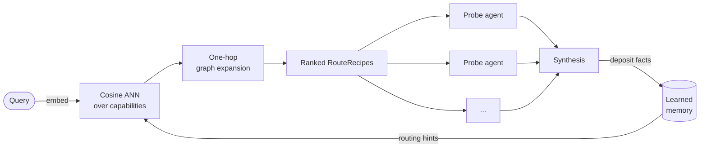

# The Source Capability Graph

The **Source Capability Graph (SCG)** is a reachability index: a graph of what each connected source *can answer*, built from its schemas and tool definitions. No credentials or record values enter the graph. It exists solely to route queries to the right capabilities before any data is fetched. It is the routing engine behind [Agentic Search](features-search.md).

---

## What the graph contains

The SCG has five node types and six edge types.

**Nodes:**

| Node | What it represents |
|---|---|
| `source` | A connected MCP server or API |
| `entity_type` | A schema type the source exposes (Jira Issue, Linear Ticket, database table) |
| `field` | An individual property on an entity type |
| `capability` | An executable operation: an MCP tool, an OpenAPI endpoint, a database procedure |
| `route_recipe` | A precomputed, ordered pathway through one or more capabilities that can answer a class of question |

**Edges:**

| Edge | Meaning |
|---|---|
| `HAS_ENTITY` | Source exposes this schema type |
| `HAS_FIELD` | Entity type has this field |
| `SUPPORTS_QUERY` | Capability accepts this field as input |
| `PRODUCES` | Capability returns this field in its output |
| `CONSUMES` | Capability chains into another (producer output matches consumer input) |
| `RESOLVES_TO` | Two entity types from different sources describe the same concept |

Node identities are content-addressed: `sha1(source_key | node_kind)[:16]`. Re-indexing a source produces stable, idempotent IDs.

---

## How a source is indexed

Adding a source triggers a five-phase map pipeline:

1. **Connect**: resolve and authenticate the connector descriptor
2. **Introspect**: fetch the raw schema: OpenAPI document, MCP tool list, or SQL introspection
3. **Parse**: dispatch to the provider to emit capability nodes, entity-type nodes, field nodes, and their edges. An OpenAPI source produces one capability node per `operationId`; an MCP tool list produces one capability node per tool.
4. **Link**: run [TypeAligner](repo:packages/mewbo_graph/src/mewbo_graph/scg/entity_resolution.py) across all sources to emit weighted `RESOLVES_TO` edges where schema types correspond (see [Cross-source type alignment](#cross-source-type-alignment) below)
5. **Finalize**: embed every node with the same LiteLLM-backed embedding model used by the Agentic Wiki; compute `CONSUMES` edges by matching capability output field names to input field names across sources

The embedding step is best-effort. If no embedding backend is configured the SCG routes queries on graph structure alone.

---

## How queries are routed

Query routing is a **zero-LLM operation** inside `scg_route`:

1. Embed the query with the same model used at index time
2. Run a brute-force cosine ANN over all stored capability and entity-type embeddings
3. Expand one hop along all edge types in both directions (outbound + one-hop reverse lookup)
4. Score each candidate: `cosine_similarity(query, node) + edge_weight`
5. Return the top-k ranked `RouteRecipe` objects, each an ordered sequence of source steps

Each RouteRecipe becomes the brief for one probe agent. The probe is granted only the tools listed in its recipe, so it cannot wander to unrelated sources. The coordinating agent collects all probe results via `check_agents`, then synthesises them into one cited answer.

> [!NOTE] Scale path
> The current brute-force cosine pass is designed with a documented upgrade seam to Personalised PageRank at scale. The calling interface does not change; only the ranking kernel is swapped in.

---

## Reading the graph directly: `scg_observe`

`scg_route` ranks entry points. `scg_observe` lets the agent walk from them. Given one or more node references, it returns each node's typed neighbourhood: its edges with kind, direction, and weight, compact neighbour cards, the route recipes that pass through it, and any learned memory notes anchored to it. The typed edges (`SUPPORTS_QUERY`, `PRODUCES`, `CONSUMES`, `RESOLVES_TO`) carry the routing meaning, so deciding where to step next is the agent's own reasoning, not a second ranking engine.

Large nodes answer in two stages. An unfiltered read of a high-degree node returns a survey first: the distinct edge and neighbour kinds with counts. The agent then re-calls with an `edge_kinds` filter for the instances it actually wants. Observation is read-only and scope-filtered. A workspace-bound agent never observes a hop into a source the workspace did not enable, and because it can't change anything, several nodes can be observed in parallel.

---

## Cross-source type alignment

At map time, `TypeAligner` compares entity-type nodes across sources and emits weighted `RESOLVES_TO` edges. Alignment is heuristic-first, LLM-assisted only in the ambiguous band:

| Field-name Jaccard overlap | Behaviour |
|---|---|
| ≥ 0.6 (confident) | Edge emitted on heuristic alone |
| 0.15–0.6 (ambiguous) | One LLM call adjudicates; edge emitted only on affirmation |
| < 0.15 | Abstain; no edge emitted |

The Jaccard score compares field names between two entity types. An exact name match between the two entity types adds a +0.2 bonus on top. `RESOLVES_TO` edges are weighted hypotheses, not hard joins. The router uses them to widen the probe scope across sources that describe the same concept. The correspondence is probabilistic, not a hard join.

This is what lets a query about task ownership route to both Jira and Linear without any manual configuration, because their `assignee` fields overlap above the confidence threshold.

---

## Entity resolution across sources

[TypeAligner](repo:packages/mewbo_graph/src/mewbo_graph/scg/entity_resolution.py) establishes probabilistic schema correspondences at map time. At query time, a second, deeper resolution step runs: [ScgAnchorResolver](repo:packages/mewbo_graph/src/mewbo_graph/scg/memory_bridge.py) implements the wiki's [StructureProvider](repo:packages/mewbo_graph/src/mewbo_graph/wiki/structure_provider.py) protocol, making every capability node and entity-type node in the SCG a participant in the same [ResolutionLadder](repo:packages/mewbo_graph/src/mewbo_graph/entities/resolver.py) used by the Agentic Wiki to resolve code symbols into named concepts.

In practice this means three things for your consumers:

- A search over "who is responsible for the billing service" does not pattern-match on the string "responsible." It resolves through the entity layer to the abstract `owner` concept, which may surface as `assignee`, `maintainer`, `responsible_team`, or `owner` depending on the source. Entity resolution finds all of them.
- "Jira Issue" and "Linear Ticket" are not just similar by field-name overlap. Once `TypeAligner` emits a `RESOLVES_TO` edge and the entity layer anchors both to the same abstract concept, queries that touch either source automatically reach both, without the probe having to enumerate individual field names.
- Route recipes are assembled from resolved entity concepts, not raw schema fields. A recipe for "find open issues assigned to a user" works across any tracker connected to the workspace, not just the one it was built from.

---

## The shared multiplex graph

The SCG does not operate as an isolated reachability index. It is a tenant of the same three-layer multiplex graph that powers the Agentic Wiki (see [The Knowledge Graph](features-wiki-graph.md)), each layer holding different knowledge, all stored in one place and queryable together.

| Layer | What search stores here | What the wiki stores here |
|---|---|---|
| **Schema** | Capability nodes, entity-type nodes, and field nodes for all connected sources | AST symbols, imports, and call graphs from indexed codebases |
| **Entity** | Abstract concepts resolved across sources via `ScgAnchorResolver` | Named entities extracted by GraphRAG enrichment (services, modules, owners) |
| **Memory** | Reachability facts deposited after each search run, anchored to capability and entity-type nodes | Q&A findings deposited by `QaMemoryDepositor`, anchored to code symbols |

When a project is both wiki-indexed and part of a search workspace, the memory layers share the same store. A Q&A session that discovers "the `orders` module owns all purchase state" can surface during a search about purchase flows. A search run that discovers "the `catalog-api` server only returns published items by default" can inform a subsequent wiki answer about catalog data. The layers cross-pollinate without any explicit wiring.

Before each query, the top-k relevant memory notes are retrieved via vector search and surfaced to `scg_route`, biasing routing toward pathways that have produced results and away from dead ends already discovered. The memory layer grows with use. No manual curation is required.

---

## The graph follows you into ordinary chat

The SCG is not search-only. Once `scg.enabled` is on and at least one source is mapped, every ordinary Mewbo session (CLI, console chat, channels) gets three graph tools: `scg_route`, `scg_observe`, and `scg_memory`. There is nothing extra to configure. Mapping the first source flips a live process; no restart is needed.

The intended loop is **route, observe, act, deposit**. The agent routes to find entry pathways, observes the typed hops around them, acts with the connector tools it already has, then deposits what it learned through `scg_memory` so the next task starts ahead. Each deposit carries a polarity: `positive` boosts that pathway in future routing, `dead_end` damps it.

Scope differs by session kind. A workspace-bound search run reads only its workspace's sources. A plain chat session is unscoped and reads the whole graph. Deposits are attributed accordingly: workspace runs label theirs `ws:<id>`, plain sessions label theirs `session:<id>`, and both feed the same shared memory layer every future run draws on.
