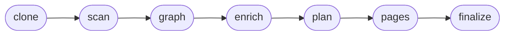

# Indexing &amp; Generation

## Turn a repo into a wiki

Generating a wiki is a normal Mewbo session, not a separate service. One agent owns the run, persists
state as it goes, and streams progress to the console.

> [!IMPORTANT] Install the wiki extra first
> Indexing needs the wiki extra installed and the API server
> running. → [Enabling it](features-wiki.md#enabling-it)

<figure><figcaption>Step 1, Source: pick the repository and auto-detect its host</figcaption></figure>

<figure><figcaption>Step 2, Generation: depth, language, and authoring model</figcaption></figure>

<figure><figcaption>Step 3, Scope: exclude noise, or index only a focused subset</figcaption></figure>

<figure><figcaption>The run: live progress through clone, scan, graph, enrich, and finalize</figcaption></figure>

---

## The indexing pipeline

A run is a fixed pipeline of seven phases.

1. **Clone.** Fetch the repository, with the wizard's access token for a private one.
2. **Scan.** Read every source file.
3. **Graph.** Parse each file's AST with tree-sitter, then lift files, classes, functions, methods
   and interfaces into nodes linked by their call, import and definition edges.
4. **Enrich.** Extract the abstract entity
   layer. → [The Knowledge Graph](features-wiki-graph.md)
5. **Plan.** Choose the pages to write.
6. **Pages.** Sub-agents write them in parallel, grounded in the scanned
   source. → [Sub-agents](features-agents.md)
7. **Finalize.** Dedupe, attach the repository description and publish.

The landing card and the indexing screen read one progress signal, so they never disagree about which
phase a run is in. The run also deposits anchored facts about each subsystem into the
memory. → [The memory grows as the wiki is used](features-wiki-graph.md#the-memory-grows-as-the-wiki-is-used)

---

## Supported languages

| Language | File extensions |
|---|---|
| Python | `.py` |
| JavaScript | `.js`, `.jsx` |
| TypeScript | `.ts`, `.tsx` |
| Go | `.go` |
| Rust | `.rs` |
| Kotlin | `.kt` |
| Java | `.java` |

/// table-caption
The languages the graph phase parses with tree-sitter. Only these reach the structural
layer.
///

A file in any other language is still scanned and read, but it adds no nodes to the code graph.
Markdown is the common case. A `README` seeds the entity layer, so the concepts it names become
entities with no structural node behind them.

---

## Tailor the index first

The wizard's three steps are shown above. What the screenshots do not say:

- The host is detected across GitHub, GitLab, Gitea, Bitbucket, Azure DevOps and any generic Git URL.
  A private repo takes an access token that is held only for the session.
- Depth is **Comprehensive** for the repository in full or **Concise** for a fast tour.
- Lockfiles, build output and vendored code are excluded by default. Switch to *Include only* to
  index a focused subset instead.

> [!TIP] Resilient to model changes
> If the model assigned to a run becomes unavailable, Mewbo switches to the next model on its
> fallback ladder and continues from the last checkpoint, logging the switch and its reason. A long
> run finishes even when individual models go dark.

---

## Re-index on demand

When a repository changes, **Re-index this wiki** refreshes it **on demand**, recomputing only the
pages, notes and graph nodes the change touched. It does not rebuild everything. A stale note is
retired rather than silently kept.

> [!NOTE] Ground the output with repo notes
> If the repository contains a `.mewbo/wiki.json` file, the indexer adopts its page plan and folds its
> notes into the prompts that write each page.
