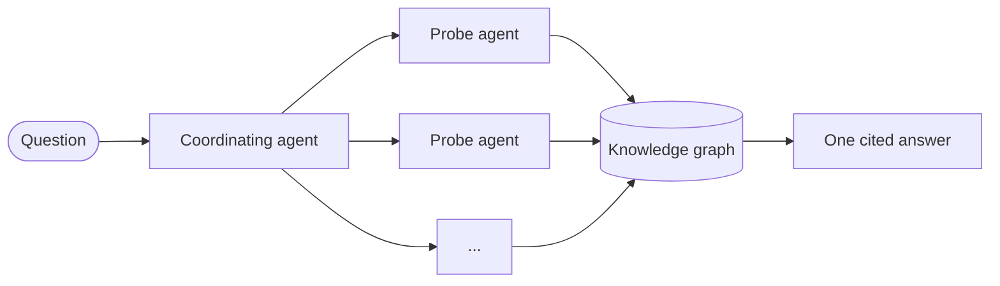

# Question Answering

## Ask a wiki page a question

Every wiki page carries an inline Q&A box. Ask a question, pick a model, and a coordinating agent
answers from the same graph that backs the pages. Every claim carries a citation back to its file.

<video controls preload="metadata" width="1920" height="1080">
  <source src="../assets/videos/mewbo-wiki-qna-demo.mp4" type="video/mp4" />
  Your browser does not support the video tag.
</video>

---

## How the Agentic Wiki builds answers

Each **probe agent** takes one angle of the question. It enters the
[knowledge graph](features-wiki-graph.md) at the symbols and notes an ANN lookup ranked highest,
then follows the edges out.

The fan-out is bounded. When the step budget runs out, the coordinator answers from what was found
rather than running on. Questions that span modules gain the most, because one probe agent's
evidence sits beside another's before a word is written.

---

## Grounded, cited answers

`[path:line-range]` chips sit in the answer text. Click one and a **source card** expands with the
code excerpt. Below the answer, **Cited Sources** and **Retrieval details** name every wiki page and
source file the run read, plus the model that wrote it.

  

---

## Answers that teach the wiki

A Q&A run writes back. A durable fact from an answer is deposited as an anchored note, off the
critical path. → [The memory grows as the wiki is used](features-wiki-graph.md#the-memory-grows-as-the-wiki-is-used)

---

## Ask from your agent fleet

Claude Code, Codex, Cursor or another Mewbo gets the same cited answer over the
[MCP server](clients-mcp.md), without the console.

- **`ask_wiki`** returns a cited answer for an indexed project. A long question returns an
  `answer_id` with `status: "running"`.
- **`get_wiki_answer`** replays an answer by its `answer_id` once it settles.
- **`read_wiki_structure`** / **`read_wiki_page`** / **`list_wiki_projects`** browse the structure
  and pages directly.
- **`submit_insight`** teaches the wiki a durable fact your agents
  found. → [The memory grows as the wiki is used](features-wiki-graph.md#the-memory-grows-as-the-wiki-is-used)

The same operations sit on the REST API under `/v1/wiki/*`. The [MCP server](clients-mcp.md) page has
the full tool list and the [REST API reference](rest-api.md) has the HTTP surface.
