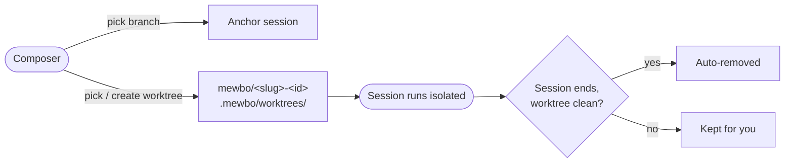

# Branches & Worktrees

## One checkout per session



A session runs in the project's working directory by default. Branches and worktrees let you choose
instead.

---

## Why isolation matters

Two sessions editing the same checkout trip over each other. A worktree fixes that. It is a
separate directory on its own branch, backed by the same repository, so each session gets a private
sandbox while the parent checkout stays untouched. Push the branch when the work is good. When it
is not, the worktree disappears and nothing leaks back.

---

## Using it from the console

Open the session composer's config menu. When the active project is a git repository, two extra
tabs appear, **Branch** and **Worktree**.

- **Branch** lists the repository's branches with the current HEAD marked. Picking one records it
  on the session context, where it shows on the session row and as a filterable trace facet. If
  that branch already has a managed worktree, the session runs in the worktree's directory.
- **Worktree** lets you pick an existing worktree or create one. Picking it anchors the session to
  that directory and derives `repo` and `branch` automatically.

The **Projects** page carries the same surface. Each project card has a worktrees panel for
creating, refreshing, and deleting worktrees outside the composer.

> [!TIP] Branch anchor vs. worktree anchor
> Picking a branch labels the session. Picking a worktree changes where it runs.

> [!NOTE] Worktrees show up in auto mode too
> In [auto workspace mode](project-configuration.md#choosing-a-workspace), `list_projects` includes
> managed worktrees alongside their parent project, and `switch_project` moves the session into one
> exactly like a configured project. See [Built-in Tools](features-builtin-tools.md#switch_project).

---

## Creating a worktree

- **New branch from a base.** Mewbo creates a fresh branch from the base you pick, atomically, via
  `git worktree add -b`. Generated names follow `mewbo/<base-slug>-<id>`, for example
  `mewbo/feature-auth-ab12cd`. The `mewbo/` prefix marks the branch as owned by Mewbo, which
  matters for cleanup later.
- **Reuse an existing branch.** The branch must already exist and must be free. A branch checked
  out by the parent repository or by another worktree cannot back a second one. The API rejects it
  with `409 Conflict`, and the branches endpoint reports `branches_in_use` so the console disables
  those entries first.

Worktree directories live under `.mewbo/worktrees/` inside the parent repository, and that path is
added to the repo's `.gitignore` automatically.

---

## REST surface

```
GET    /api/v_projects/{project}/branches                List branches and HEAD
GET    /api/v_projects/{project}/worktrees               List worktrees
POST   /api/v_projects/{project}/worktrees                Create a worktree
DELETE /api/v_projects/{project}/worktrees/{worktree_id} Remove a managed worktree
```

`{project}` accepts a managed project id, a configured project name such as `Assistant`, or a git
identity such as `owner/repo`.

- `GET .../branches` reports `current_branch` as `null` when HEAD is detached, and `git_repo` as
  `false` when the project path is not a git working tree.
- `GET .../worktrees` returns worktrees managed by the app together with worktrees a user created
  with plain `git worktree add`. Each entry carries a `managed` flag and a `clean` flag.
- `POST .../worktrees` takes `{"branch": "..."}` to reuse an existing free branch, or adds
  `"base"` to create the branch fresh from it. A branch in use returns `409`.
- `DELETE` removes a managed worktree. A dirty worktree refuses with `409` unless you pass
  `?force=true`. The call is idempotent, and deleting an already-absent worktree returns `200` with
  `{"status": "already_absent"}`.

To anchor a session to a worktree over REST, pass the worktree's project id in the session context.

```json
POST /api/sessions/{session_id}/query
{
  "query": "...",
  "context": { "project": "managed:<worktree_project_id>" }
}
```

The same `context` object works when creating the session via
[POST /api/sessions](endpoint:POST /api/sessions). The backend fills in `repo` and `branch` from the
worktree record. To anchor to a branch without a worktree, pass `"branch": "<name>"` instead.

For full request and response schemas see the [REST API Reference](rest-api.md).

---

## Lifecycle rules

- **Clean worktrees are removed automatically.** When a session anchored to a worktree ends, Mewbo
  checks it. Clean means `git status` is empty and nothing sits unpushed ahead of upstream.
  Anything that could lose work keeps the worktree alive so you can resume or recover.
- **Branches owned by Mewbo go with their worktree.** Deleting a managed worktree deletes its
  branch too if the branch carries the `mewbo/` prefix. Branches you named yourself are left alone.
- **User worktrees are yours.** Worktrees created directly with `git worktree add` are listed with
  `managed` set to `false` and are never deleted by this API or by the reaper. Remove them with
  `git worktree remove`.

> [!NOTE] No cleanup knobs by design
> There is no TTL setting, no retention flag, and no toggle scoped to a single session. Finish or
> push your work and the sandbox vanishes. Leave anything behind and it stays.
