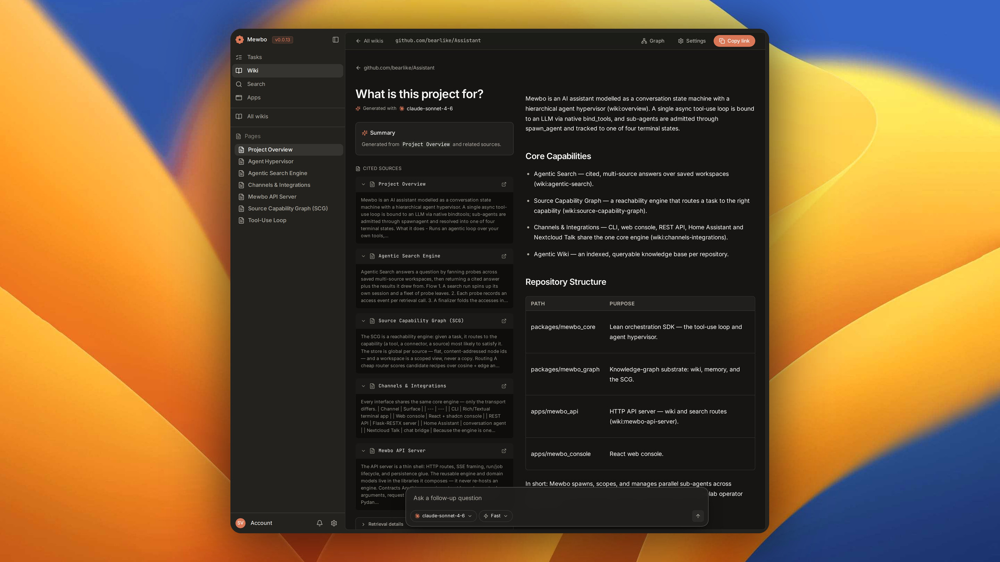

<!--
  Maintainer note: this landing page is a decision surface, not a sitemap.
  The sidebar already enumerates pages. Every section here should help a
  visitor self-select a path (surface, journey stage, capability cluster).
  Keep positioning aligned with README.md when core messaging changes.
-->

<section class="ms-hero" markdown>

Documentation

### Introducing Mewbo

Mewbo is an open stack for handing agents to your engineers and operators, inside the
permissions you set. It plugs into the tools and systems you already run.
Automation, wiki, search and apps stand on one harness, whichever model you bring.

  <a class="ms-btn ms-btn--primary" href="getting-started/">Quickstart →</a>
  <a class="ms-btn ms-btn--secondary" href="deployment-docker/">Install via Docker</a>
  <a class="ms-btn ms-btn--ghost" href="api/">API reference</a>

  
    <iconify-icon class="ms-pill__icon" icon="lucide:git-fork" width="14" height="14" aria-hidden="true"></iconify-icon>
    Parallel sub-agents
  
  
    <iconify-icon class="ms-pill__icon" icon="lucide:check-check" width="14" height="14" aria-hidden="true"></iconify-icon>
    Claude Code and Codex compatible
  
  
    <iconify-icon class="ms-pill__icon" icon="lucide:server" width="14" height="14" aria-hidden="true"></iconify-icon>
    Self hosted, any model
  
  
    <iconify-icon class="ms-pill__icon" icon="lucide:shield-check" width="14" height="14" aria-hidden="true"></iconify-icon>
    Permissions, plan mode, sandboxed shell
  
  
    <iconify-icon class="ms-pill__icon" icon="lucide:quote" width="14" height="14" aria-hidden="true"></iconify-icon>
    Answers cited to a path and line
  

<figure><figcaption>Your sessions at a glance</figcaption></figure>

<figure><figcaption>Inside a task, step by step</figcaption></figure>

<figure><figcaption>Interactive widgets, inline in chat</figcaption></figure>

<figure><figcaption>Agentic Wiki: documentation grounded in your code</figcaption></figure>

<figure><figcaption>Ask the wiki, and every claim carries its source</figcaption></figure>

<figure><figcaption>Agentic Search: workspaces over your connected tools</figcaption></figure>

<figure><figcaption>One ranked list across every tool, topped by a synthesis</figcaption></figure>

<figure><figcaption>Plugins and a marketplace to extend any session</figcaption></figure>

<figure><figcaption>Agentic Apps: a sub-agent writes it, then it runs on a schedule</figcaption></figure>

<figure><figcaption>Reverse invocation: a trigger starts a session with nobody watching</figcaption></figure>

</section>

---

## Choose your surface { .ms-h2-icon data-icon="target" }

A coding agent serves one person. Mewbo deploys once and serves every role, on the surface each person already works in.

<a class="ms-card" href="terminal/">
  
    <iconify-icon icon="lucide:terminal" width="20" height="20" aria-hidden="true"></iconify-icon>
  
  Terminal
  Hand off the refactor, the migration or the flaky test you have been putting off, and stay in the shell while it works. It runs on your machine, against the branch you are already on.
</a>

<a class="ms-card" href="web/">
  
    <iconify-icon icon="lucide:app-window" width="20" height="20" aria-hidden="true"></iconify-icon>
  
  Web console
  The whole team works here. Each role sees only its granted tools, escalation is one request away, and a supervised run becomes a repeating trigger.
</a>

<a class="ms-card" href="android/">
  
    <iconify-icon icon="simple-icons:android" width="20" height="20" aria-hidden="true"></iconify-icon>
  
  Android
  Make Mewbo the assistant your phone answers to. Ask out loud from any screen or answer a permission prompt on the move, against the same deployment your team already runs.
</a>

<a class="ms-card" href="clients-nextcloud-talk/">
  
    <iconify-icon icon="simple-icons:slack" width="20" height="20" aria-hidden="true"></iconify-icon>
  
  Team chat
  Mention Mewbo in a channel and it works in the open. The thread is the record, so the next person picks it up without asking anyone what happened.
</a>

<a class="ms-card" href="clients-email/">
  
    <iconify-icon icon="lucide:mail" width="20" height="20" aria-hidden="true"></iconify-icon>
  
  Email
  Send it work the way you would send a colleague work. Reply in the thread to push it further, from a phone, a laptop or an inbox rule.
</a>

<a class="ms-card" href="clients-home-assistant/">
  
    <iconify-icon icon="simple-icons:homeassistant" width="20" height="20" aria-hidden="true"></iconify-icon>
  
  Home Assistant
  Ask which rooms are free, why a machine stopped, or what tripped overnight. Every entity your site exposes is now something you can ask.
</a>

---

## How it works { .ms-h2-icon data-icon="flow" }

Every product on this page runs the same three steps underneath.

### You describe an outcome

Ask in plain English on whichever surface is closest. Calls run as the model generates them, and anything the permission policy does not match comes back to you as a prompt. Switch to plan mode for unfamiliar or destructive work and the run stops at a drafted plan instead. Reject it with feedback and a revised plan comes back.

### Mewbo delegates in parallel

The root agent spawns a sub-agent for every piece that can run at once. A test run, a search, a refactor and an MCP call all execute in parallel. A stalled child is caught by the hypervisor, which injects a correction between tool steps. A budget that runs out buys a turn to wrap up rather than a bare halt.

### You get a synthesised answer, not a pile of logs

Each sub-agent returns a structured result with its status, summary, warnings, files touched and checks against the acceptance criteria. The root synthesises those into one answer, backed by a transcript of every tool call, permission prompt and compaction. Fork any message to replay that branch on a different model.

!!! note "Go deeper"

    [Architecture Overview](core-orchestration.md) covers the tool use loop, the hypervisor and the concurrency lifecycle.

---

## Highlights { .ms-h2-icon data-icon="star" }

<a class="ms-card" href="features-wiki/">
Agentic Wiki
Every repository gets documentation that stays current, and a place to ask questions about it. A new teammate asks how something works instead of who wrote it, and the answer comes grounded in the code and cited so it can be checked.
</a>

<a class="ms-card" href="features-search/">
Agentic Search
One search across every system your team has connected. Ask where a decision landed and sub-agents query your trackers, chats and repositories at once, merging what they find into a single ranked answer that names its sources.
</a>

<a class="ms-card" href="authentication/">
Control over what actually runs
Giving a team an agent is a permissions decision. Your identity provider says who people are, roles and teams say what each may run, a policy checks every tool call, and the shell sits in a kernel sandbox. All four are set in one place.
</a>

<a class="ms-card" href="apps/">
Agentic Apps
Describe an app in a sentence and an agent builds it over your live systems, from the data model to the interface to the pipelines that keep it fresh. It runs in your deployment under your permission rules and repairs itself when a feed breaks.
</a>

<a class="ms-card" href="clients-mcp/">
Mewbo as an MCP server
Claude Code, Codex or Cursor calls Mewbo as a tool. Send a whole task to your deployment without leaving the editor, or ask the wiki about a repo you have never opened, while your session keeps its context on the task at hand.
</a>

<a class="ms-card" href="api/structured-outputs/">
Structured Outputs
Give your own software an agent without building one. Send a question and the JSON Schema you need back, and a managed session researches your code and tools, then returns an answer that fits it exactly.
</a>

---

## Already using Claude Code or Codex? { .ms-h2-icon data-icon="plug" }

Point Mewbo at a project and it loads the MCP servers, skills, plugins and instruction files you already have.

MCP servers
Both the Mewbo <code>servers</code> and the Claude Code / VS Code <code>mcpServers</code> schemas are accepted at project and user scope.

Skills
<code>SKILL.md</code> files in <code>~/.claude/skills/</code> or <code>.claude/skills/</code> activate exactly as authored, with the Agent Skills standard.

Plugins &amp; marketplaces
Claude Code plugin manifests install from any marketplace that already serves them, with commands, agents and tools carried over.

Project instructions
<code>CLAUDE.md</code>, <code>AGENTS.md</code>, and <code>.claude/rules/*.md</code> all load hierarchically on session start.

<a class="ms-card" href="features-plugins/#session-tools">
Session tools
A <code>session_tools</code> array in <code>plugin.json</code> contributes stateful tools that live for one agent.
</a>

!!! note "See also"

    [Project Setup](project-configuration.md) and [Plugins &amp; Marketplace](features-plugins.md) walk through the complete compatibility matrix.

---

## What you can do { .ms-h2-icon data-icon="grid" }

Workspace &amp; execution
<ul class="ms-card__list">
  <li><a href="features-builtin-tools/">Built-in tools</a>: read, edit, shell, list</li>
  <li><a href="web/widgets/">Widgets</a>: interactive UI inline in chat</li>
  <li><a href="features-mcp/">External MCP tools</a>: servers Mewbo calls</li>
  <li><a href="web/ide/">Web IDE</a>: per-session code-server</li>
  <li><a href="features-lsp/">Code intelligence (LSP)</a></li>
</ul>

Knowledge &amp; discovery
<ul class="ms-card__list">
  <li><a href="features-wiki/">Agentic Wiki</a>: source-grounded repo docs</li>
  <li><a href="features-wiki-graph/">Knowledge graph</a> of the codebase</li>
  <li><a href="features-search/">Agentic Search</a> across connected MCPs</li>
  <li><a href="apps/">Agentic Apps</a>: a data layer and interface over any of it</li>
</ul>

Composition &amp; delegation
<ul class="ms-card__list">
  <li><a href="features-plugins/">Plugins and marketplace</a></li>
  <li><a href="features-agents/">Sub-agents and the hypervisor</a></li>
  <li><a href="features-skills/">Skills (Agent Skills standard)</a></li>
  <li><a href="features-compaction/">Compaction</a>: long runs that keep going</li>
</ul>

Control &amp; safety
<ul class="ms-card__list">
  <li><a href="authentication/">Identity, roles and teams</a></li>
  <li><a href="features-plan-mode/">Plan mode</a>: review before execution</li>
  <li><a href="features-permissions-hooks/">Permissions and hooks</a></li>
  <li><a href="features-sandbox/">Sandboxed execution</a>: a kernel confined shell</li>
  <li><a href="features-policies/">Policies</a>: semantic gate-checks on tool calls</li>
  <li><a href="features-monitors/">Monitors</a>: session-wide behavioural guardrails</li>
</ul>

Under the hood
<ul class="ms-card__list">
  <li><a href="core-orchestration/">Architecture overview</a></li>
  <li><a href="session-runtime/">Session runtime</a></li>
  <li><a href="features-token-usage/">Token usage and budgets</a></li>
  <li><a href="clients-mcp/">Mewbo as an MCP server</a>: agents that call in</li>
  <li><a href="rest-api/">Full API reference</a></li>
</ul>

---

## From install to production { .ms-h2-icon data-icon="route" }

Install

<ul class="ms-step__links">
  <li><a href="getting-started/">Get Started</a></li>
  <li><a href="deployment-docker/">Docker Compose</a></li>
</ul>

Configure

<ul class="ms-step__links">
  <li><a href="llm-setup/">LLM setup</a></li>
  <li><a href="configuration/">Configuration reference</a></li>
  <li><a href="project-configuration/">Project setup</a></li>
</ul>

Use

<ul class="ms-step__links">
  <li><a href="terminal/">Terminal</a></li>
  <li><a href="web/">Web console</a></li>
  <li><a href="android/">Android</a></li>
  <li><a href="clients-mcp/">MCP server</a></li>
</ul>

Deploy

<ul class="ms-step__links">
  <li><a href="deployment-production/">Production setup</a></li>
  <li><a href="deployment-storage/">Storage backends</a></li>
  <li><a href="features-permissions-hooks/">Permissions and hooks</a></li>
</ul>

Extend

<ul class="ms-step__links">
  <li><a href="features-mcp/">MCP tools</a></li>
  <li><a href="features-plugins/">Plugins</a></li>
  <li><a href="api/structured-outputs/">Structured Outputs</a></li>
  <li><a href="rest-api/">REST API reference</a></li>
</ul>

---

## Keep learning { .ms-h2-icon data-icon="book" }

<a class="ms-card" href="https://github.com/bearlike/Assistant">
  
    <iconify-icon icon="simple-icons:github" width="20" height="20" aria-hidden="true"></iconify-icon>
  
  GitHub repo
  Source, issues, and releases.
</a>

<a class="ms-card" href="core-orchestration/">
  
    <iconify-icon icon="lucide:layers" width="20" height="20" aria-hidden="true"></iconify-icon>
  
  Architecture deep-dive
  The tool use loop, the hypervisor, and the lifecycle.
</a>

<a class="ms-card" href="troubleshooting/">
  
    <iconify-icon icon="lucide:life-buoy" width="20" height="20" aria-hidden="true"></iconify-icon>
  
  Troubleshooting
  Common errors and how to diagnose them.
</a>

<a class="ms-card" href="https://github.com/bearlike/Assistant/releases">
  
    <iconify-icon icon="lucide:list" width="20" height="20" aria-hidden="true"></iconify-icon>
  
  Changelog
  Release notes and upgrade guides.
</a>

