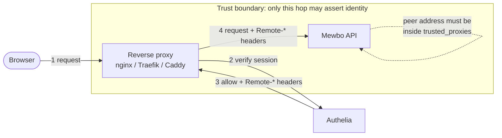

# Authelia

[Authelia](https://www.authelia.com) is most often deployed as a forward-auth companion to a reverse proxy: the proxy asks Authelia about every request, Authelia answers "allow" or "deny", and on allow it returns the signed-in user's identity in a set of response headers. Mewbo consumes those headers directly through its `trusted_header` authenticator, so a deployment that already protects other services with Authelia can put Mewbo behind the same policy with no new login flow.

Authelia can also act as a full OpenID Connect provider. Both paths are covered below. Start with forward auth if Authelia already fronts your other internal services; choose the OIDC path if you want Mewbo to own its own login button and issue its own session independent of the proxy.

---

## What this unlocks

- Single sign-on for the Mewbo console and REST API using the Authelia session your users already hold.
- Group-driven roles: an Authelia group becomes a Mewbo role through the ordinary group mapping rules.
- Authelia's own access-control rules (two-factor policy, network policy, per-domain rules) apply to Mewbo without Mewbo implementing any of them.

---

## Path A: forward auth (recommended when Authelia already fronts your services)

### How the trust boundary sits

In forward auth, Mewbo never speaks to Authelia. It trusts identity headers that the reverse proxy attaches, and it trusts them **only** when the connection comes from an address you have explicitly allowlisted.



Everything inside the dashed boundary is trusted. The consequence is blunt and worth stating plainly: **any host that can open a TCP connection to Mewbo from an allowlisted address can assert any identity it likes.** Read the [security requirements](#security-requirements-read-before-enabling) section before you enable this.

### Configure Mewbo

Authelia emits its identity headers with the `Remote-` prefix and separates multiple groups with commas.

```json
{
  "api": {
    "auth": {
      "enabled": true,
      "authenticators": [
        {
          "name": "authelia",
          "kind": "trusted_header",
          "issuer": "https://auth.example.com",
          "user_header": "Remote-User",
          "groups_header": "Remote-Groups",
          "email_header": "Remote-Email",
          "name_header": "Remote-Name",
          "group_delimiter": ",",
          "trusted_proxies": ["10.42.0.7/32"]
        }
      ],
      "session": { "secret": "generate-a-long-random-string" },
      "role_mappings": {
        "default_role": "viewer",
        "rules": [
          { "match": "mewbo-admins", "target": "admin" },
          { "match": "engineering", "target": "operator" }
        ]
      },
      "bootstrap": { "admin_group": "mewbo-admins" }
    }
  }
}
```

Field notes, all verified against [`authenticators.py`](repo:packages/mewbo_iam/src/mewbo_iam/authenticators.py):

| Field | Default | Notes |
|---|---|---|
| `user_header` | `X-Forwarded-User` | Set it to `Remote-User` for Authelia. This header is the join key; a request without it is simply anonymous. |
| `groups_header` | `X-Forwarded-Groups` | Authelia sends `Remote-Groups`. |
| `email_header` | `X-Forwarded-Email` | Authelia sends `Remote-Email`. |
| `name_header` | `X-Forwarded-Preferred-Username` | Authelia sends `Remote-Name`, which carries the display name. |
| `group_delimiter` | `,` | Only `,` and `&#124;` are accepted. Authelia uses a comma, which is already the default. |
| `trusted_proxies` | none, **required** | A list of CIDRs. The config will not validate without at least one, and every entry must parse as an IP network. |
| `issuer` | `trusted-header` | A label recorded on the identity and in the audit trail. Set it to something you will recognise. |

`session.secret` is required as soon as any non-API-key authenticator is configured. Mewbo refuses to start without it, because a federated login mints a signed session cookie and an unsigned cookie is forgeable.

### Configure the proxy to forward the headers

This is the step teams miss most often. Authelia returns the identity headers to the **proxy**, and the proxy does not pass them upstream unless you tell it to. If you skip this, every request reaches Mewbo with no identity and users land as anonymous.

=== "nginx"

    ```nginx
    location /api/authelia {
        internal;
        proxy_pass http://authelia:9091/api/verify;
        proxy_pass_request_body off;
        proxy_set_header Content-Length "";
        proxy_set_header X-Original-URL $scheme://$http_host$request_uri;
    }

    location / {
        auth_request /api/authelia;

        # Lift the identity out of the auth_request response ...
        auth_request_set $user  $upstream_http_remote_user;
        auth_request_set $groups $upstream_http_remote_groups;
        auth_request_set $email $upstream_http_remote_email;
        auth_request_set $name  $upstream_http_remote_name;

        # ... and forward it to Mewbo.
        proxy_set_header Remote-User   $user;
        proxy_set_header Remote-Groups $groups;
        proxy_set_header Remote-Email  $email;
        proxy_set_header Remote-Name   $name;

        proxy_pass http://mewbo-api:5000;
    }
    ```

    The `auth_request_set` lines are the load-bearing part. Without them the `proxy_set_header` values are empty strings.

=== "Traefik"

    ```yaml
    http:
      middlewares:
        authelia:
          forwardAuth:
            address: "http://authelia:9091/api/verify?rd=https://auth.example.com"
            trustForwardHeader: true
            authResponseHeaders:
              - "Remote-User"
              - "Remote-Groups"
              - "Remote-Email"
              - "Remote-Name"
    ```

    `authResponseHeaders` is the equivalent of nginx's `auth_request_set` pair. A middleware without it authenticates correctly and forwards nothing.

=== "Caddy"

    ```caddyfile
    console.example.com {
        forward_auth authelia:9091 {
            uri /api/verify?rd=https://auth.example.com
            copy_headers Remote-User Remote-Groups Remote-Email Remote-Name
        }
        reverse_proxy mewbo-api:5000
    }
    ```

    `copy_headers` is the directive that forwards the identity upstream.

### Strip the headers from client input

The proxy must also **overwrite** these headers on every inbound request, so a client cannot simply send `Remote-User: admin` itself. The `proxy_set_header` and `copy_headers` directives above do this implicitly by assigning the value from the auth response. If you build your own proxy configuration, make the overwrite explicit and unconditional.

---

## Security requirements (read before enabling)

Trusted-header authentication is an authentication-bypass class of feature when it is misconfigured. Mewbo enforces what it can and the rest is yours to get right.

**A `trusted_proxies` allowlist is mandatory.** The config does not validate without a non-empty list, and each entry must parse as an IP network. This is a definition-time check, so a typo stops the server at boot rather than silently widening trust.

**Headers from any other peer are ignored and audited.** When a request carrying the user header arrives from an address outside the allowlist, Mewbo logs a warning, writes a `login_failure` audit event with reason `untrusted_proxy_source`, and continues as anonymous. It deliberately probes only whether the header is *present*, never reading its value, so an untrusted caller's assertion is not consulted at all.

**`X-Forwarded-For` is deliberately not parsed.** The peer address is `request.remote_addr` and nothing else, which Werkzeug populates from the actual socket. Choosing a hop out of a client-appendable list is precisely where forward-auth deployments grow bypasses, so Mewbo does not do it. The practical consequence: **the address you allowlist must be the peer that actually opens the TCP connection to Mewbo.** If more proxies sit in front, you have two supported options.

1. Allowlist the last hop, meaning the proxy that directly connects to Mewbo, and let the hops in front of it be Authelia's problem.
2. Rewrite `remote_addr` at the WSGI layer with werkzeug's hop-counting `ProxyFix` middleware, configured with the exact number of trusted hops. This is a transport concern settled once at deploy time.

Do not set an over-broad CIDR to "make it work". `0.0.0.0/0` turns the feature into an open door.

**An explicit credential always outranks the proxy assertion.** Mewbo resolves a request through four ordered channels: API key, bearer token, session cookie, then trusted header. A caller who presents an API key or bearer token is never silently re-identified as whoever the proxy says is browsing. A presented-but-invalid API key stops resolution outright rather than falling through to the header channel.

**Cookie mode requires a pinned CORS origin.** This applies to the OIDC path below rather than to forward auth, but it belongs with the security rules: when a browser-login authenticator is enabled, Mewbo refuses to boot if `CORS_ORIGIN` is the wildcard `*`. A browser will not send credentials to, nor accept a credentialed response from, a wildcard origin, so the combination is invalid rather than merely insecure. Set it to the console's exact origin, for example `https://console.example.com`.

---

## Path B: Authelia as an OpenID Connect provider

If you would rather Mewbo owned its own login button, register it as an OIDC client in Authelia's `identity_providers.oidc.clients` list and point Mewbo at the discovery document.

```json
{
  "name": "authelia",
  "kind": "oidc",
  "issuer": "https://auth.example.com",
  "discovery_url": "https://auth.example.com/.well-known/openid-configuration",
  "client_id": "mewbo",
  "client_secret": "the-secret-you-configured-in-authelia",
  "scopes": ["openid", "email", "profile", "groups"],
  "groups_claim": "groups"
}
```

Authelia exposes group membership on a dedicated `groups` scope, so request it explicitly.

> [!IMPORTANT] `group_delimiter` does not apply on this path
> It exists **only** on the `trusted_header` authenticator shown above. OIDC does no delimiter splitting whatsoever, so the groups claim must be a JSON **array**. A single delimited string such as `"admins,engineering"` becomes one group whose name contains the comma, matching no rule. Authelia emits a proper list, so this only bites if you have customised the claim.

The redirect URI to register on the Authelia side is:

```
https://console.example.com/api/auth/callback
```

Mewbo derives that URI from the request's scheme and host, honouring `X-Forwarded-Proto` and `X-Forwarded-Host`, so a proxied deployment must set those headers correctly or the callback URI will not match what you registered.

---

## Verify it works

1. **Check the resolved identity.** Sign in through the proxy, then call `GET /api/auth/me` from the browser session. A working forward-auth setup returns `authenticated: true`, the subject taken from `Remote-User`, the resolved `roles`, and the full `permissions` set. The `auth_method` object reports `kind: "trusted_header"` and the `issuer` you configured.
2. **Confirm the groups arrived.** If `roles` shows only your `default_role` when you expected more, the groups header is either missing or delimited differently than configured. Compare the `teams` and `roles` fields against the Authelia group names.
3. **Prove the boundary holds.** From a host *outside* your `trusted_proxies` range, send a request with a forged `Remote-User` header directly to Mewbo. It must resolve as anonymous, and a `login_failure` event with reason `untrusted_proxy_source` must appear in the audit trail. If that request succeeds, your allowlist is wrong and the deployment is open.

---

## Failure modes

| Symptom | Cause | Fix |
|---|---|---|
| Every user is anonymous; `/api/auth/me` returns 401 | The proxy authenticates but does not forward the headers | Add `auth_request_set` + `proxy_set_header` (nginx), `authResponseHeaders` (Traefik), or `copy_headers` (Caddy) |
| Identity resolves, but everyone lands on the default role | `groups_header` name is wrong, or the delimiter does not match | Confirm Authelia sends `Remote-Groups` and that `group_delimiter` is `,` |
| Server refuses to boot: `trusted_proxies must be non-empty` | The allowlist is missing | Add the proxy's CIDR |
| Server refuses to boot: `invalid trusted-proxy CIDR` | An entry is not a parseable IP network | Use CIDR notation, for example `10.42.0.7/32` rather than a hostname |
| Server refuses to boot, complaining about `session.secret` | A non-API-key authenticator is configured without a signing secret | Set `api.auth.session.secret` |
| Audit shows `untrusted_proxy_source` for legitimate traffic | The connecting peer is not the address you allowlisted, usually because another proxy sits in between | Allowlist the real last hop, or apply `ProxyFix` with the correct hop count |
| Users bounce back to the login page in a loop | Cookie is not being stored because the deployment is served over http while marked `Secure`, or `X-Forwarded-Proto` is not set | Serve over https and forward `X-Forwarded-Proto` |

---

## What is not covered yet

- There is no login rate limiting or account lockout in Mewbo itself. For the forward-auth path this does not matter, because Authelia performs the credential check and applies its own regulation policy.
- Group membership is re-read from the headers on each request, so an Authelia group change takes effect as soon as the proxy issues headers reflecting it.

For the concepts behind this page, including roles, the permission catalogue, how a request resolves to a principal, and what is and is not enforced, see [Authentication and Access](authentication.md). This guide connects one provider; it deliberately does not restate the model.
