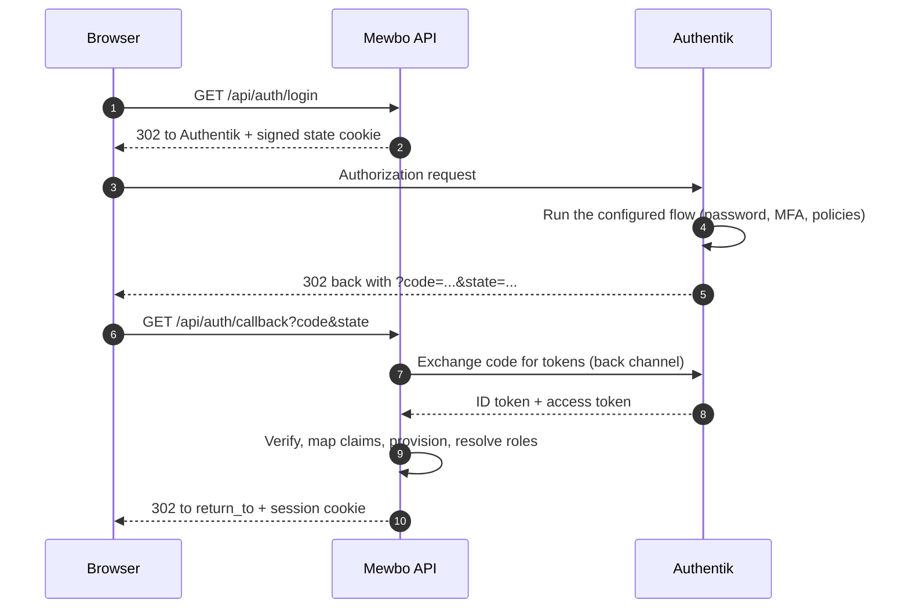
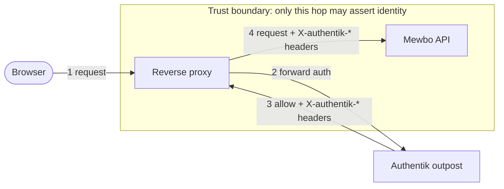

# Authentik

[Authentik](https://goauthentik.io) can front Mewbo two different ways, and the choice determines which Mewbo authenticator you configure.

- **As an OpenID Connect provider.** Mewbo owns its own login button and runs the authorization-code flow against Authentik. Choose this when Mewbo is reachable directly and you want it to issue its own session.
- **As a forward-auth proxy provider.** Authentik's embedded outpost terminates authentication at the reverse proxy and passes identity to Mewbo in `X-authentik-*` headers. Choose this when an Authentik outpost already fronts your internal services.

Both are covered below.

---

## What this unlocks

- Single sign-on for the Mewbo console and REST API against your Authentik tenant.
- Authentik groups drive Mewbo roles through the ordinary group mapping rules.
- Authentik's flows (multi-factor, enrolment, per-application policies) apply to Mewbo without Mewbo implementing any of them.

---

## Path A: Authentik as an OpenID Connect provider

### The login flow



### Configure Authentik

Create an OAuth2/OpenID provider and an application bound to it.

| Authentik setting | Value |
|---|---|
| Client type | Confidential |
| Redirect URI | `https://console.example.com/api/auth/callback` |
| Scopes | `openid`, `email`, `profile` |
| Subject mode | Based on the user's ID or UUID, whichever you intend to be stable |

> [!IMPORTANT] Groups ride the `profile` scope, not a dedicated `groups` scope
> This is the trap that costs people an afternoon. Unlike Keycloak or Authelia, Authentik does **not** expose a separate `groups` scope. Its default `profile` scope mapping already includes a `groups` claim containing the user's group names. Requesting a scope literally named `groups` will fail or return nothing. Keep the default scope set and read the `groups` claim.

If you have customised your scope mappings and groups no longer appear, add a scope mapping whose expression returns them, for example `return {"groups": [group.name for group in request.user.ak_groups.all()]}`, and bind it to the provider.

### Configure Mewbo

```json
{
  "api": {
    "auth": {
      "enabled": true,
      "authenticators": [
        {
          "name": "authentik",
          "kind": "oidc",
          "issuer": "https://idp.example.com/application/o/mewbo/",
          "discovery_url": "https://idp.example.com/application/o/mewbo/.well-known/openid-configuration",
          "client_id": "the-client-id-from-authentik",
          "client_secret": "the-client-secret-from-authentik",
          "scopes": ["openid", "email", "profile"],
          "groups_claim": "groups"
        }
      ],
      "session": { "secret": "generate-a-long-random-string" },
      "role_mappings": {
        "default_role": "viewer",
        "rules": [
          { "match": "Mewbo Admins", "target": "admin" },
          { "match": "Mewbo Operators", "target": "operator" }
        ]
      },
      "bootstrap": { "admin_group": "Mewbo Admins" }
    }
  }
}
```

Notes on the fields, verified against [`authenticators.py`](repo:packages/mewbo_iam/src/mewbo_iam/authenticators.py):

- `issuer` must match the `iss` claim Authentik puts in the token exactly, including the trailing slash. Authentik's issuer is the application's OIDC base URL.
- `groups_claim` accepts a dotted path, so a nested claim such as `resource.groups` is reachable without code changes. Authentik emits a flat `groups`, which is the default.
- `scopes` defaults to `["openid", "email", "profile"]`. Leave it alone unless you have a reason.
- Group matching is case-insensitive, so `Mewbo Admins` and `mewbo admins` both match the same rule. Use `match_kind: "regex"` for a pattern instead of an exact name.

> [!IMPORTANT] `group_delimiter` does not apply here
> It exists **only** on the `trusted_header` authenticator. On the OIDC path there is no delimiter splitting at all, so the groups claim must be a JSON **array**. A claim carrying a single delimited string such as `"admins,engineering"` becomes one group whose name literally contains the comma, and it will match no rule. If you have customised an Authentik scope mapping, make sure it returns a list rather than a joined string.

The OIDC authenticator requires the `oidc` extra. Install it with `pip install mewbo-iam[oidc]`. If it is missing, Mewbo refuses to boot with a message naming the kind, the extra, and the missing module rather than failing later at first login.

---

## Path B: Authentik forward auth (proxy provider)

### Where the trust boundary sits



### Configure Mewbo

Authentik's proxy provider emits identity on `X-authentik-` prefixed headers, and it separates multiple groups with a **pipe**, not a comma.

```json
{
  "name": "authentik-proxy",
  "kind": "trusted_header",
  "issuer": "https://idp.example.com",
  "user_header": "X-authentik-username",
  "groups_header": "X-authentik-groups",
  "email_header": "X-authentik-email",
  "name_header": "X-authentik-name",
  "group_delimiter": "|",
  "trusted_proxies": ["10.42.0.7/32"]
}
```

`group_delimiter` accepts only `,` or `|`. Authentik needs `|`; leaving it at the default comma is the most common reason a forward-auth user lands on the default role with all their groups collapsed into one meaningless string.

The proxy must be configured to copy those headers upstream. An Authentik outpost returns them to the proxy, and the proxy drops them unless told otherwise. See the [Authelia guide](integrations-authelia.md#configure-the-proxy-to-forward-the-headers) for the nginx `auth_request_set`, Traefik `authResponseHeaders`, and Caddy `copy_headers` recipes; the mechanism is identical, only the header names change.

---

## Security requirements for the forward-auth path

Trusted-header mode is an authentication-bypass class of feature when misconfigured.

**`trusted_proxies` is required and must be non-empty.** The configuration will not validate without it, and every entry must parse as an IP network. A bad CIDR stops the server at boot rather than silently widening trust.

**Identity headers from any other peer are ignored and audited.** A request carrying the user header from an address outside the allowlist is logged, recorded as a `login_failure` audit event with reason `untrusted_proxy_source`, and continues anonymously. Mewbo probes only whether the header is present, never its value.

**`X-Forwarded-For` is deliberately not parsed.** The peer address is the socket's own `remote_addr`. Picking a hop out of a client-appendable header is exactly where these deployments grow bypasses. So the address you allowlist must be the peer that actually opens the TCP connection to Mewbo. If more proxies sit in front, either allowlist that real last hop, or rewrite `remote_addr` at the WSGI layer with werkzeug's hop-counting `ProxyFix`, configured with the exact number of trusted hops.

**Cookie mode requires a pinned `CORS_ORIGIN`.** When a browser-login authenticator such as OIDC is enabled, Mewbo refuses to boot if the CORS origin is the wildcard `*`. A browser will neither send credentials to, nor accept a credentialed response from, a wildcard origin, so the combination is invalid rather than merely weak. Set it to the console's exact origin, for example `https://console.example.com`.

---

## Verify it works

1. Sign in, then call `GET /api/auth/me`. A working setup returns `authenticated: true`, your subject, the resolved `roles`, the full `permissions` set, and an `auth_method` object reporting `kind: "oidc"` or `kind: "trusted_header"` with the issuer you configured.
2. If `roles` shows only the `default_role`, groups did not arrive. On the OIDC path, decode the ID token and confirm a `groups` claim is present; if it is absent, your scope mapping is the problem, not Mewbo. On the forward-auth path, check the delimiter first.
3. On the forward-auth path, send a forged `X-authentik-username` header from a host outside `trusted_proxies` and confirm it resolves as anonymous with an `untrusted_proxy_source` audit event. If it succeeds, the allowlist is wrong.

---

## Failure modes

| Symptom | Cause | Fix |
|---|---|---|
| Login redirects, then returns to the console with `?auth_error=login_failed` | The callback was rejected: state mismatch, expired login, bad signature, or a failed token exchange | Check the server log, which carries the structural reason. Confirm the redirect URI registered in Authentik matches `<origin>/api/auth/callback` byte for byte |
| `?auth_error=provider_error` | Authentik itself returned an error to the callback, usually a policy denial | Check the Authentik event log for the denied flow |
| `?auth_error=account_disabled` | The user exists in Mewbo but is disabled | Re-enable the user through the admin surface |
| Server will not boot, naming the `oidc` extra | The OIDC driver dependencies are not installed | `pip install mewbo-iam[oidc]` |
| Server will not boot, complaining about `session.secret` | A non-API-key authenticator is configured with no signing secret | Set `api.auth.session.secret` |
| Server will not boot, complaining about a wildcard CORS origin | A browser-login authenticator plus `CORS_ORIGIN: "*"` | Pin the origin to the console's exact URL |
| All groups collapse into a single role | `group_delimiter` is `,` on the forward-auth path | Set it to `&#124;` for Authentik |
| Redirect URI mismatch, and the URI looks like `http://` when you expected `https://` | The proxy is not forwarding `X-Forwarded-Proto` | Forward `X-Forwarded-Proto` and `X-Forwarded-Host` |

---

## Choosing between the two paths

| | OIDC provider | Forward-auth proxy |
|---|---|---|
| Who runs the login | Mewbo | The Authentik outpost |
| Mewbo needs network access to Authentik | Yes, for discovery and token exchange | No |
| Extra dependency | `mewbo-iam[oidc]` | None |
| Group delimiter concern | No, claims are already a list | Yes, must be `&#124;` |
| Bypass risk if misconfigured | Low | High, gated entirely on `trusted_proxies` |

If both are viable in your environment, prefer the OIDC path. It requires no network-position assumption to be secure.

For the concepts behind this page, including roles, the permission catalogue, how a request resolves to a principal, and what is and is not enforced, see [Authentication and Access](authentication.md). This guide connects one provider; it deliberately does not restate the model.
