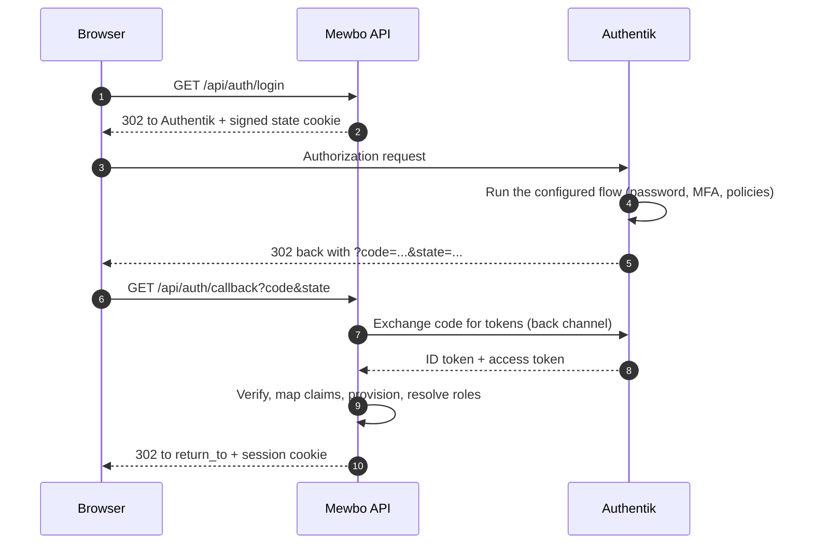

# Authentik

## Map groups to Mewbo roles

[Authentik](https://goauthentik.io) fronts Mewbo two ways, and the choice determines which authenticator you configure.

- **As an OpenID Connect provider.** Mewbo owns its login button and runs the authorization-code flow against Authentik. Choose this when Mewbo is reachable directly.
- **As a forward-auth proxy provider.** Authentik's embedded outpost terminates authentication at the reverse proxy and passes identity in `X-authentik-*` headers. Choose this when an outpost already fronts your internal services.

---

## What this unlocks

- Users sign in to the Mewbo console and REST API against your Authentik tenant, and Authentik groups drive Mewbo roles through the ordinary mapping rules.
- Authentik's flows, multi factor, enrolment and per-application policies apply to Mewbo without Mewbo implementing any of them.

---

## Path A: Authentik as an OpenID Connect provider

### The login flow



### Configure Authentik

Create an OAuth2/OpenID provider and an application bound to it.

| Authentik setting | Value |
|---|---|
| Client type | Confidential |
| Redirect URI | `https://console.example.com/api/auth/callback` |
| Scopes | `openid`, `email`, `profile` |
| Subject mode | Based on the user's ID or UUID, whichever you intend to be stable |

> [!IMPORTANT] Groups ride the `profile` scope, not a dedicated `groups` scope
> Unlike Keycloak or Authelia, Authentik exposes no separate `groups` scope. Its default `profile` scope mapping already includes a `groups` claim carrying the user's group names, and requesting a scope literally named `groups` fails or returns nothing. Keep the default scope set.

If you have customised your scope mappings and groups no longer appear, bind a scope mapping whose expression returns them. `return {"groups": [group.name for group in request.user.ak_groups.all()]}` is a working example.

### Configure Mewbo

```json title="configs/app.json" linenums="1"
{
  "api": {
    "auth": {
      "enabled": true,
      "authenticators": [
        {
          "name": "authentik",
          "kind": "oidc",
          "issuer": "https://idp.example.com/application/o/mewbo/",
          "discovery_url": "https://idp.example.com/application/o/mewbo/.well-known/openid-configuration",
          "client_id": "the-client-id-from-authentik",
          "client_secret": "the-client-secret-from-authentik",
          "scopes": ["openid", "email", "profile"],
          "groups_claim": "groups"
        }
      ],
      "session": { "secret": "generate-a-long-random-string" },
      "role_mappings": {
        "default_role": "viewer",
        "rules": [
          { "match": "Mewbo Admins", "target": "admin" },
          { "match": "Mewbo Operators", "target": "operator" }
        ]
      },
      "bootstrap": { "admin_group": "Mewbo Admins" }
    }
  }
}
```

Field notes, verified against [`authenticators.py`](repo:packages/mewbo_iam/src/mewbo_iam/authenticators.py).

- `issuer` must match the `iss` claim exactly, trailing slash included. Authentik's issuer is the application's OIDC base URL.
- `groups_claim` accepts a dotted path. Authentik emits a flat `groups`, which is the default.
- `scopes` defaults to `["openid", "email", "profile"]`. Leave it alone unless you have a reason.
- Group matching is case-insensitive, so `Mewbo Admins` and `mewbo admins` match the same rule. Set `match_kind` to `regex` for a pattern instead of an exact name.

> [!IMPORTANT] `group_delimiter` does not apply here
> It exists only on the `trusted_header` authenticator, so the OIDC groups claim must be a JSON **array**. See [why claim paths are the recurring theme](authentication-providers.md#why-claim-paths-are-the-recurring-theme). If you have customised an Authentik scope mapping, make sure it returns a list rather than a joined string.

The OIDC authenticator requires the `oidc` extra, so run `pip install mewbo-iam[oidc]`.

---

## Path B: Authentik forward auth (proxy provider)

### Where the trust boundary sits


### Configure Mewbo

Authentik's proxy provider emits identity on `X-authentik-` prefixed headers and separates groups with a **pipe**, not a comma.

```json title="configs/app.json"
{
  "name": "authentik-proxy",
  "kind": "trusted_header",
  "issuer": "https://idp.example.com",
  "user_header": "X-authentik-username",
  "groups_header": "X-authentik-groups",
  "email_header": "X-authentik-email",
  "name_header": "X-authentik-name",
  "group_delimiter": "|",
  "trusted_proxies": ["10.42.0.7/32"]
}
```

`group_delimiter` accepts only `,` or `|`. Authentik needs `|`. Leaving it at the default comma is the most common reason a forward-auth user lands on the default role, with every group collapsed into one meaningless string.

The proxy must copy those headers upstream, and it drops them unless told otherwise. The [Authelia guide](integrations-authelia.md#configure-the-proxy-to-forward-the-headers) carries the nginx, Traefik and Caddy recipes. Only the header names change.

---

## Security requirements for the forward-auth path

Trusted-header mode is an authentication-bypass class of feature when misconfigured. The full model, the allowlist requirement, the audit behaviour for untrusted peers and why `X-Forwarded-For` is never parsed are covered once in [Security preconditions](authentication.md#trusted-header-mode).

The provider-specific part is which address to name. `trusted_proxies` must name the proxy or outpost that directly opens the TCP connection to Mewbo. An outpost sitting behind another proxy is not that address.

**Cookie mode requires a pinned `CORS_ORIGIN`.** With a browser-login authenticator enabled, Mewbo refuses to boot on a wildcard `*`. Set it to the console's exact origin.

---

## Verify it works

1. Sign in, then call `GET /api/auth/me`. Expect `authenticated: true`, your subject, the resolved `roles`, the full `permissions` set, and an `auth_method` reporting `kind: "oidc"` or `kind: "trusted_header"` with your issuer.
2. If `roles` shows only the `default_role`, groups did not arrive. On the OIDC path, decode the ID token and look for a `groups` claim. An absent claim is a scope mapping problem, not a Mewbo one. On the forward-auth path, check the delimiter first.
3. On the forward-auth path, send a forged `X-authentik-username` header from a host outside `trusted_proxies`. It must resolve as anonymous with an `untrusted_proxy_source` audit event. If it succeeds, the allowlist is wrong.

---

## Failure modes

| Symptom | Cause | Fix |
|---|---|---|
| Login redirects, then returns to the console with `?auth_error=login_failed` | The callback was rejected: state mismatch, expired login, bad signature, or a failed token exchange | Check the server log, which carries the structural reason. Confirm the redirect URI registered in Authentik matches `<origin>/api/auth/callback` byte for byte |
| `?auth_error=provider_error` | Authentik itself returned an error to the callback, usually a policy denial | Check the Authentik event log for the denied flow |
| All groups collapse into a single role | `group_delimiter` is `,` on the forward-auth path | Set it to `&#124;` for Authentik |
| Redirect URI mismatch, and the URI looks like `http://` when you expected `https://` | The proxy is not forwarding `X-Forwarded-Proto` | Forward `X-Forwarded-Proto` and `X-Forwarded-Host` |

The boot failures shared by every provider, a missing extra, an unset `session.secret`, a wildcard CORS origin, and a disabled account, are in [Troubleshooting](authentication-providers.md#troubleshooting).

---

## Choosing between the two paths

| | OIDC provider | Forward-auth proxy |
|---|---|---|
| Who runs the login | Mewbo | The Authentik outpost |
| Mewbo needs network access to Authentik | Yes, for discovery and token exchange | No |
| Extra dependency | `mewbo-iam[oidc]` | None |
| Group delimiter concern | No, claims are already a list | Yes, must be `&#124;` |
| Bypass risk if misconfigured | Low | High, gated entirely on `trusted_proxies` |

If both are viable, prefer OIDC. It requires no network-position assumption to be secure.

For the concepts behind this page, see [Authentication and Access](authentication.md). This guide connects one provider and deliberately does not restate the model.
