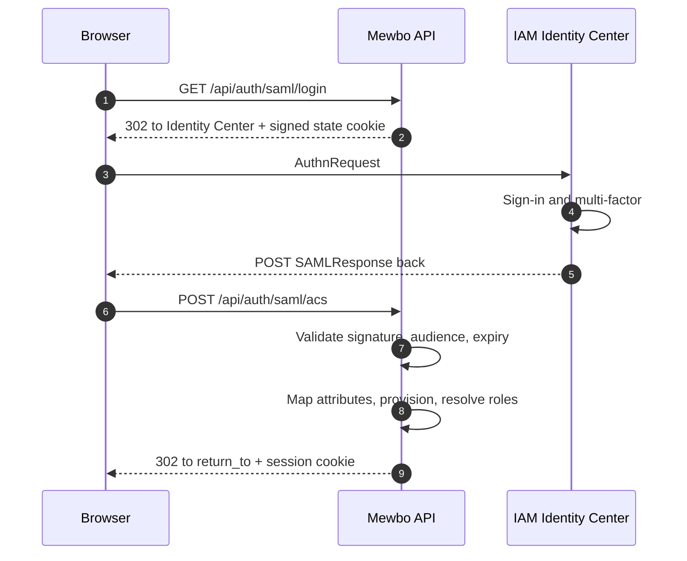

# AWS IAM Identity Center and Cognito

AWS offers two quite different products for signing users in, and they integrate with Mewbo along different paths.

- **IAM Identity Center**, formerly AWS SSO, is the enterprise workforce directory. In practice it is a **SAML** identity provider paired with **SCIM** provisioning. Use it when your organisation already manages workforce identity in AWS.
- **Amazon Cognito** is a user-pool service aimed at application sign-in. It speaks **OpenID Connect** and puts group membership in a `cognito:groups` claim. Use it when Mewbo's users live in a pool you control rather than in your corporate directory.

Pick the one your users actually live in. They are not alternatives to each other so much as answers to different questions.

---

## IAM Identity Center

Identity Center does not offer a general-purpose OIDC relying-party registration for third-party applications. The supported integration is a **custom SAML application**, optionally with SCIM provisioning alongside it.

### Prerequisites, including one your users will notice

- **Sign-in is service-provider initiated only.** Users must start at Mewbo, at `/api/auth/saml/login`. The assertion consumer requires a valid signed state cookie that only that route issues, so **clicking the Mewbo tile in the AWS access portal will not sign anyone in.** Point the tile at `https://console.example.com/api/auth/saml/login`, or tell users where to start.
- **Mewbo does not sign its AuthnRequests and cannot decrypt encrypted assertions.** There is no service-provider private key. An unsigned AuthnRequest is spec-legal and Identity Center accepts one, but do not enable assertion encryption.
- **There is no Single Logout.** Signing out of Mewbo clears the Mewbo session and does not end the Identity Center session.
- Assertion signatures are always required and cannot be relaxed by identity-provider metadata. The NameID format requested is `unspecified`, over an HTTP POST binding.
- **Replay protection is process-local.** Consumed assertion ids are remembered per worker, and Mewbo normally runs several. A replay routed to a different worker inside the assertion's validity window is not caught. The exposure is bounded by that short window, but it is a real gap.

If the first two points are blockers, terminating SAML at a reverse proxy and feeding Mewbo through the trusted-header authenticator sidesteps both. See the [Entra guide's reverse-proxy section](integrations-entra-id.md#alternative-terminate-saml-at-a-reverse-proxy), which applies here unchanged.

### The login flow



### Configure Identity Center

Create a **custom SAML 2.0 application**. Mewbo publishes its own SP metadata, so the least error-prone route is to hand the AWS console the metadata document rather than transcribe values:

```
https://console.example.com/api/auth/saml/metadata
```

If you enter values by hand:

| Identity Center setting | Value |
|---|---|
| Application ACS URL | `https://console.example.com/api/auth/saml/acs` |
| Application SAML audience | `https://console.example.com` |

Then configure the attribute mappings. Identity Center sends nothing useful by default beyond the subject, so map at minimum an email attribute, a display name, and, if you want group-driven roles, a groups attribute.

### Configure Mewbo

```json
{
  "api": {
    "auth": {
      "enabled": true,
      "authenticators": [
        {
          "name": "identity-center",
          "kind": "saml",
          "issuer": "https://portal.sso.eu-west-1.amazonaws.com/saml/assertion/EXAMPLEID",
          "sp_entity_id": "https://console.example.com",
          "idp_metadata_url": "https://portal.sso.eu-west-1.amazonaws.com/saml/metadata/EXAMPLEID",
          "subject_attribute": "NameID",
          "email_attribute": "email",
          "name_attribute": "displayName",
          "groups_attribute": "groups"
        }
      ],
      "session": { "secret": "generate-a-long-random-string" },
      "role_mappings": {
        "default_role": "viewer",
        "rules": [
          { "match": "MewboAdmins", "target": "admin" },
          { "match": "Engineering", "target": "operator" }
        ]
      },
      "bootstrap": { "admin_group": "MewboAdmins" }
    }
  }
}
```

`issuer` must match the assertion's issuer exactly. Exactly one of `idp_metadata_url` or `idp_metadata_xml` is required; supplying both, or neither, is rejected when the configuration is parsed rather than at first login.

`groups_attribute` must match the attribute name you configured on the AWS side. Attribute names in a SAML assertion are frequently full URIs rather than short names, so copy them from the AWS console rather than guessing.

The `saml` extra is required: `pip install mewbo-iam[saml]`.

---

## SCIM provisioning

Identity Center can push users and groups into Mewbo over SCIM 2.0, so accounts appear before their first login and are deactivated when someone leaves.

### Enable it in Mewbo

```json
"scim": {
  "enabled": true,
  "secret": "a-long-random-bearer-secret-you-generate"
}
```

Two things to know about the token. It is the **raw secret**, not a signed or derived value: whatever you put in `secret` is exactly what the identity provider presents as `Authorization: Bearer <secret>`, compared in constant time. And SCIM **fails closed**: if it is enabled with no secret configured, every request is rejected with 401 rather than admitting anyone.

Generate something long and random, and treat it as a credential. The config API marks it write-only, so it is never returned once set.

### Give AWS these values

| Identity Center setting | Value |
|---|---|
| SCIM endpoint | `https://console.example.com/api/scim/v2` |
| Access token | The `secret` you configured |

### What the endpoint supports

All routes are mounted under `/api/scim/v2`, and every response, errors included, is `application/scim+json`.

| Resource | Methods |
|---|---|
| `/ServiceProviderConfig` | `GET` |
| `/Users` | `GET`, `POST` |
| `/Users/<id>` | `GET`, `PUT`, `PATCH`, `DELETE` |
| `/Groups` | `GET`, `POST` |
| `/Groups/<id>` | `GET`, `PUT`, `PATCH`, `DELETE` |

Filtering supports the single form `attribute eq "value"`, and only on three attributes: `userName` and `externalId` for users, `displayName` for groups. Anything else is refused rather than silently mis-answered. Pagination uses `startIndex`, which begins at 1, and `count`, capped at 200. While SCIM is switched off every route returns a clean 404 without touching a store or comparing a token, so mounting it is safe even if you never turn it on.

There are **no `/Schemas` or `/ResourceTypes` endpoints.** Some connectors probe these during setup and will report a discovery failure. `/ServiceProviderConfig` is served and is the document to point a connector at.

There is also no token lifecycle. The bearer value is the raw secret you chose, with no mint endpoint, no expiry, and no rotation window. Rotating it means changing it in both places at once, so plan a brief window where provisioning fails.

> [!WARNING] Group members are not persisted yet
> `/Groups` accepts group creation, renaming, and deletion, and those are durable. **Group membership is not.** Member ids in a payload are validated against the user store, and unknown ids are logged and skipped rather than failing the batch, but resolved members are then **not written anywhere**. Every Group response reports `members: []`.
>
> The practical consequence: **do not rely on SCIM group pushes to drive Mewbo roles.** Drive roles from the SAML `groups_attribute` at login instead, which does work. Use SCIM for user lifecycle, meaning account creation and deactivation, which is where it earns its keep today.
>
> This is a known gap rather than a misconfiguration. Nothing you change on the AWS side will make member persistence work.

> [!WARNING] Renaming a group at the identity provider forks a new team
> Groups are matched by a slug derived from `displayName`, so a rename does not update the existing team. It creates a second one and leaves the original behind. Rename groups sparingly, and expect to tidy up the orphan afterwards.

---

## Amazon Cognito

Cognito is a standards-clean OIDC provider and needs no special handling beyond knowing where it puts groups.

### Configure Cognito

Create a user pool and an **app client** with a client secret.

| Cognito setting | Value |
|---|---|
| Allowed callback URL | `https://console.example.com/api/auth/callback` |
| Allowed sign-out URL | `https://console.example.com/` |
| OAuth grant type | Authorization code grant |
| OpenID Connect scopes | `openid`, `email`, `profile` |

### Configure Mewbo

```json
{
  "name": "cognito",
  "kind": "oidc",
  "issuer": "https://cognito-idp.eu-west-1.amazonaws.com/eu-west-1_ExamplePool",
  "discovery_url": "https://cognito-idp.eu-west-1.amazonaws.com/eu-west-1_ExamplePool/.well-known/openid-configuration",
  "client_id": "the-app-client-id",
  "client_secret": "the-app-client-secret",
  "scopes": ["openid", "email", "profile"],
  "groups_claim": "cognito:groups"
}
```

The claim name genuinely contains a colon. That is fine: the dotted-path reader splits on `.` only, so `cognito:groups` is read as a single top-level claim name rather than being parsed as a path.

The issuer is the user pool's URL, with no trailing slash and no `/oauth2` suffix. It must match the `iss` claim exactly.

The `oidc` extra is required: `pip install mewbo-iam[oidc]`.

### The 25-group quota

Cognito applies a **default quota of 25 groups per user pool**. This is an AWS-side limit rather than anything Mewbo imposes, and it is a soft quota you can request an increase for.

It matters here because it shapes how you should model authorization. With at most 25 groups to spend across every application sharing the pool, do not mirror your whole organisational structure into Cognito groups. Create a small number of coarse groups that mean something to Mewbo, such as `mewbo-admins`, `mewbo-operators`, and `mewbo-viewers`, and map those.

Unlike Entra, Cognito does not silently substitute a pointer when a user is in many groups, so there is no overage failure mode to guard against. The quota bites at group creation time instead, which is a much easier problem to notice.

---

## Verify it works

1. Sign in, then call `GET /api/auth/me`. Expect `authenticated: true`, your subject, the resolved `roles`, the full `permissions` set, and an `auth_method` object reporting `kind: "saml"` or `kind: "oidc"` with your issuer.
2. If `roles` shows only the default on the Cognito path, confirm the user is actually in a group and that `groups_claim` reads `cognito:groups` exactly, including the colon.
3. If `roles` shows only the default on the Identity Center path, the attribute mapping is the first thing to check. Identity Center sends very little unless you tell it to.
4. To check SCIM, call `GET /api/scim/v2/ServiceProviderConfig` with your bearer token. It returns the capability document and is the quickest confirmation that the token and the endpoint URL are both right.

---

## Failure modes

| Symptom | Cause | Fix |
|---|---|---|
| SCIM requests all return 401 | The token does not match, or `secret` is unset while SCIM is enabled, which fails closed | Set `scim.secret` and paste the identical value into AWS |
| SCIM requests all return 404 | SCIM is not enabled | Set `scim.enabled` to true and restart |
| Group membership never appears in Mewbo | Group members are not persisted yet | Drive roles from the SAML groups attribute at login. This is not fixable from the AWS side |
| SCIM filter requests fail | A filter more complex than `attribute eq "value"` was sent | Only the simple equality form is supported |
| Cognito users all land on the default role | `groups_claim` is missing the `cognito:` prefix | Set it to `cognito:groups` exactly |
| Identity Center login fails at the ACS step | Signature, audience, or expiry validation failed | Check the server log, which carries the structural reason without ever logging the assertion. Confirm the audience matches `sp_entity_id` |
| `?auth_error=account_disabled` | The user exists in Mewbo but has been disabled | Re-enable them through the admin surface |
| Redirect or ACS URL mismatch, showing `http://` where you expect `https://` | The reverse proxy is not forwarding `X-Forwarded-Proto` | Forward `X-Forwarded-Proto` and `X-Forwarded-Host`, since both the callback and ACS URLs are derived from the request origin |
| Server will not boot: `provide exactly one of idp_metadata_url or idp_metadata_xml` | Both or neither were set | Set exactly one |
| Server will not boot, naming the `oidc` or `saml` extra | Driver dependencies are not installed | `pip install mewbo-iam[oidc]` or `pip install mewbo-iam[saml]` |
| Server will not boot, complaining about a wildcard CORS origin | A browser-login authenticator plus `CORS_ORIGIN: "*"` | Pin the origin to the console's exact URL, since a credentialed cross-origin request cannot use a wildcard |

---

## Choosing between them

| | IAM Identity Center | Cognito |
|---|---|---|
| Protocol to Mewbo | SAML 2.0 | OpenID Connect |
| Where users live | Your workforce directory | A user pool you manage |
| Group claim | A SAML attribute you map | `cognito:groups` |
| Provisioning | SCIM, users only today | None |
| Extra required | `mewbo-iam[saml]` | `mewbo-iam[oidc]` |
| Group limit to plan around | None specific | Default quota of 25 per pool |

For the concepts behind this page, including roles, the permission catalogue, how a request resolves to a principal, and what is and is not enforced, see [Authentication and Access](authentication.md). This guide connects one provider; it deliberately does not restate the model.
