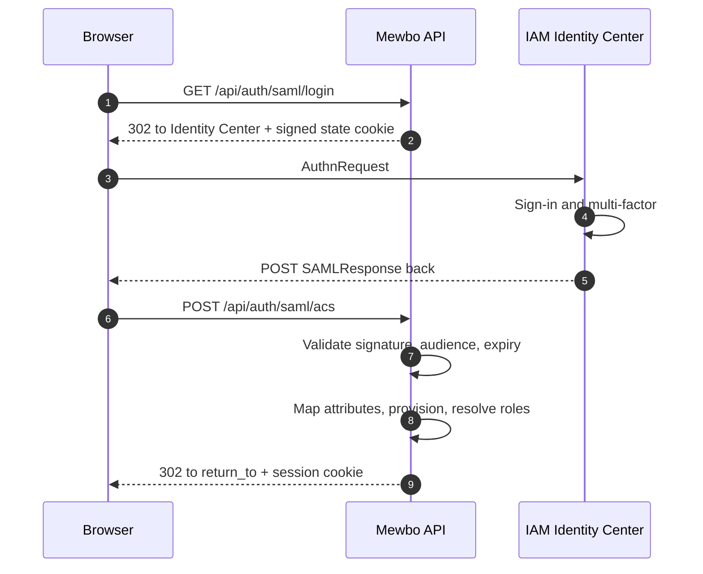

# AWS IAM Identity Center and Cognito

## Sign in with AWS accounts

AWS offers two different products for signing users in, and they reach Mewbo along different paths. Pick the one your users already live in.

- **IAM Identity Center**, formerly AWS SSO, is the enterprise workforce directory. In practice it is a **SAML** identity provider paired with **SCIM** provisioning. Use it when your organisation already manages workforce identity in AWS.
- **Amazon Cognito** is a user-pool service aimed at application sign-in. It speaks **OpenID Connect** and puts group membership in a `cognito:groups` claim. Use it when Mewbo's users live in a pool you control rather than in your corporate directory.

---

## IAM Identity Center

Identity Center does not offer a general-purpose OIDC relying-party registration for third-party applications. The supported integration is a **custom SAML application**, optionally with SCIM provisioning alongside it.

### Prerequisites, including one your users will notice

Mewbo's SAML limitations apply here unchanged. The [Entra guide's SAML prerequisites](integrations-entra-id.md#prerequisites-and-one-that-will-surprise-your-users) carry all four with the reasoning behind each, and its [reverse-proxy section](integrations-entra-id.md#alternative-terminate-saml-at-a-reverse-proxy) is the way out if request signing or the redirect restriction blocks you.

One thing is specific to this portal. **Clicking the Mewbo tile in the AWS access portal will not sign anyone in**, because sign-in must start at Mewbo, at `/api/auth/saml/login`. Point the tile there, or tell users where to start.

### The login flow



### Configure Identity Center

Create a **custom SAML 2.0 application**. Mewbo publishes its own SP metadata, so hand the AWS console this document rather than transcribing values.

```
https://console.example.com/api/auth/saml/metadata
```

If you enter values by hand, these are the two.

| Identity Center setting | Value |
|---|---|
| Application ACS URL | `https://console.example.com/api/auth/saml/acs` |
| Application SAML audience | `https://console.example.com` |

Then configure the attribute mappings. Identity Center sends nothing beyond the subject by default, so map at minimum an email attribute, a display name, and a groups attribute if you want group-driven roles.

### Configure Mewbo

```json title="configs/app.json" linenums="1"
{
  "api": {
    "auth": {
      "enabled": true,
      "authenticators": [
        {
          "name": "identity-center",
          "kind": "saml",
          "issuer": "https://portal.sso.eu-west-1.amazonaws.com/saml/assertion/EXAMPLEID",
          "sp_entity_id": "https://console.example.com",
          "idp_metadata_url": "https://portal.sso.eu-west-1.amazonaws.com/saml/metadata/EXAMPLEID",
          "subject_attribute": "NameID",
          "email_attribute": "email",
          "name_attribute": "displayName",
          "groups_attribute": "groups"
        }
      ],
      "session": { "secret": "generate-a-long-random-string" },
      "role_mappings": {
        "default_role": "viewer",
        "rules": [
          { "match": "MewboAdmins", "target": "admin" },
          { "match": "Engineering", "target": "operator" }
        ]
      },
      "bootstrap": { "admin_group": "MewboAdmins" }
    }
  }
}
```

`issuer` must match the assertion's issuer exactly. Exactly one of `idp_metadata_url` or `idp_metadata_xml` is required, and both or neither is rejected when the configuration is parsed.

`groups_attribute` must match the attribute name you configured on the AWS side. SAML attribute names are frequently full URIs rather than short names, so copy them from the AWS console rather than guessing.

The `saml` extra is required. Run `pip install mewbo-iam[saml]`.

---

## SCIM provisioning

Identity Center can push users and groups into Mewbo over SCIM 2.0, so accounts appear before their first login and are deactivated when someone leaves. What the endpoint implements, what it refuses and how deletes behave is covered once in [SCIM provisioning](authentication.md#scim-provisioning). This section is the AWS wiring.

### Enable it in Mewbo

```json title="configs/app.json"
"scim": {
  "enabled": true,
  "secret": "a-long-random-bearer-secret-you-generate"
}
```

The token is the raw secret, not a signed or derived value. Whatever you set as `secret` is exactly what Identity Center presents as `Authorization: Bearer <secret>`. Generate something long and random and treat it as a credential. The config API marks it write-only, so it is never returned once set.

There is no token lifecycle. No mint endpoint, no expiry, no rotation window. Rotating means changing it in both places at once, so plan a brief window where provisioning fails.

### Give AWS these values

| Identity Center setting | Value |
|---|---|
| SCIM endpoint | `https://console.example.com/api/scim/v2` |
| Access token | The `secret` you configured |

### What the endpoint supports

All routes are mounted under `/api/scim/v2`, and every response, errors included, is `application/scim+json`.

| Resource | Methods |
|---|---|
| `/ServiceProviderConfig` | `GET` |
| `/Users` | `GET`, `POST` |
| `/Users/<id>` | `GET`, `PUT`, `PATCH`, `DELETE` |
| `/Groups` | `GET`, `POST` |
| `/Groups/<id>` | `GET`, `PUT`, `PATCH`, `DELETE` |

Pagination uses `startIndex`, starting at 1, and `count`, capped at 200. Point a connector's discovery step at `/ServiceProviderConfig`, since there are no `/Schemas` or `/ResourceTypes` endpoints for it to probe.

Two behaviours are worth knowing before you point Identity Center at this. SCIM fails closed, so with no secret configured every request returns 401. While SCIM is off, every route returns a clean 404 without touching a store or comparing a token, which makes mounting it safe even if you never turn it on.

> [!WARNING] Group members are not persisted yet
> `/Groups` accepts group creation, renaming and deletion, and those are durable. **Group membership is not.** Member ids in a payload are validated against the user store, and unknown ids are logged and skipped rather than failing the batch, but resolved members are then **not written anywhere**. Every Group response reports `members: []`.
>
> So do not rely on SCIM group pushes to drive Mewbo roles. Drive roles from the SAML `groups_attribute` at login, and use SCIM for user lifecycle, meaning account creation and deactivation. That is a known gap rather than a misconfiguration, and nothing you change on the AWS side will fix it.

> [!WARNING] Renaming a group at the identity provider forks a new team
> Groups are matched by a slug derived from `displayName`, so a rename does not update the existing team. It creates a second one and leaves the original behind. Rename groups sparingly, and expect to tidy up the orphan afterwards.

---

## Amazon Cognito

Cognito is a standards-clean OIDC provider. The only thing to know is where it puts groups.

### Configure Cognito

Create a user pool and an **app client** with a client secret.

| Cognito setting | Value |
|---|---|
| Allowed callback URL | `https://console.example.com/api/auth/callback` |
| Allowed sign-out URL | `https://console.example.com/` |
| OAuth grant type | Authorization code grant |
| OpenID Connect scopes | `openid`, `email`, `profile` |

### Configure Mewbo

```json title="configs/app.json"
{
  "name": "cognito",
  "kind": "oidc",
  "issuer": "https://cognito-idp.eu-west-1.amazonaws.com/eu-west-1_ExamplePool",
  "discovery_url": "https://cognito-idp.eu-west-1.amazonaws.com/eu-west-1_ExamplePool/.well-known/openid-configuration",
  "client_id": "the-app-client-id",
  "client_secret": "the-app-client-secret",
  "scopes": ["openid", "email", "profile"],
  "groups_claim": "cognito:groups"
}
```

The claim name genuinely contains a colon, and that is fine. The dotted-path reader splits on `.` only, so `cognito:groups` is read as one top-level claim name rather than as a path.

The issuer is the user pool's URL, with no trailing slash and no `/oauth2` suffix. It must match the `iss` claim exactly.

The `oidc` extra is required. Run `pip install mewbo-iam[oidc]`.

### The 25-group quota

Cognito applies a **default quota of 25 groups per user pool**. It is an AWS-side soft quota you can request an increase for, and it shapes how you model authorization.

With at most 25 groups to spend across every application sharing the pool, do not mirror your organisational structure into Cognito groups. Create a few coarse groups that mean something to Mewbo, such as `mewbo-admins`, `mewbo-operators` and `mewbo-viewers`, and map those.

Unlike Entra, Cognito never substitutes a pointer when a user is in many groups, so there is no overage failure mode here. The quota bites at group creation time instead, which is far easier to notice.

---

## Verify it works

1. Sign in, then call `GET /api/auth/me`. Expect `authenticated: true`, your subject, the resolved `roles`, the full `permissions` set, and an `auth_method` object reporting `kind: "saml"` or `kind: "oidc"` with your issuer.
2. If `roles` shows only the default on the Cognito path, confirm the user is in a group and that `groups_claim` reads `cognito:groups` exactly, colon included.
3. If `roles` shows only the default on the Identity Center path, check the attribute mapping first. Identity Center sends very little unless you tell it to.
4. To check SCIM, call `GET /api/scim/v2/ServiceProviderConfig` with your bearer token. It returns the capability document, which is the quickest confirmation that the token and the endpoint URL are both right.

---

## Failure modes

These are AWS specific. Boot failures and generic callback errors are in the shared [Troubleshooting](authentication-providers.md#troubleshooting) table.

| Symptom | Cause | Fix |
|---|---|---|
| SCIM requests all return 401 | The token does not match, or `secret` is unset while SCIM is enabled, which fails closed | Set `scim.secret` and paste the identical value into AWS |
| SCIM requests all return 404 | SCIM is not enabled | Set `scim.enabled` to true and restart |
| Group membership never appears in Mewbo | Group members are not persisted yet | Drive roles from the SAML groups attribute at login. This is not fixable from the AWS side |
| SCIM filter requests fail | A filter more complex than `attribute eq "value"` was sent | Only the simple equality form is supported |
| Cognito users all land on the default role | `groups_claim` is missing the `cognito:` prefix | Set it to `cognito:groups` exactly |
| Identity Center login fails at the ACS step | Signature, audience or expiry validation failed | Check the server log, which carries the structural reason without ever logging the assertion. Confirm the audience matches `sp_entity_id` |
| Redirect or ACS URL mismatch, showing `http://` where you expect `https://` | The reverse proxy is not forwarding `X-Forwarded-Proto` | Forward `X-Forwarded-Proto` and `X-Forwarded-Host`. Both the callback and ACS URLs are derived from the request origin |
| Server will not boot: `provide exactly one of idp_metadata_url or idp_metadata_xml` | Both or neither were set | Set exactly one |

---

## Choosing between them

| | IAM Identity Center | Cognito |
|---|---|---|
| Protocol to Mewbo | SAML 2.0 | OpenID Connect |
| Where users live | Your workforce directory | A user pool you manage |
| Group claim | A SAML attribute you map | `cognito:groups` |
| Provisioning | SCIM, users only today | None |
| Extra required | `mewbo-iam[saml]` | `mewbo-iam[oidc]` |
| Group limit to plan around | None specific | Default quota of 25 per pool |

For the concepts behind this page, including roles, the permission catalogue, how a request resolves to a principal, and what is and is not enforced, see [Authentication and Access](authentication.md). This guide connects one provider. It deliberately does not restate the model.
