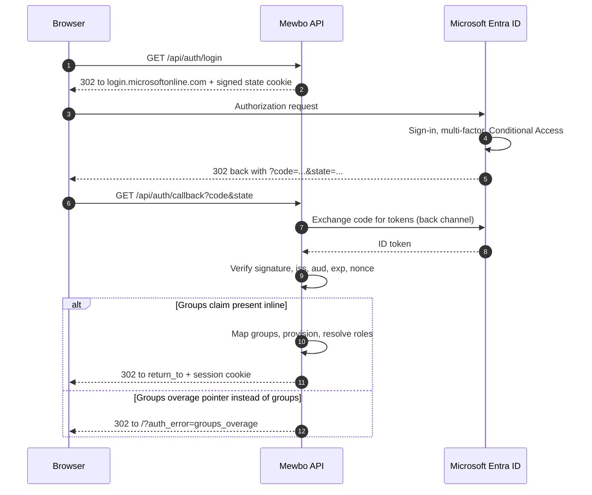

# Microsoft Entra ID

## Sign in with Azure AD groups

[Microsoft Entra ID](https://learn.microsoft.com/entra/identity/), formerly Azure Active Directory, works with Mewbo over either OpenID Connect or SAML 2.0. Both paths are covered here.

Sign in tends to work first time. Authorization is where the two surprises live, and both concern group membership.

- **Group claims carry object UUIDs, not group names.** Your mapping rules must match UUIDs, or you should switch to app roles.
- **Entra drops the groups claim entirely once a user is in too many groups**, replacing it with a pointer to the Graph API. On the OIDC path Mewbo fails loud rather than silently granting nothing.

---

## What this unlocks

- Single sign on for the Mewbo console and REST API with Entra ID accounts.
- Conditional Access, multi factor and device compliance policies apply to Mewbo without Mewbo implementing any of them.
- Entra security groups or app roles drive Mewbo roles.

---

## The login flow



---

## Path A: OpenID Connect

### Configure Entra

In the Entra admin centre, register an application.

| Entra setting | Value |
|---|---|
| Redirect URI, type Web | `https://console.example.com/api/auth/callback` |
| Front-channel logout URL | `https://console.example.com/` |
| Client secret | Create one under Certificates and secrets, and copy the **value**, not the id |
| Token configuration | Add the optional `groups` claim, or define app roles. See below |

| | Value |
|---|---|
| Issuer | `https://login.microsoftonline.com/<tenant-id>/v2.0` |
| Discovery URL | `https://login.microsoftonline.com/<tenant-id>/v2.0/.well-known/openid-configuration` |

Use the v2.0 endpoints. The v1.0 endpoint issues tokens whose `iss` does not match the v2.0 issuer string, and Mewbo checks the discovery document's issuer against your configured `issuer` before it will verify anything.

### Configure Mewbo

```json title="configs/app.json" linenums="1"
{
  "api": {
    "auth": {
      "enabled": true,
      "authenticators": [
        {
          "name": "entra",
          "kind": "oidc",
          "issuer": "https://login.microsoftonline.com/00000000-1111-2222-3333-444444444444/v2.0",
          "discovery_url": "https://login.microsoftonline.com/00000000-1111-2222-3333-444444444444/v2.0/.well-known/openid-configuration",
          "client_id": "55555555-6666-7777-8888-999999999999",
          "client_secret": "the-secret-value-from-the-portal",
          "scopes": ["openid", "email", "profile"],
          "groups_claim": "roles"
        }
      ],
      "session": { "secret": "generate-a-long-random-string" },
      "role_mappings": {
        "default_role": "viewer",
        "rules": [
          { "match": "MewboAdmin", "target": "admin" },
          { "match": "MewboOperator", "target": "operator" }
        ]
      },
      "bootstrap": { "admin_group": "MewboAdmin" }
    }
  }
}
```

The `oidc` extra is required. Run `pip install mewbo-iam[oidc]`.

---

## Trap 1: group claims are object UUIDs

Add the optional `groups` claim in Token configuration and Entra emits an array of **group object ids**, not display names.

```json
{ "groups": ["aaaaaaaa-1111-2222-3333-444444444444", "bbbbbbbb-5555-6666-7777-888888888888"] }
```

Three ways to live with this, best first.

=== "Prefer app roles (recommended)"

    App roles emit the **names** you choose, so your configuration stays readable and survives a group being recreated.

    In the app registration, under App roles, create a role with a value such as `MewboAdmin`. Then, under Enterprise applications, assign users or groups to that role. Entra places the assigned role values in a `roles` claim.

    ```json title="configs/app.json"
    "groups_claim": "roles"
    ```

    The token then carries what you wrote.

    ```json
    { "roles": ["MewboAdmin", "MewboOperator"] }
    ```

    This is the configuration shown above. It also sidesteps Trap 2, since app-role assignments are not subject to the group-count limit.

=== "Match on UUIDs"

    Keep the `groups` claim and write the object ids into your rules. It works, and it is unreadable.

    ```json title="configs/app.json"
    "groups_claim": "groups",
    "role_mappings": {
      "default_role": "viewer",
      "rules": [
        { "match": "aaaaaaaa-1111-2222-3333-444444444444", "target": "admin" }
      ]
    }
    ```

    Matching is case-insensitive, so Entra's casing for the UUID does not matter. Record which group each id refers to somewhere, because nothing in the file will tell you six months later.

=== "Emit on-premises group names"

    For groups synchronised from on-premises Active Directory **only**, the app registration manifest can emit `sAMAccountName` instead of the object id. Set `optionalClaims.idToken` to include `groups` with `additionalProperties` of `sam_account_name`.

    Cloud-only groups have no `sAMAccountName`, so a mixed estate emits names for synced groups and nothing usable for the rest. That is worse than either consistent option. Use this only if all your groups are synced.

---

## Trap 2: the groups overage

Entra refuses to put an unbounded number of groups in a token. Once a user belongs to too many, it drops the groups claim completely and substitutes a **reference** to the Microsoft Graph API.

```json
{
  "_claim_names": { "groups": "src1" },
  "_claim_sources": { "src1": { "endpoint": "https://graph.microsoft.com/v1.0/users/.../getMemberObjects" } }
}
```

Microsoft's documentation puts that boundary in the low hundreds and the figure has moved between token types and over time. Treat it as `a user in many groups` rather than a number you can safely sit just under.

**Mewbo refuses the login rather than admitting the user with no groups.** The browser is redirected to `/?auth_error=groups_overage` and the server log carries the explanation at error level. The check runs immediately after the signature is verified, before issuer, audience and expiry, so an overage is reported as an overage rather than masked by another claim complaint. Treating it as `this user has no groups` would strip every group derived role from the users in the most groups, usually the most senior ones.

The check lives in the JWT verifier, so it covers the login callback and the bearer token path and nothing else. Introspection responses, userinfo responses, SAML attribute statements and LDAP directory entries are never overage checked. That matters most for the SAML path below.

### Fixing an overage

| Fix | How |
|---|---|
| **Switch to app roles** | The recommended fix. App-role assignments are not subject to the group limit, so the overage cannot recur. Set `groups_claim` to `roles` |
| **Emit only assigned groups** | In Token configuration, set the groups claim to **Groups assigned to the application** rather than all groups. Only groups actually assigned to the Mewbo enterprise application are emitted, which is almost always a handful |
| **Reduce group membership** | Rarely practical, and it does not prevent recurrence |
| **Call Graph** | Mewbo does **not** follow the `_claim_sources` pointer. There is no Graph client and no configuration field that would enable one. Resolve Graph-derived membership outside Mewbo and assign roles through the IAM admin API or over SCIM |

`Groups assigned to the application` needs no change to your role mappings, so it is usually the fastest way out of a live incident.

---

## Path B: SAML 2.0

Entra can also act as a SAML identity provider. Configure Mewbo as a non-gallery Enterprise application.

### Prerequisites, and one that will surprise your users

Check these before you build the integration. Two of them are not configuration problems you can solve later.

- **Sign-in is service-provider initiated only.** Users must start at `/api/auth/saml/login`, since the assertion consumer requires a signed state cookie only that route issues and refuses any assertion arriving without one. Clicking the Mewbo tile in the Entra My Apps dashboard will not sign anyone in. Link the tile to `https://console.example.com/api/auth/saml/login` instead.
- **Mewbo does not sign its AuthnRequests and cannot decrypt encrypted assertions.** There is no service-provider private key. An unsigned AuthnRequest is spec-legal and Entra accepts one by default, but a policy requiring a signed request, or enabled assertion encryption, will break the integration. Leave assertion encryption off.
- **There is no Single Logout.** No SLO endpoint is served and none appears in the SP metadata. Signing out of Mewbo clears the Mewbo session. It does not end the Entra session.
- Assertion signatures are always required, and nothing in the identity provider's metadata can relax that. The NameID format requested is `unspecified`, and the assertion arrives over an HTTP POST binding.

If either of the first two is a blocker, the [reverse-proxy alternative](#alternative-terminate-saml-at-a-reverse-proxy) below sidesteps both.

| Entra SAML setting | Value |
|---|---|
| Identifier, Entity ID | `https://console.example.com` |
| Reply URL, ACS | `https://console.example.com/api/auth/saml/acs` |
| Sign-on URL | `https://console.example.com/api/auth/saml/login` |

```json title="configs/app.json"
{
  "name": "entra-saml",
  "kind": "saml",
  "issuer": "https://sts.windows.net/00000000-1111-2222-3333-444444444444/",
  "sp_entity_id": "https://console.example.com",
  "idp_metadata_url": "https://login.microsoftonline.com/00000000-1111-2222-3333-444444444444/federationmetadata/2007-06/federationmetadata.xml?appid=55555555-6666-7777-8888-999999999999",
  "subject_attribute": "NameID",
  "email_attribute": "http://schemas.xmlsoap.org/ws/2005/05/identity/claims/emailaddress",
  "name_attribute": "http://schemas.microsoft.com/identity/claims/displayname",
  "groups_attribute": "http://schemas.microsoft.com/ws/2008/06/identity/claims/groups"
}
```

Entra sends attributes under their full claim-type URIs rather than short names. Copy them from the Attributes and Claims blade rather than typing them.

Exactly one of `idp_metadata_url` or `idp_metadata_xml` is required, and both or neither is rejected when the configuration is parsed. Mewbo publishes its own SP metadata at `GET /api/auth/saml/metadata`, so hand that URL to whoever administers Entra instead of transcribing values.

The `saml` extra is required. Run `pip install mewbo-iam[saml]`.

> [!WARNING] The overage check does not cover the SAML path
> The fail-loud detection above lives in the JWT verifier, so it protects the OIDC and bearer paths only. If an Entra SAML user exceeds the group limit, Entra substitutes a `groups.link` attribute for the groups attribute, Mewbo finds no groups, and the user is silently assigned only `default_role`.
>
> On the SAML path with users in many groups, prefer emitting only application-assigned groups, and treat an unexpected drop to `default_role` as a suspected overage rather than a mapping error.

### Replay protection is per worker

Consumed assertion ids are remembered so a captured, still valid `SAMLResponse` cannot be replayed. That memory is process local and gunicorn workers do not share it, so a replay routed to a different worker inside the assertion's validity window is not caught. See [Known limits](authentication.md#known-limits).

### Alternative: terminate SAML at a reverse proxy

If the service provider initiated restriction or the lack of request signing blocks you, let something that already speaks SAML do the handshake and assert the result to Mewbo through the trusted header authenticator. For a shop with existing SAML infrastructure this is often the better recommendation, not a fallback.

A Shibboleth SP, SimpleSAMLphp or an auth proxy sidecar terminates SAML at the proxy. Mewbo never runs the SAML code path, so there is no `saml` extra and no xmlsec dependency, and neither limitation above applies because the proxy handles both.

Configure it exactly as in the [Authelia guide](integrations-authelia.md#path-a-forward-auth-recommended-when-authelia-already-fronts-your-services), substituting your proxy's identity header names. The [trusted header security requirements](integrations-authelia.md#security-requirements-read-before-enabling) apply in full, and they are strict. This is an authentication bypass class of feature if the `trusted_proxies` allowlist is wrong.

---

## Verify it works

1. Sign in through the console, then call `GET /api/auth/me`. Expect `authenticated: true`, your Entra object id as the subject, the resolved `roles`, the full `permissions` set, and an `auth_method` object reporting your issuer.
2. If `roles` contains only `viewer`, decode the ID token and look for `roles` or `groups`. Use the Entra token inspection tooling rather than guessing. An absent claim and a claim at the wrong path need different fixes.
3. To confirm overage handling before it bites in production, add a test account to enough groups to cross the limit. The login should be refused with `?auth_error=groups_overage` rather than succeeding with no roles.

---

## Failure modes

These are Entra specific. Boot failures and generic callback errors are in the shared [Troubleshooting](authentication-providers.md#troubleshooting) table.

| Symptom | Cause | Fix |
|---|---|---|
| `?auth_error=groups_overage` | The user is in more groups than the token can carry | Switch to app roles, or emit only application-assigned groups |
| Everyone lands on `viewer`, OIDC path | The groups or roles claim was never added in Token configuration | Add the optional claim or define app roles, then set `groups_claim` to match |
| Everyone lands on `viewer`, SAML path | Possibly an unreported overage, since the SAML path has no overage check | Emit only application-assigned groups, and verify the assertion's attributes |
| Rules never match, and the claim is present | The claim carries UUIDs while the rules carry names | Match the UUIDs, or move to app roles |
| Login fails with an issuer mismatch in the log | The v1.0 endpoint was configured, so the token's `iss` disagrees with the discovery document | Use the v2.0 issuer and discovery URL |
| `?auth_error=provider_error` | Entra returned an error to the callback, commonly a Conditional Access block or a missing admin consent | Check the Entra sign-in logs for that user |

---

## Token verification, for the security review

The algorithm allowlist and the double issuer pin are described in [What a browser login actually does](authentication.md#what-a-browser-login-actually-does). These four numbers are the ones a reviewer asks for, verified against [`jwks.py`](repo:packages/mewbo_iam/src/mewbo_iam/drivers/jwks.py).

- **Audience is essential**, resolved as the explicit audience, then the authenticator's configured `audience`, then the `client_id`.
- **Expiry is essential**, with 45 seconds of clock-skew tolerance.
- **Nonce is checked** on the ID token from the login callback, as replay defence.
- **Signing keys are cached for 6 hours**, and an unrecognised key id forces one out-of-band refresh, so a provider rotating keys does not cause an outage.

For the concepts behind this page, including roles, the permission catalogue, how a request resolves to a principal, and what is and is not enforced, see [Authentication and Access](authentication.md). This guide connects one provider. It deliberately does not restate the model.
