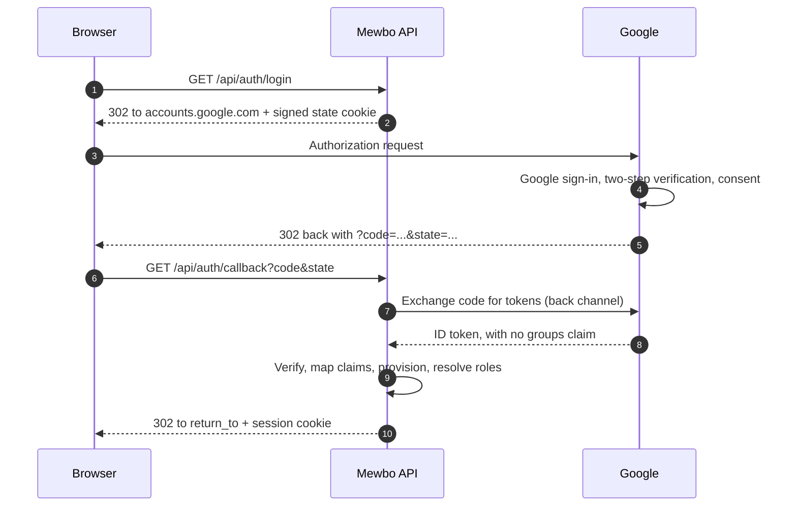

# Google Cloud Identity and Workspace

## Sign in with a Workspace account

Google is a standards-compliant OpenID Connect provider, and signing in to Mewbo with a Google Workspace account takes a short configuration block. Group-driven authorization is the part that needs a decision.

> [!WARNING] Google's OIDC ID token carries no groups claim at all
> This is not a scope you forgot to request. Google's OpenID Connect implementation does not emit group membership in the ID token, and no combination of scopes will make it appear. Mapping Google Groups to Mewbo roles needs one of the alternatives below.

Read the [authorization options](#getting-groups-into-mewbo) before you commit to a design.

---

## What this unlocks

- Single sign on for the Mewbo console and REST API with Google Workspace or Cloud Identity accounts.
- Google's own security controls, two-step verification, context-aware access and session length, apply to Mewbo without Mewbo implementing any of them.
- Authorization by email address, email domain, SAML group attributes, or explicit role assignment, depending on which option below you choose.

---

## The login flow



---

## Configure Google

In the Google Cloud console, under APIs and Services, create an **OAuth 2.0 Client ID** of type Web application.

| Google setting | Value |
|---|---|
| Application type | Web application |
| Authorised redirect URI | `https://console.example.com/api/auth/callback` |
| Authorised JavaScript origin | `https://console.example.com` |

Set the OAuth consent screen to **Internal**. Only accounts in your Workspace tenant can then complete the flow, which is an authorization boundary in its own right and almost always what an enterprise deployment wants.

Copy the client ID and client secret.

---

## Configure Mewbo

```json title="configs/app.json"
{
  "api": {
    "auth": {
      "enabled": true,
      "authenticators": [
        {
          "name": "google",
          "kind": "oidc",
          "issuer": "https://accounts.google.com",
          "discovery_url": "https://accounts.google.com/.well-known/openid-configuration",
          "client_id": "1234567890-abcdefg.apps.googleusercontent.com",
          "client_secret": "the-client-secret",
          "scopes": ["openid", "email", "profile"]
        }
      ],
      "session": { "secret": "generate-a-long-random-string" },
      "role_mappings": { "default_role": "viewer" }
    }
  }
}
```

Field notes, verified against [`authenticators.py`](repo:packages/mewbo_iam/src/mewbo_iam/authenticators.py).

- `issuer` is `https://accounts.google.com` with no trailing slash. It must match the `iss` claim exactly.
- `identity_claim` defaults to `sub`, a stable opaque numeric string on Google that survives an email change. Prefer it over email as the join key.
- `email_claim` and `email_verified_claim` default to `email` and `email_verified`. Google populates both. `email_verified` is read only when the provider sends a real boolean. Anything else leaves it unknown rather than assuming false.
- `picture_claim` defaults to `picture`, which Google populates with the profile photo URL.
- There is deliberately **no** `groups_claim` above. Setting one yields nothing and every user still lands on `default_role`.

The `oidc` extra is required. Run `pip install mewbo-iam[oidc]`.

---

## Getting groups into Mewbo

Four options, best first.

### Option 1: assign roles by email or domain rule

The simplest approach, and often sufficient. Mapping rules match group names and Google supplies none, so pin the small set of privileged users with the bootstrap allowlist and leave everyone else on the default role.

```json title="configs/app.json"
"role_mappings": { "default_role": "member" },
"bootstrap": {
  "admin_subjects": ["100000000000000000001", "100000000000000000002"]
}
```

`admin_subjects` matches the `sub` claim exactly, which for Google is the numeric account id rather than the email address. Find it by signing in once and reading the `subject` field from `GET /api/auth/me`.

Combine this with an Internal consent screen and the result is direct. Anyone in your Workspace tenant signs in as a `member`, and a named list of people are admins.

> [!WARNING] On the Google OIDC path, `admin_subjects` is not a bootstrap. It is the permanent list
> Roles are recomputed from the group mapping at every login, so a hand-granted role does not survive the next one. See [Your identity provider is authoritative](authentication.md#your-identity-provider-is-authoritative-and-stays-authoritative).
>
> Google supplies no groups, so that mapping always resolves to `default_role`. Keep every privileged user in `admin_subjects`, and treat the list as your real source of truth. If that is untenable, use one of the three options below, all of which supply real groups.

### Option 2: use SAML instead of OIDC

Google's SAML implementation **can** send group membership, which OIDC cannot. In the Google Admin console, configure Mewbo as a custom SAML app and add a **Group membership** attribute mapping, selecting which groups to include and the attribute name to send them as.

Mewbo's SAML limitations apply here unchanged, and one of them changes what your users do. Sign in is service-provider initiated only, so the app tile in the Google apps launcher will not sign anyone in. Point it at `https://console.example.com/api/auth/saml/login` instead. Leave assertion encryption off, since Mewbo holds no service-provider private key. The [Entra guide's SAML prerequisites](integrations-entra-id.md#prerequisites-and-one-that-will-surprise-your-users) cover the rest, including request signing and Single Logout, and its [reverse-proxy alternative](integrations-entra-id.md#alternative-terminate-saml-at-a-reverse-proxy) if any of them block you.

```json title="configs/app.json"
{
  "name": "google-saml",
  "kind": "saml",
  "issuer": "https://accounts.google.com/o/saml2?idpid=C01abcdef",
  "sp_entity_id": "https://console.example.com",
  "idp_metadata_url": "https://accounts.google.com/o/saml2/idp?idpid=C01abcdef",
  "subject_attribute": "NameID",
  "email_attribute": "email",
  "name_attribute": "displayName",
  "groups_attribute": "groups"
}
```

`groups_attribute` must match the attribute name you configured in the Google Admin console. The metadata source rule and the two URLs to register are in [Any other SAML provider](authentication-providers.md#any-other-saml-provider).

| Google SAML setting | Value |
|---|---|
| ACS URL | `https://console.example.com/api/auth/saml/acs` |
| Entity ID | `https://console.example.com` |

The `saml` extra is required. Run `pip install mewbo-iam[saml]`.

### Option 3: query the Directory API yourself

Google's Cloud Identity and Admin SDK Directory API can list a user's groups, but Mewbo does not call it. There is no Google specific directory driver and no configuration field that would enable one, so do not go looking for a `google_directory` authenticator kind.

The integration point sits outside Mewbo. Have an external process read group membership from the Directory API and assign Mewbo roles through the IAM admin API, or provision users over SCIM.

### Option 4: put an identity broker in front

If you already run Keycloak, Authentik or Authelia, broker Google through it. The broker handles Google sign in, you manage groups in the broker, and Mewbo sees a normal OIDC provider emitting a proper groups claim. For an organisation that wants Google as the credential source and real group-driven authorization, this is usually the least total work.

See the [Keycloak](integrations-keycloak.md), [Authentik](integrations-authentik.md) or [Authelia](integrations-authelia.md) guides, and configure Google as an upstream identity provider inside them.

---

## Verify it works

1. Sign in through the console, then call `GET /api/auth/me`. Expect `authenticated: true`, your numeric Google `sub` as the subject, `email_verified: true`, a `picture_url` under `avatar`, and an `auth_method` reporting `kind: "oidc"` with issuer `https://accounts.google.com`.
2. On the OIDC path, expect `roles` to contain exactly your `default_role` unless you used the bootstrap allowlist. That is correct behaviour, not a misconfiguration.
3. On the SAML path, confirm `roles` reflects your group attribute mapping. If it does not, the attribute name in the config and in the Google Admin console disagree.

---

## Failure modes

These are Google specific. Boot failures and generic callback errors are in the shared [Troubleshooting](authentication-providers.md#troubleshooting) table.

| Symptom | Cause | Fix |
|---|---|---|
| Everyone lands on `default_role`, and `groups_claim` is set | Google's ID token has no groups claim, and never will | Use one of the four options above. This is not fixable by configuration |
| `redirect_uri_mismatch` from Google | The registered redirect URI does not match what Mewbo sent | Register `<origin>/api/auth/callback` exactly, including scheme and any port |
| The URI Google rejects reads `http://` when you serve https | The reverse proxy is not forwarding `X-Forwarded-Proto` | Forward `X-Forwarded-Proto` and `X-Forwarded-Host` |
| Users outside your organisation can sign in | The OAuth consent screen is set to External | Set it to Internal, which restricts it to your Workspace tenant |
| `?auth_error=provider_error` | Google returned an error to the callback, typically a denied consent | Retry, and check the consent screen configuration |

For the concepts behind this page, including roles, the permission catalogue, how a request resolves to a principal, and what is and is not enforced, see [Authentication and Access](authentication.md). This guide connects one provider. It deliberately does not restate the model.
