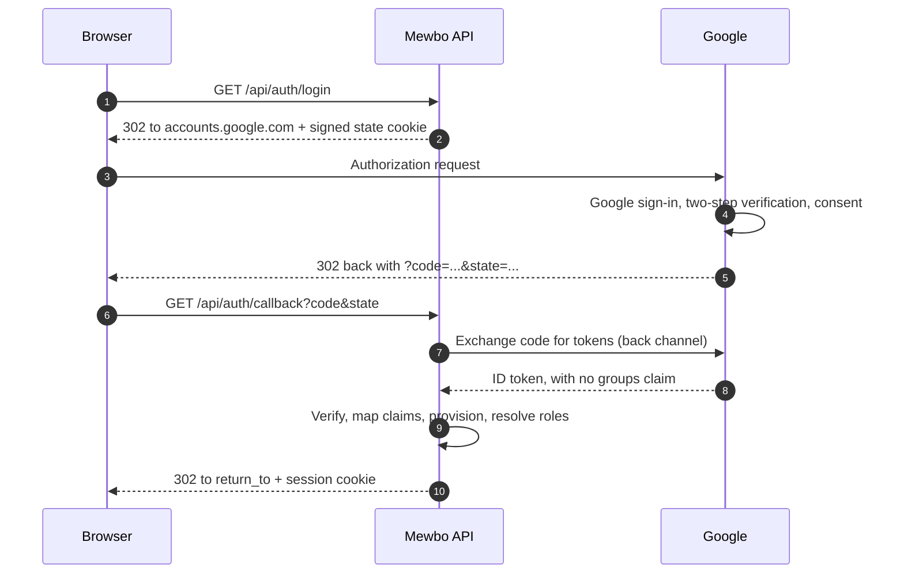

# Google Cloud Identity and Workspace

Google is a fully standards-compliant OpenID Connect provider, and signing in to Mewbo with a Google Workspace account works with a short, unremarkable configuration block. Group-driven authorization is where it gets interesting, and the reason is worth stating before anything else.

> [!WARNING] Google's OIDC ID token carries no groups claim at all
> This is not a scope you forgot to request or a mapper you failed to configure. Google's OpenID Connect implementation simply does not emit group membership in the ID token, and no combination of scopes will make it appear. If your plan was "sign in with Google, map Google Groups to Mewbo roles", that plan needs one of the alternatives below.

Everything else about Google works exactly as you would expect. Read the [authorization options](#getting-groups-into-mewbo) section before you commit to a design.

---

## What this unlocks

- Single sign-on for the Mewbo console and REST API with Google Workspace or Cloud Identity accounts.
- Google's own security controls (two-step verification, context-aware access, session length) apply to Mewbo without Mewbo implementing any of them.
- Authorization by email address, email domain, SAML group attributes, or explicit role assignment, depending on which option below you choose.

---

## The login flow



---

## Configure Google

In the Google Cloud console, under APIs and Services, create an **OAuth 2.0 Client ID** of type Web application.

| Google setting | Value |
|---|---|
| Application type | Web application |
| Authorised redirect URI | `https://console.example.com/api/auth/callback` |
| Authorised JavaScript origin | `https://console.example.com` |

Configure the OAuth consent screen as **Internal** if you want it restricted to your Workspace organisation, which is almost always what an enterprise deployment wants. Internal consent means only accounts in your Workspace tenant can complete the flow, and that alone is a meaningful authorization boundary.

Copy the client ID and client secret.

---

## Configure Mewbo

```json
{
  "api": {
    "auth": {
      "enabled": true,
      "authenticators": [
        {
          "name": "google",
          "kind": "oidc",
          "issuer": "https://accounts.google.com",
          "discovery_url": "https://accounts.google.com/.well-known/openid-configuration",
          "client_id": "1234567890-abcdefg.apps.googleusercontent.com",
          "client_secret": "the-client-secret",
          "scopes": ["openid", "email", "profile"]
        }
      ],
      "session": { "secret": "generate-a-long-random-string" },
      "role_mappings": { "default_role": "viewer" }
    }
  }
}
```

Field notes, verified against [`authenticators.py`](repo:packages/mewbo_iam/src/mewbo_iam/authenticators.py):

- `issuer` is `https://accounts.google.com` with no trailing slash. This must match the `iss` claim exactly.
- `identity_claim` defaults to `sub`, which for Google is a stable, opaque numeric string that never changes even if the user's email does. Prefer it over email as the join key.
- `email_claim` and `email_verified_claim` default to `email` and `email_verified`, both of which Google populates. `email_verified` is read only when the provider sends a real boolean; anything else leaves it unknown rather than assuming false.
- `picture_claim` defaults to `picture`, which Google populates with the user's profile photo URL.
- There is deliberately **no** `groups_claim` in the block above, because setting one would be pointless. The dotted-path read simply yields nothing and every user lands on `default_role`.

The `oidc` extra is required: `pip install mewbo-iam[oidc]`.

---

## Getting groups into Mewbo

Four options, in the order most deployments should consider them.

### Option 1: assign roles by email or domain rule

The simplest approach, and often sufficient. Mewbo's mapping rules match against the identity provider's group names, and Google supplies none, so instead pin the small set of privileged users explicitly with the bootstrap allowlist and leave everyone else on the default role.

```json
"role_mappings": { "default_role": "member" },
"bootstrap": {
  "admin_subjects": ["100000000000000000001", "100000000000000000002"]
}
```

`admin_subjects` matches the `sub` claim exactly, which for Google is the numeric account id rather than the email address. Find it by signing in once and reading the `subject` field from `GET /api/auth/me`.

Combine this with an Internal consent screen and the practical result is: anyone in your Workspace tenant can sign in as a `member`, and a named list of people are admins.

> [!WARNING] On the Google OIDC path, `admin_subjects` is not a bootstrap, it is the permanent list
> Roles are recomputed from the group mapping on **every** login and the stored record is overwritten with the result. That is what makes an identity provider group change take effect at next sign-in, and it is the right behaviour when groups drive roles.
>
> Google supplies no groups, so the mapping always resolves to `default_role`. The consequence is specific and easy to get wrong: **promoting a user through the admin surface does not survive their next login.** They are recomputed straight back down to `default_role`.
>
> So on this path, keep every privileged user in `admin_subjects`, and treat that list as your real source of truth rather than a cold-start convenience. If that is untenable for your organisation, you want one of the three options below, all of which supply real groups.

### Option 2: use SAML instead of OIDC

Google's SAML implementation **can** send group membership, which OIDC cannot. In the Google Admin console, configure Mewbo as a custom SAML app and add a **Group membership** attribute mapping, selecting which groups to include and the attribute name to send them as.

Before committing to this path, three limitations apply to every SAML integration:

- **Sign-in is service-provider initiated only.** Users must start at `/api/auth/saml/login`, so the app tile in the Google apps launcher will not sign anyone in. Point the tile at `https://console.example.com/api/auth/saml/login`.
- **Mewbo does not sign AuthnRequests and cannot decrypt encrypted assertions.** Leave assertion encryption off in the Google Admin console.
- **There is no Single Logout**, and replay protection is per worker rather than shared across the deployment.

The [Entra guide](integrations-entra-id.md#alternative-terminate-saml-at-a-reverse-proxy) describes a reverse-proxy alternative that avoids the first two.

```json
{
  "name": "google-saml",
  "kind": "saml",
  "issuer": "https://accounts.google.com/o/saml2?idpid=C01abcdef",
  "sp_entity_id": "https://console.example.com",
  "idp_metadata_url": "https://accounts.google.com/o/saml2/idp?idpid=C01abcdef",
  "subject_attribute": "NameID",
  "email_attribute": "email",
  "name_attribute": "displayName",
  "groups_attribute": "groups"
}
```

`groups_attribute` must match the attribute name you configured in the Google Admin console. Exactly one of `idp_metadata_url` or `idp_metadata_xml` is required; providing both, or neither, is rejected when the configuration is parsed.

Register these on the Google side:

| Google SAML setting | Value |
|---|---|
| ACS URL | `https://console.example.com/api/auth/saml/acs` |
| Entity ID | `https://console.example.com` |

Mewbo publishes its own SP metadata at `GET /api/auth/saml/metadata`, which you can hand to whoever administers the Google Admin console rather than transcribing values by hand.

The SAML authenticator requires the `saml` extra: `pip install mewbo-iam[saml]`.

### Option 3: query the Directory API yourself

Google's Cloud Identity and Admin SDK Directory API can list a user's groups, but **Mewbo does not call it**. There is no Google-specific directory driver in the codebase, and no configuration field that would enable one. If you want this, the integration point is outside Mewbo: have an external process read group membership from the Directory API and assign Mewbo roles through the IAM admin API, or provision users and their roles through SCIM.

This is an honest gap rather than a hidden feature. Do not go looking for a `google_directory` authenticator kind, because there is not one.

### Option 4: put an identity broker in front

If you already run Keycloak, Authentik, or Authelia, brokering Google through it gives you the best of both. The broker handles Google sign-in, you manage groups in the broker, and Mewbo sees a normal OIDC provider that emits a proper groups claim. See the [Keycloak](integrations-keycloak.md), [Authentik](integrations-authentik.md), or [Authelia](integrations-authelia.md) guides, and configure Google as an upstream identity provider inside them.

For an organisation that wants Google as the credential source and real group-driven authorization in Mewbo, this is usually the least total work.

---

## Verify it works

1. Sign in through the console, then call `GET /api/auth/me`. Expect `authenticated: true`, your numeric Google `sub` as the subject, `email_verified: true`, a `picture_url` under `avatar`, and an `auth_method` reporting `kind: "oidc"` with issuer `https://accounts.google.com`.
2. Expect `roles` to contain exactly your `default_role` on the OIDC path unless you used the bootstrap allowlist. That is correct behaviour, not a misconfiguration.
3. On the SAML path, confirm `roles` reflects your Google group attribute mapping. If it does not, the attribute name in the config and in the Google Admin console disagree.

---

## Failure modes

| Symptom | Cause | Fix |
|---|---|---|
| Everyone lands on `default_role`, and `groups_claim` is set | Google's ID token has no groups claim, and never will | Use one of the four options above. This is not fixable by configuration |
| `redirect_uri_mismatch` from Google | The registered redirect URI does not match what Mewbo sent | Register `<origin>/api/auth/callback` exactly, including scheme and any port |
| The URI Google rejects reads `http://` when you serve https | The reverse proxy is not forwarding `X-Forwarded-Proto` | Forward `X-Forwarded-Proto` and `X-Forwarded-Host` |
| Users outside your organisation can sign in | The OAuth consent screen is set to External | Set it to Internal, which restricts it to your Workspace tenant |
| `?auth_error=login_failed` | The callback was rejected: state mismatch, expired login, bad signature, or a failed token exchange | Check the server log, which carries the structural reason |
| `?auth_error=provider_error` | Google returned an error to the callback, typically a denied consent | Retry, and check the consent screen configuration |
| `?auth_error=account_disabled` | The user exists in Mewbo but has been disabled | Re-enable them through the admin surface |
| Server will not boot, naming the `oidc` or `saml` extra | Driver dependencies are not installed | `pip install mewbo-iam[oidc]` or `pip install mewbo-iam[saml]` |
| Server will not boot, complaining about `session.secret` | A non-API-key authenticator is configured with no signing secret | Set `api.auth.session.secret` |
| Server will not boot, complaining about a wildcard CORS origin | A browser-login authenticator plus `CORS_ORIGIN: "*"` | Pin the origin to the console's exact URL, since a credentialed cross-origin request cannot use a wildcard |

For the concepts behind this page, including roles, the permission catalogue, how a request resolves to a principal, and what is and is not enforced, see [Authentication and Access](authentication.md). This guide connects one provider; it deliberately does not restate the model.
