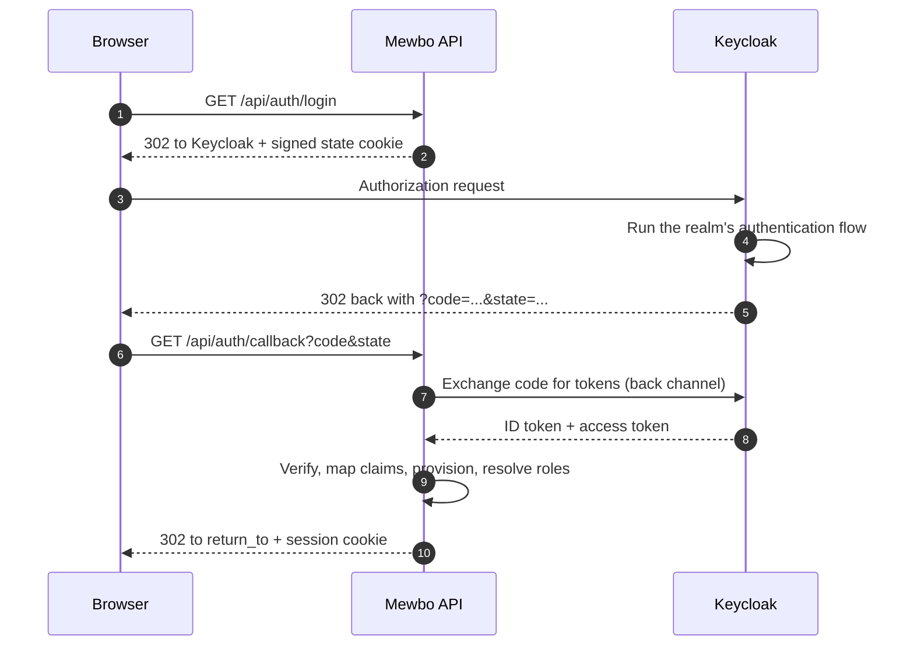

# Keycloak

## Find roles inside the token

[Keycloak](https://www.keycloak.org) is a standards-clean OpenID Connect provider and the least surprising one to put in front of Mewbo. One thing catches people out. **Keycloak puts roles and groups in three different places in the token**, and none is a plain top-level `groups` claim unless you create it. This guide covers all three.

---

## What this unlocks

- Single sign on for the Mewbo console and REST API against a Keycloak realm.
- Realm roles, client roles, or group membership can each drive Mewbo roles.
- Keycloak's authentication flows, multi factor, step up and identity brokering to an upstream provider, apply to Mewbo without Mewbo implementing any of them.

---

## The login flow



---

## Configure Keycloak

Create a client in your realm.

| Keycloak setting | Value |
|---|---|
| Client ID | `mewbo` |
| Client authentication | On, making it a confidential client |
| Standard flow | Enabled, this is the authorization-code flow |
| Valid redirect URI | `https://console.example.com/api/auth/callback` |
| Valid post logout redirect URI | `https://console.example.com/` |
| Web origins | `https://console.example.com` |

Copy the generated client secret from the Credentials tab.

---

## Choosing where roles come from

This decision shapes the rest of the configuration. `groups_claim` accepts a **dotted path**, so a nested claim is reachable without any code change. A path whose segments do not all exist yields nothing rather than an error.

=== "Realm roles"

    Realm roles live at `realm_access.roles` and are included in tokens by default, with no mapper to configure. This is the simplest option and the one to reach for first.

    ```json title="configs/app.json"
    "groups_claim": "realm_access.roles"
    ```

    The claim's shape in the token:

    ```json
    { "realm_access": { "roles": ["mewbo-admins", "engineering", "offline_access"] } }
    ```

    Keycloak mixes its own built-in roles such as `offline_access` and `uma_authorization` into this list. Unmatched names match no rule, so they are harmless.

=== "Client roles"

    Client roles live under their client's name, which keeps Mewbo's roles from colliding with another application's.

    ```json title="configs/app.json"
    "groups_claim": "resource_access.mewbo.roles"
    ```

    The claim's shape in the token:

    ```json
    { "resource_access": { "mewbo": { "roles": ["admin", "operator"] } } }
    ```

    Substitute your own client ID for `mewbo` in the path. Renaming the client changes the claim path with it.

=== "Groups"

    Group membership is **not in the token by default**. A missing mapper is the single most common reason a Keycloak setup resolves everyone to the default role.

    In the client, go to Client scopes, open the dedicated `mewbo-dedicated` scope, and add a mapper of type **Group Membership**.

    | Mapper setting | Value |
    |---|---|
    | Name | `groups` |
    | Token Claim Name | `groups` |
    | Full group path | Off, unless you want the leading-slash form |
    | Add to ID token | On |
    | Add to access token | On |

    ```json title="configs/app.json"
    "groups_claim": "groups"
    ```

> [!IMPORTANT] The full-group-path toggle changes what you must match on
> With **Full group path off** a group emits its bare name, `engineering`. With it **on** the same group emits `/acme/engineering`. Mewbo matches whatever string arrives, so the toggle and your `role_mappings` rules must agree.
>
> With full paths on, write the leading-slash form into `match`, or set `match_kind` to `regex` with a pattern such as `.*/engineering` so nesting changes do not break it.

---

## Configure Mewbo

```json title="configs/app.json" linenums="1"
{
  "api": {
    "auth": {
      "enabled": true,
      "authenticators": [
        {
          "name": "keycloak",
          "kind": "oidc",
          "issuer": "https://idp.example.com/realms/acme",
          "discovery_url": "https://idp.example.com/realms/acme/.well-known/openid-configuration",
          "client_id": "mewbo",
          "client_secret": "the-secret-from-the-credentials-tab",
          "scopes": ["openid", "email", "profile"],
          "groups_claim": "realm_access.roles"
        }
      ],
      "session": { "secret": "generate-a-long-random-string" },
      "role_mappings": {
        "default_role": "viewer",
        "rules": [
          { "match": "mewbo-admins", "target": "admin" },
          { "match": "mewbo-operators", "target": "operator" },
          { "match": "^eng-.*$", "match_kind": "regex", "target": "member" }
        ]
      },
      "team_mappings": {
        "rules": [
          { "match": "platform-team", "target": "platform" }
        ]
      },
      "bootstrap": { "admin_group": "mewbo-admins" }
    }
  }
}
```

Field notes, verified against [`authenticators.py`](repo:packages/mewbo_iam/src/mewbo_iam/authenticators.py) and [`mappings.py`](repo:packages/mewbo_iam/src/mewbo_iam/mappings.py).

- `issuer` must equal the `iss` claim in the token exactly. For Keycloak that is `<base>/realms/<realm>` with no trailing slash.
- `identity_claim` defaults to `sub`, a stable UUID on Keycloak. Anything else risks changing when a user is renamed.
- `email_claim`, `name_claim` and `picture_claim` default to `email`, `name` and `picture`. Keycloak populates all three under the standard `profile` and `email` scopes.

How the rules themselves evaluate, ordering, case sensitivity and the `default_role` fallback, is covered once in [Mapping groups to roles](authentication.md#mapping-groups-to-roles).

The `oidc` extra is required. Run `pip install mewbo-iam[oidc]`.

---

## Bootstrapping the first administrator

The `bootstrap` block gets the first administrator in before anyone can be granted admin through the console. How it works, and why a hand-granted role does not survive the next login, is covered once in [Bootstrapping the first administrator](authentication.md#bootstrapping-the-first-administrator).

One value is Keycloak specific. `admin_subjects` is an exact-match allowlist of subject identifiers, which here means the user's `sub` UUID rather than their username. Since Keycloak does supply groups, prefer `admin_group` and drop the subject list.

---

## Verify it works

1. Sign in through the console, then call `GET /api/auth/me`. A working setup returns `authenticated: true`, your `sub` as the subject, the resolved `roles`, the full `permissions` set, your `teams`, and an `auth_method` object reporting `kind: "oidc"` with your issuer.
2. If `roles` contains only `viewer`, the group claim did not arrive. The Keycloak client's Client scopes, Evaluate tab shows the exact generated token. Confirm the claim exists at the path you configured before changing anything in Mewbo.
3. Test a logout round trip with `POST /api/auth/logout?idp=true`. It clears the Mewbo session and redirects to Keycloak's end-session endpoint.

---

## Failure modes

These are Keycloak specific. Boot failures and generic callback errors are in the shared [Troubleshooting](authentication-providers.md#troubleshooting) table.

| Symptom | Cause | Fix |
|---|---|---|
| Everyone lands on `viewer` | The claim is not in the token, most often the Group Membership mapper was never added | Use the Evaluate tab to inspect the real token, then fix the mapper or the claim path |
| Everyone lands on `viewer`, and the claim *is* present | `groups_claim` path does not match the token's nesting | Match the path exactly, for example `resource_access.mewbo.roles` rather than `roles` |
| Group names do not match the rules | Full group path is on, so names arrive as `/acme/engineering` | Match the path form, or switch the rule to `match_kind: "regex"` |
| `?auth_error=login_failed` | The callback was rejected | Check the server log, then confirm the registered redirect URI matches `<origin>/api/auth/callback` byte for byte |
| `?auth_error=provider_error` | Keycloak returned an error to the callback, usually a policy or consent denial | Check the Keycloak event log |

---

## Running Keycloak alongside other authenticators

A deployment can keep issuing service keys for automation while humans sign in through Keycloak. See [Running more than one at once](authentication-providers.md#running-more-than-one-at-once) for the list shape and for selecting one authenticator by name.

The ordering matters when both are in play. Mewbo resolves a request through ordered channels. API key first, then bearer token, then session cookie, then trusted proxy header. An explicit credential always outranks an ambient one, so a script presenting an API key is never silently re-identified as whoever happens to be browsing.

For the concepts behind this page, including roles, the permission catalogue, how a request resolves to a principal, and what is and is not enforced, see [Authentication and Access](authentication.md). This guide connects one provider. It deliberately does not restate the model.
