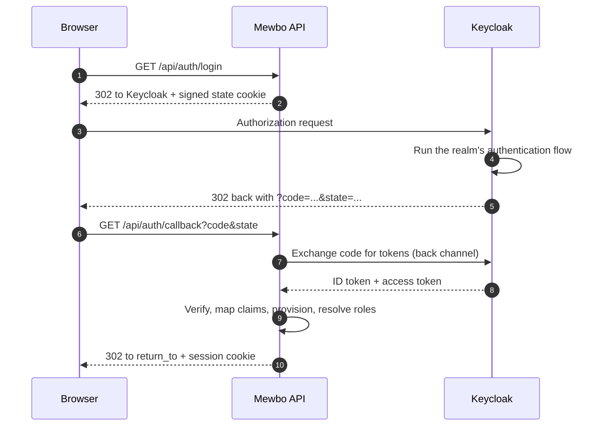

# Keycloak

[Keycloak](https://www.keycloak.org) is a standards-clean OpenID Connect provider, which makes it the least surprising identity provider to put in front of Mewbo. The one thing that reliably catches people out is that **Keycloak puts roles and groups in three different places in the token**, and none of them is a plain top-level `groups` claim unless you create it. This guide covers all three.

---

## What this unlocks

- Single sign-on for the Mewbo console and REST API against a Keycloak realm.
- Realm roles, client roles, or group membership can each drive Mewbo roles.
- Keycloak's authentication flows (multi-factor, step-up, identity brokering to an upstream provider) apply to Mewbo without Mewbo implementing any of them.

---

## The login flow



---

## Configure Keycloak

Create a client in your realm.

| Keycloak setting | Value |
|---|---|
| Client ID | `mewbo` |
| Client authentication | On, making it a confidential client |
| Standard flow | Enabled, this is the authorization-code flow |
| Valid redirect URI | `https://console.example.com/api/auth/callback` |
| Valid post logout redirect URI | `https://console.example.com/` |
| Web origins | `https://console.example.com` |

Copy the generated client secret from the Credentials tab.

---

## Choosing where roles come from

This is the decision that shapes the rest of the configuration. Mewbo reads a single claim path, and `groups_claim` accepts a **dotted path**, so a nested claim is reachable without any code change. The dotted read descends one mapping segment at a time and yields nothing if a segment is missing, so a provider that omits an optional claim degrades cleanly rather than erroring.

=== "Realm roles"

    Realm roles live at `realm_access.roles` and are included in tokens by default, with no mapper to configure. This is the simplest option and the one to reach for first.

    ```json
    "groups_claim": "realm_access.roles"
    ```

    The claim's shape in the token:

    ```json
    { "realm_access": { "roles": ["mewbo-admins", "engineering", "offline_access"] } }
    ```

    Note that Keycloak mixes its own built-in roles such as `offline_access` and `uma_authorization` into this list. That is harmless, since unmatched names simply match no rule, but do not be surprised to see them.

=== "Client roles"

    Client roles are scoped to one client and live under that client's name, which keeps Mewbo's roles from colliding with another application's.

    ```json
    "groups_claim": "resource_access.mewbo.roles"
    ```

    The claim's shape in the token:

    ```json
    { "resource_access": { "mewbo": { "roles": ["admin", "operator"] } } }
    ```

    Substitute your actual client ID for `mewbo` in the path. If you renamed the client, the claim path changes with it.

=== "Groups"

    Group membership is **not in the token by default**. You must add a mapper explicitly, which is the single most common reason a Keycloak setup resolves everyone to the default role.

    In the client, go to Client scopes, open the dedicated `mewbo-dedicated` scope, and add a mapper of type **Group Membership** with:

    | Mapper setting | Value |
    |---|---|
    | Name | `groups` |
    | Token Claim Name | `groups` |
    | Full group path | Off, unless you want the leading-slash form |
    | Add to ID token | On |
    | Add to access token | On |

    ```json
    "groups_claim": "groups"
    ```

> [!IMPORTANT] The full-group-path toggle changes what you must match on
> With **Full group path off**, a group emits its bare name: `engineering`. With it **on**, the same group emits its hierarchical path: `/acme/engineering`. Mewbo matches whatever string arrives, so the toggle and your `role_mappings` rules must agree. If you enable full paths, either write the leading-slash form into `match`, or switch that rule to `match_kind: "regex"` and use a pattern such as `.*/engineering` so nesting changes do not break it.

---

## Configure Mewbo

```json
{
  "api": {
    "auth": {
      "enabled": true,
      "authenticators": [
        {
          "name": "keycloak",
          "kind": "oidc",
          "issuer": "https://idp.example.com/realms/acme",
          "discovery_url": "https://idp.example.com/realms/acme/.well-known/openid-configuration",
          "client_id": "mewbo",
          "client_secret": "the-secret-from-the-credentials-tab",
          "scopes": ["openid", "email", "profile"],
          "groups_claim": "realm_access.roles"
        }
      ],
      "session": { "secret": "generate-a-long-random-string" },
      "role_mappings": {
        "default_role": "viewer",
        "rules": [
          { "match": "mewbo-admins", "target": "admin" },
          { "match": "mewbo-operators", "target": "operator" },
          { "match": "^eng-.*$", "match_kind": "regex", "target": "member" }
        ]
      },
      "team_mappings": {
        "rules": [
          { "match": "platform-team", "target": "platform" }
        ]
      },
      "bootstrap": { "admin_group": "mewbo-admins" }
    }
  }
}
```

Field notes, verified against [`authenticators.py`](repo:packages/mewbo_iam/src/mewbo_iam/authenticators.py) and [`mappings.py`](repo:packages/mewbo_iam/src/mewbo_iam/mappings.py):

- `issuer` must equal the `iss` claim in the token exactly. For Keycloak that is `<base>/realms/<realm>` with no trailing slash.
- `identity_claim` defaults to `sub`, which for Keycloak is a stable UUID. Leave it unless you have a strong reason, since anything else risks changing when a user is renamed.
- `email_claim`, `name_claim`, and `picture_claim` default to `email`, `name`, and `picture`, all of which Keycloak populates under the standard `profile` and `email` scopes.
- Rules are **ordered** and every matching rule contributes its target, deduplicated in rule order. A user in two matching groups gets both roles.
- Matching is case-insensitive for both `exact` and `regex`, and a regex must match the whole string. An invalid pattern is rejected when the config is parsed, not at login.
- `default_role` applies when no rule matches, so every user lands with a defined, least-privilege role. It defaults to `viewer`.
- `team_mappings` has no default, so an unmatched user simply joins no team, which is a valid state.

The `oidc` extra is required: `pip install mewbo-iam[oidc]`. If it is absent, Mewbo refuses to boot with a message naming the kind, the extra, and the missing module rather than failing at first login.

---

## Bootstrapping the first administrator

Before anyone can be granted the admin role through the console, an admin has to exist. The `bootstrap` block is the cold-start escape hatch and confers admin on a matching login.

```json
"bootstrap": {
  "admin_group": "mewbo-admins",
  "admin_subjects": ["cccccccc-1111-2222-3333-444444444444"]
}
```

`admin_group` is matched case-insensitively against the identity provider's group names. `admin_subjects` is an exact-match allowlist of subject identifiers, which for Keycloak means the user's `sub` UUID rather than their username. Either one matching confers admin.

> [!IMPORTANT] Roles are recomputed on every login, not merged
> Each time a federated user signs in, their roles are resolved afresh from the group mapping plus the bootstrap rule, and the stored user record is overwritten with that result.
>
> This is what you want when groups drive roles: remove someone from `mewbo-admins` in Keycloak and they lose admin at their next sign-in, with no separate step in Mewbo. It has one consequence worth knowing before it surprises you, though. **A role granted by hand through the admin surface does not survive the user's next login** if the group mapping does not also produce it. For a federated user, the identity provider is the source of truth for roles; change the group, not the user.

---

## Verify it works

1. Sign in through the console, then call `GET /api/auth/me`. A working setup returns `authenticated: true`, your `sub` as the subject, the resolved `roles`, the full `permissions` set, your `teams`, and an `auth_method` object reporting `kind: "oidc"` with your issuer.
2. If `roles` contains only `viewer`, the group claim did not arrive. Decode the ID token at the Keycloak client's Client scopes, Evaluate tab, which shows the exact generated token. Confirm the claim exists at the path you configured before changing anything in Mewbo.
3. Test a logout round trip with `POST /api/auth/logout?idp=true`, which clears the Mewbo session and redirects to Keycloak's end-session endpoint.

---

## Failure modes

| Symptom | Cause | Fix |
|---|---|---|
| Everyone lands on `viewer` | The claim is not in the token, most often the Group Membership mapper was never added | Use the Evaluate tab to inspect the real token, then fix the mapper or the claim path |
| Everyone lands on `viewer`, and the claim *is* present | `groups_claim` path does not match the token's nesting | Match the path exactly, for example `resource_access.mewbo.roles` rather than `roles` |
| Group names do not match the rules | Full group path is on, so names arrive as `/acme/engineering` | Match the path form, or switch the rule to `match_kind: "regex"` |
| `?auth_error=login_failed` | The callback was rejected: state mismatch, expired login, bad signature, or a failed token exchange | Check the server log, which carries the structural reason, and confirm the registered redirect URI matches `<origin>/api/auth/callback` byte for byte |
| `?auth_error=provider_error` | Keycloak returned an error to the callback, usually a policy or consent denial | Check the Keycloak event log |
| `?auth_error=account_disabled` | The user exists in Mewbo but has been disabled | Re-enable the user through the admin surface |
| Redirect URI mismatch, and the URI reads `http://` when you expected `https://` | The reverse proxy is not forwarding `X-Forwarded-Proto` | Forward `X-Forwarded-Proto` and `X-Forwarded-Host` |
| Server will not boot, naming the `oidc` extra | OIDC driver dependencies are not installed | `pip install mewbo-iam[oidc]` |
| Server will not boot, complaining about `session.secret` | A non-API-key authenticator is configured with no signing secret | Set `api.auth.session.secret` |
| Server will not boot, complaining about a wildcard CORS origin | A browser-login authenticator plus `CORS_ORIGIN: "*"` | Pin the origin to the console's exact URL, since a credentialed cross-origin request cannot use a wildcard |

---

## Running Keycloak alongside other authenticators

`authenticators` is a list, and local API keys are themselves an authenticator kind. A deployment can keep issuing service keys for automation while humans sign in through Keycloak.

```json
"authenticators": [
  { "name": "local-keys", "kind": "api_key" },
  { "name": "keycloak", "kind": "oidc", "...": "..." }
]
```

Mewbo resolves a request through ordered channels: API key first, then bearer token, then session cookie, then trusted proxy header. An explicit credential always outranks an ambient one, so a script presenting an API key is never silently re-identified as whoever happens to be browsing.

When more than one OIDC authenticator is configured, `GET /api/auth/login?authenticator=keycloak` selects one by name. Without the parameter, the default is used.

For the concepts behind this page, including roles, the permission catalogue, how a request resolves to a principal, and what is and is not enforced, see [Authentication and Access](authentication.md). This guide connects one provider; it deliberately does not restate the model.
