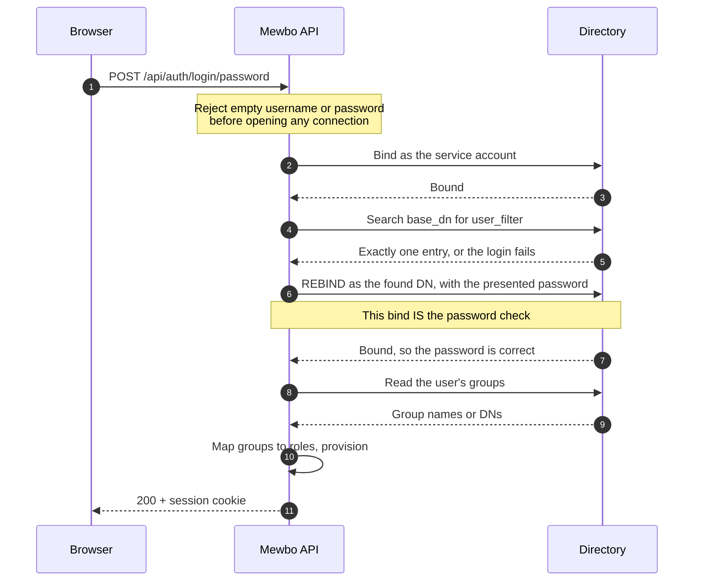

# LDAP and Active Directory

Mewbo can verify usernames and passwords directly against an LDAP directory, including Microsoft Active Directory. This is the one authenticator where Mewbo itself handles the user's password, so it works differently from the redirect-based providers and deserves a careful read.

Unlike OIDC or SAML, there is no browser redirect and no identity provider session. Mewbo serves a username and password form, and verifies the credentials by binding to the directory as that user.

---

## What this unlocks

- Username and password sign-in for the Mewbo console and REST API against an existing directory.
- Directory groups drive Mewbo roles, including nested groups on Active Directory.
- No identity provider deployment required. If you have a directory, you have enough.

---

## How the password check actually works

This is worth understanding before you configure anything, because the security of the whole arrangement rests on one step.



**The rebind is the password check, and nothing else is.** A search that finds the user proves only that the account exists. Treating a successful search as verification is a classic authentication bypass, so Mewbo keeps the two visibly separate: the search returns a DN, and no identity is built until the rebind with the presented password succeeds.

Two related traps are closed deliberately, both verified in [`ldap.py`](repo:packages/mewbo_iam/src/mewbo_iam/drivers/ldap.py):

- **Empty passwords are rejected before a connection is opened.** LDAP treats a bind carrying a DN and an empty password as an *anonymous* bind, which succeeds. A login path that passed an empty password straight through would authenticate anyone who knows a username.
- **An ambiguous filter refuses to authenticate.** If `user_filter` matches more than one entry, the login fails rather than resolving to the first hit. Which entry comes "first" is a server ordering detail, not an identity decision.

---

## Configure Mewbo

=== "OpenLDAP"

    ```json
    {
      "api": {
        "auth": {
          "enabled": true,
          "authenticators": [
            {
              "name": "openldap",
              "kind": "ldap",
              "server_url": "ldaps://directory.example.com:636",
              "base_dn": "ou=people,dc=example,dc=com",
              "user_filter": "(uid={username})",
              "uid_attribute": "uid",
              "mail_attribute": "mail",
              "name_attribute": "cn",
              "group_attribute": "memberOf",
              "bind_dn": "cn=mewbo-service,ou=services,dc=example,dc=com",
              "bind_password": "the-service-account-password",
              "tls_verify": true,
              "tls_ca_file": "/etc/ssl/certs/internal-ca.pem"
            }
          ],
          "session": { "secret": "generate-a-long-random-string" },
          "role_mappings": {
            "default_role": "viewer",
            "rules": [
              { "match": "cn=mewbo-admins,ou=groups,dc=example,dc=com", "target": "admin" }
            ]
          }
        }
      }
    }
    ```

=== "Active Directory"

    ```json
    {
      "name": "active-directory",
      "kind": "ldap",
      "server_url": "ldaps://dc01.example.com:636",
      "base_dn": "dc=example,dc=com",
      "user_filter": "(sAMAccountName={username})",
      "uid_attribute": "sAMAccountName",
      "mail_attribute": "mail",
      "name_attribute": "displayName",
      "group_attribute": "memberOf",
      "bind_dn": "cn=Mewbo Service,ou=Service Accounts,dc=example,dc=com",
      "bind_password": "the-service-account-password",
      "group_base_dn": "dc=example,dc=com",
      "group_member_attribute": "member",
      "group_name_attribute": "cn",
      "nested_groups": true,
      "tls_verify": true,
      "tls_ca_file": "/etc/ssl/certs/internal-ca.pem"
    }
    ```

    Active Directory's login name attribute is `sAMAccountName` rather than `uid`, and its display name is `displayName` rather than `cn`. `userPrincipalName` is the alternative if your users sign in with their email-shaped principal name.

The `ldap` extra is required: `pip install mewbo-iam[ldap]`.

### Field reference

| Field | Default | Notes |
|---|---|---|
| `server_url` | required | Must be an `ldap://` or `ldaps://` URL. Anything else is rejected when the config is parsed |
| `base_dn` | required | The subtree searched for users |
| `user_filter` | `(uid={username})` | Must contain the `{username}` placeholder, enforced at parse time |
| `uid_attribute` | `uid` | Becomes the identity's subject. Use `sAMAccountName` on Active Directory |
| `mail_attribute` | `mail` | |
| `name_attribute` | `cn` | Use `displayName` on Active Directory |
| `group_attribute` | `memberOf` | Read off the user entry when `group_base_dn` is unset |
| `bind_dn`, `bind_password` | none | The service account used for the **search only**. Must be set together, enforced at parse time. Omit both to search anonymously |
| `start_tls` | `false` | Upgrades a plain `ldap://` connection. Ignored for `ldaps://`, which is already encrypted |
| `tls_verify` | `true` | Verifies the certificate chain **and** the hostname. See below |
| `tls_ca_file` | none | PEM bundle for a private or internal CA. Unset means the system trust store |
| `group_base_dn` | none | Enables the reverse group search instead of reading `memberOf` |
| `group_member_attribute` | `member` | The attribute on a group listing its members |
| `group_name_attribute` | none | Which attribute becomes the group name. Unset uses the group's DN |
| `nested_groups` | `false` | Requires `group_base_dn`, enforced at parse time |

---

## TLS: leave verification on

**`tls_verify` defaults to `true`, and you should leave it there.** This is not ordinary transport hygiene, because of how the password check works.

The underlying ldap3 library's default TLS configuration validates nothing. Without an explicit certificate policy, `ldaps://` and StartTLS encrypt the connection but never authenticate the server. Since Mewbo verifies passwords by *binding to the directory*, anyone able to intercept traffic between Mewbo and the directory could present any certificate at all and would be handed every password your users type. Encryption without authentication is not a weaker form of security here; it is an open credential harvest.

With verification on, an untrusted certificate **refuses the handshake and the password never leaves Mewbo**. The same policy is applied to both the service connection and the user rebind, assembled in one place so the two legs cannot drift apart. The rebind is the leg the password crosses, so this matters.

**The hostname is checked as well as the chain**, and this is the likeliest support issue. A certificate that is perfectly valid but issued for a different name is refused. In practice that means:

- **Connecting by IP address will fail** unless the certificate actually lists that IP. Use the hostname the certificate was issued for.
- `ldaps://dc01.example.com` and `ldaps://dc01` are not interchangeable. Match `server_url` to the certificate's subject or subject alternative name.

If your directory presents a certificate from a private or internal CA, which is the usual case for an in-house Active Directory or OpenLDAP server, **set `tls_ca_file` rather than turning verification off**. Point it at a PEM bundle containing the CA certificate, and treat that as a normal part of setup rather than a workaround.

**A self-signed certificate is also handled by `tls_ca_file`:** put the certificate itself in the bundle. "Self-signed" reads to many operators as "I have to disable verification", and it does not. You almost never need `tls_verify: false`.

When you genuinely have no other option, understand what you are accepting rather than treating it as a connection-troubleshooting step: with verification off, anyone able to intercept traffic between Mewbo and the directory can present their own certificate and **collect every password your users type**. That is the consequence, stated once and plainly. If you find yourself reaching for it to make a handshake succeed, the actual fix is almost always `tls_ca_file` or correcting the hostname.

Setting `tls_verify: false` together with `tls_ca_file` is rejected at parse time, because a CA bundle is only ever consulted while validating. The pair states two different intentions and one of them would be silently lost, so Mewbo refuses rather than picking a winner and leaving a configuration that reads as the opposite of what it does.

---

## Reading groups: two strategies

Which strategy runs is decided by whether `group_base_dn` is set.

=== "memberOf on the user entry (default)"

    With `group_base_dn` unset, Mewbo reads the `group_attribute` straight off the user's own entry. This is one fewer directory round trip and needs no extra permissions.

    `memberOf` returns **full DNs**, so your mapping rules must match DNs:

    ```json
    { "match": "cn=mewbo-admins,ou=groups,dc=example,dc=com", "target": "admin" }
    ```

    A regex rule is often more readable and survives the group moving between organisational units:

    ```json
    { "match": "cn=mewbo-admins,.*", "match_kind": "regex", "target": "admin" }
    ```

    This strategy **cannot** expand nested groups. `memberOf` lists direct membership only.

=== "Reverse group search"

    With `group_base_dn` set, Mewbo searches that subtree for group entries listing the user as a member, filtering on `group_member_attribute`. This is the only strategy that can expand nesting.

    `group_name_attribute` chooses what becomes the group name. Set it to `cn` to match on bare names:

    ```json
    { "match": "mewbo-admins", "target": "admin" }
    ```

    Left unset, the group's DN is used, which matches what `memberOf` returns so both strategies agree by default.

### Nested groups on Active Directory

Setting `nested_groups: true` makes the group search use Active Directory's `LDAP_MATCHING_RULE_IN_CHAIN` extensible match, OID `1.2.840.113556.1.4.1941`. The filter becomes:

```
(member:1.2.840.113556.1.4.1941:=cn=alice,ou=people,dc=example,dc=com)
```

The server then walks the membership chain transitively, so a user in `engineering`, which is itself a member of `all-staff`, matches a rule targeting `all-staff`. That is one server-side search rather than a recursive client-side crawl.

This is an **Active Directory family feature**. Other directories ignore or reject the OID, which is why it is opt-in. `nested_groups` requires `group_base_dn`, enforced when the config is parsed, because the `memberOf` attribute cannot express nesting at all.

> [!NOTE] Group resolution is best-effort by design
> If the directory refuses the group search, the login still succeeds and the user gets **no** groups, which lands them on the mapping's `default_role`. That degrades a user to least privilege, which is the safe direction. The alternative, keeping whatever roles they last had, fails open and is not what you want when the directory is misbehaving.
>
> The practical consequence: a user who unexpectedly drops to `viewer` may be hitting a group-search permission problem rather than a mapping mistake. Check the service account's read rights on the group subtree.

---

## Signing in

LDAP is served through a username and password endpoint rather than a redirect:

```
POST /api/auth/login/password
{ "username": "alice", "password": "..." }
```

A success returns the profile and sets the session cookie. The route answers 404 when no LDAP authenticator is configured, 400 when either field is missing, and **401 with a single generic message for every authentication failure**. That last point is deliberate: no username oracle, and no "account disabled" disclosure. The audit trail carries the real reason, recorded as `invalid_credentials`, `account_disabled`, or `directory_error`.

The console renders this form automatically when password login is configured.

> [!WARNING] There is no rate limiting or account lockout
> Mewbo does not throttle password attempts and has no lockout plane. **Your directory's own lockout policy is the only brake on password guessing.** Confirm it is configured before exposing this endpoint to an untrusted network.
>
> A per-attempt delay was considered and rejected, because blocking a worker thread turns the login route into a cheap denial-of-service lever. If you need rate limiting today, apply it at the reverse proxy.

---

## Verify it works

1. Sign in with a known-good account, then call `GET /api/auth/me`. Expect `authenticated: true`, your `uid_attribute` value as the subject, the resolved `roles`, and an `auth_method` object reporting `kind: "ldap"`.
2. If `roles` shows only the default, print what the directory actually returns. On the `memberOf` strategy, run the equivalent search by hand with `ldapsearch` and compare the DN strings against your rules character for character. A DN that differs only in spacing after a comma will not match an exact rule.
3. Confirm a **wrong** password fails and that an **empty** password fails. If an empty password ever succeeds, stop and investigate immediately, because that is the anonymous-bind failure mode.
4. Test nested groups, if enabled, with a user whose membership is indirect only.

---

## Failure modes

| Symptom | Cause | Fix |
|---|---|---|
| Every login returns 401, including known-good credentials | The user filter matches nothing, or matches more than one entry | Run the filter with `ldapsearch` against `base_dn` and confirm exactly one result |
| Every login returns 401, and the log shows a bind error | The service account credentials are wrong, or the directory is unreachable | Check `bind_dn` and `bind_password`, which must be set together |
| Login route returns 404 | No LDAP authenticator is configured, so password login is not served | Add the authenticator, then restart |
| Users land on `default_role` despite correct group membership | The service account cannot read the group subtree, and group resolution degraded to empty | Grant read access, then re-test |
| Group rules never match | `memberOf` returns DNs while the rules carry bare names | Match the DN, use a regex, or switch to the reverse search with `group_name_attribute: "cn"` |
| Nested groups are not expanded | `nested_groups` is off, or the directory is not Active Directory | Enable it with `group_base_dn` set. Non-AD directories do not support the OID |
| Server will not boot: `user_filter must contain the '{username}' placeholder` | The filter is missing the placeholder | Add `{username}` |
| Server will not boot: `bind_dn and bind_password must be set together` | Only one of the pair is set | Set both, or neither for an anonymous search |
| Server will not boot: `nested_groups requires group_base_dn` | Nesting was enabled without the reverse search | Set `group_base_dn` |
| Server will not boot: `tls_ca_file is only consulted when tls_verify is true` | Verification is off while a CA bundle is set | Turn verification on, or drop the bundle |
| Server will not boot: `server_url must be an ldap:// or ldaps:// URL` | A bare hostname or an `https://` URL | Use the correct scheme |
| TLS handshake failures against an internal directory | The certificate is signed by a private CA the system does not trust | Set `tls_ca_file`. Do **not** turn `tls_verify` off |
| A password you know is correct is rejected as invalid | A connection-level failure on the **rebind** leg, most often a rejected certificate, is currently reported as an invalid credential rather than as a directory fault | Check the server log and confirm the directory's certificate is trusted. Suspect this whenever the service bind succeeds but every user login fails |
| Logins hang, then fail | The directory is unreachable or wedged | Connections are bounded at 10 seconds. Check network reachability and firewall rules |
| Server will not boot, naming the `ldap` extra | Driver dependencies are not installed | `pip install mewbo-iam[ldap]` |

---

## LDAP injection

Every value interpolated into a search filter is escaped per RFC 4515, mapping backslash, `*`, `(`, `)`, `/`, and NUL to their hex forms. This applies to the login name in `user_filter` and to the user DN in the reverse group search. An unescaped `*` would otherwise rewrite the filter it lands in, which is the LDAP analogue of SQL injection.

You do not need to do anything to enable this, but do not build a `user_filter` that tries to pre-escape or quote the placeholder yourself.

For the concepts behind this page, including roles, the permission catalogue, how a request resolves to a principal, and what is and is not enforced, see [Authentication and Access](authentication.md). This guide connects one provider; it deliberately does not restate the model.
