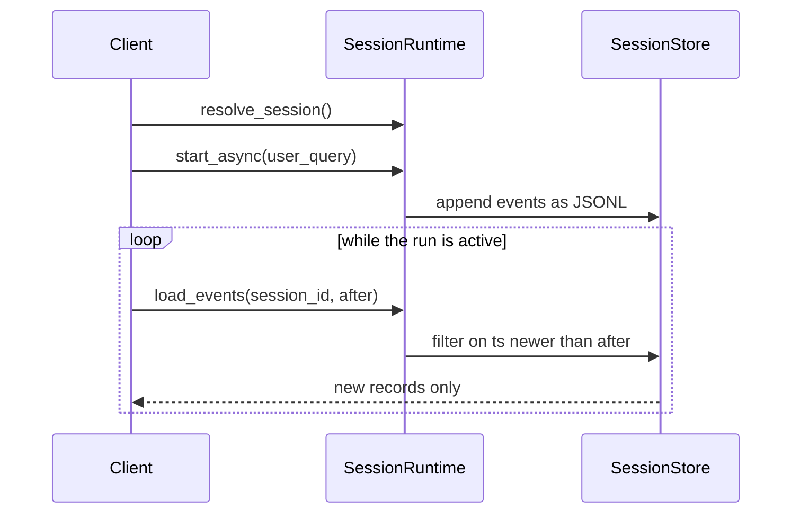

# Session Runtime

## Shared lifecycle for CLI and API

The session runtime is the shared facade behind both the CLI and the REST API. It owns session
lifecycle, async run tracking, and cancellation. Event polling is exposed over the API. The CLI reads
events in-process.

## What it does
- Resolves sessions by id, tag, or fork.
- Forks from a message through `fork_at_ts`, creating a session holding only the events up to that
  timestamp. Edit and regenerate runs on this.
- Runs orchestration synchronously or on a background thread.
- Tracks active runs per session and supports cancellation.
- Filters session events for polling with an `after` timestamp.
- Summarizes a session with title, status, done reason, context, and archived flag.
- Filters empty sessions out of listings and hides archived sessions unless asked.

## Core commands
Three commands work across every interface.

- `/compact` compacts the session transcript and writes a summary.
- `/terminate` requests cancellation for the active run.
- `/status` returns the current session summary.

The runtime recognizes only these. Interface-specific commands stay in each UI layer.

## Event polling model (API)
`SessionStore` writes events as JSONL records. `load_events(session_id, after)` filters them by the
ISO-8601 `ts` on each event.



Two payload shapes are worth knowing. `action_plan` payloads carry `steps: [{title, description}]`.
Tool activity uses `tool_id`, `operation`, and `tool_input` inside `tool_result` and `permission`
events.

## Minimal usage (Python)
```python
from mewbo_core.loop.session_runtime import SessionRuntime
from mewbo_core.session.session_store import SessionStore

runtime = SessionRuntime(session_store=SessionStore())
session_id = runtime.resolve_session(session_tag="primary")

# synchronous run
result = runtime.run_sync(user_query="Hello", session_id=session_id)

# async run + polling
runtime.start_async(session_id=session_id, user_query="Do the task")
events = runtime.load_events(session_id, after=None)

# fork from a specific message timestamp (edit & regenerate)
forked_id = runtime.resolve_session(
    fork_from=session_id,
    fork_at_ts="2026-04-15T10:30:00+00:00",
)
```

## Archiving behavior
- `SessionStore.archive_session(session_id)` marks a session archived.
- `SessionStore.unarchive_session(session_id)` removes the archive flag.
- `SessionRuntime.list_sessions()` hides archived sessions by default. Use
  `list_sessions(include_archived=True)` to include them.

## Channel adapter sessions

A chat platform adapter creates standard sessions through the runtime. Thread mapping reuses session
tags.

- **Tag format** is `<platform>:<thread_id>`, for example `nextcloud-talk:100`.
- **Lookup** through `session_store.resolve_tag(tag)` returns the session id or `None`.
- **Create** with `create_session()` followed by `tag_session(session_id, tag)`.
- Tags persist in MongoDB or JSON and survive an API restart.

Channel sessions are indistinguishable from console and CLI sessions in listings, event streams, and
Langfuse traces. A `context` event carrying `source_platform` is injected at creation, so the LLM and
the completion callback both have the session origin.

## Session Provenance

Every session has an **origin**, the surface or subsystem that created it. Origin is classified from
session tags and context at creation time and is never set manually. The console renders it as a
badge on each session card and uses it to power the origin filter.

| Origin | Classified when |
|--------|-----------------|
| `wiki` | Session is tagged `wiki:job` (indexing run), `wiki:qa` (Q&A query), `wiki:act` (scoped refresh) or `wiki:maintain` (on-demand maintainer) |
| `search` | Session is tagged `agentic_search` |
| `structured` | Session is tagged `structured:run` ([`POST /v1/structured`](endpoint:POST /v1/structured) agentic mode, including MCP `structured_query`) or `structured:fast` (`POST /v1/structured` with `mode:"synthesis"`) |
| `draft` | Session is tagged `draft:stream` ([`POST /v1/draft/stream`](endpoint:POST /v1/draft/stream)) |
| `mobile` | Session is tagged `mobile:<platform>`, or its context names a mobile client such as `aura-android` |
| `apps` | Session is tagged `app:<app_id>` (a Mewbo Apps builder or maintainer session) |
| `channel` | Session carries a channel tag with a `:room:` or `:thread:` segment, such as `nextcloud-talk:room:<token>` |
| `user` | Everything else: direct console, CLI, or API sessions |

/// table-caption
How each session origin is classified from tags and context.
///

`structured` and `draft` come from the realtime endpoints. Those endpoints mint real sessions, so
every structured query and draft stream is browsable in the session list with a full transcript.

`apps` covers Mewbo Apps sessions. There is one builder session per app creation, plus one
long-lived maintainer session that the app's pipelines wake to apply changes. These are background
product sessions rather than tasks you started, so the origin filter hides them by default.

The **origin filter** on the session list shows only the surfaces you care about. It shows `user` and
`channel` by default and hides `wiki`, `search`, `structured`, `draft`, and `apps`. Each origin
toggles independently.

**Badge display.** Each session card carries a small origin badge, so you can tell at a glance which
surface created the session. A channel session shows its platform name, Nextcloud or Email, instead
of the generic label.

**Capability and workspace chips.** Each capability advertised at creation, `scg` or `wiki` for
example, renders as a chip beside the project and branch, and a structured workspace id renders the
same way. Chips reflect advertised capabilities only. A capability granted at runtime shows up in the
session's Langfuse trace and not on the card.

### Trace provenance in Langfuse

The same provenance reaches observability. At run start each session's tags, context, and client
surface are folded into filter tags on its Langfuse trace. You can filter traces by origin, product,
session type, client surface such as `cli`, `console`, `api` or `mcp`, project, repo, branch,
workspace, and model.

Higher-cardinality facets land in trace metadata instead, including worktree ids, capabilities, and
wiki or search run ids. CI agent pickup sessions surface as the `vcs` product. Operator setup is
covered in [Production deployment](deployment-production.md#observability-with-langfuse).

## Design goals
- Keep the core orchestration engine centralized.
- Keep interface layers thin and easy to extend.
- Avoid duplicate session lifecycle logic.
