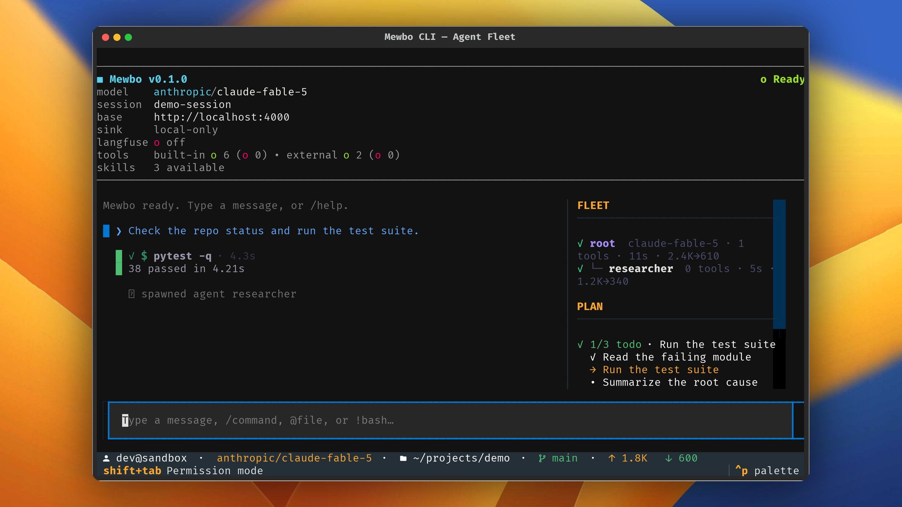

# Agent Fleet

## Watch every running agent

The terminal client shows the whole agent tree while it runs, so you can follow every sub-agent without leaving the screen. [Sub-agents](../features-agents.md) covers how delegation itself works.

## The fleet sidebar

When the root agent spawns sub-agents, a fleet section appears in the sidebar with one row per agent. Each row shows a status glyph, the agent's label, its model, its tool count, its elapsed time, and its token totals. A filled dot is running, a check mark is finished, and a cross is failed.

A row carries a tool count and never tool names, so it stays scannable. The panel lives in [`fleet_panel.py`](repo:apps/mewbo_cli/src/mewbo_cli/tui/widgets/fleet_panel.py).

Rows tick on their own while the agents run. A stall shows as a readout on that agent's row, so a hung sub-agent stays visible even while the root keeps working.

## Drilling into an agent

Select a row to open that agent's transcript in place, with its own breadcrumb and footer. Press ++esc++ to return to the live root transcript. The fleet sidebar stays put. The drill in view lives in [`fleet_drill.py`](repo:apps/mewbo_cli/src/mewbo_cli/tui/widgets/fleet_drill.py).

## Orchestration cards

Fleet tool calls render as dedicated cards instead of raw JSON. The cards live in [`orchestration_cards.py`](repo:apps/mewbo_cli/src/mewbo_cli/tui/widgets/orchestration_cards.py).

- A spawn card names the task, the model, and the agent type.
- A fleet check renders as a small table listing each agent, its status, its tokens or steps, and its last tool.
- A tool discovery renders a short list of the tools it found, each with a one line description.

## Everything streams in order

One hub subscribes to the session's event bus and demuxes every event by agent, so text, tools and spawns render in order. Sub-agent output streams live and labeled rather than arriving as a batch at the end. The hub lives in [`agent_transcript_hub.py`](repo:apps/mewbo_cli/src/mewbo_cli/tui/agent_transcript_hub.py).

## Next steps

- [The Interface](interface.md) covers the transcript, the plan dock, and approval prompts.
- [Configuration](configuration.md) covers flags, the config chain, and session recovery.
- [Sub-agents](../features-agents.md) covers how delegation works across every Mewbo surface.
