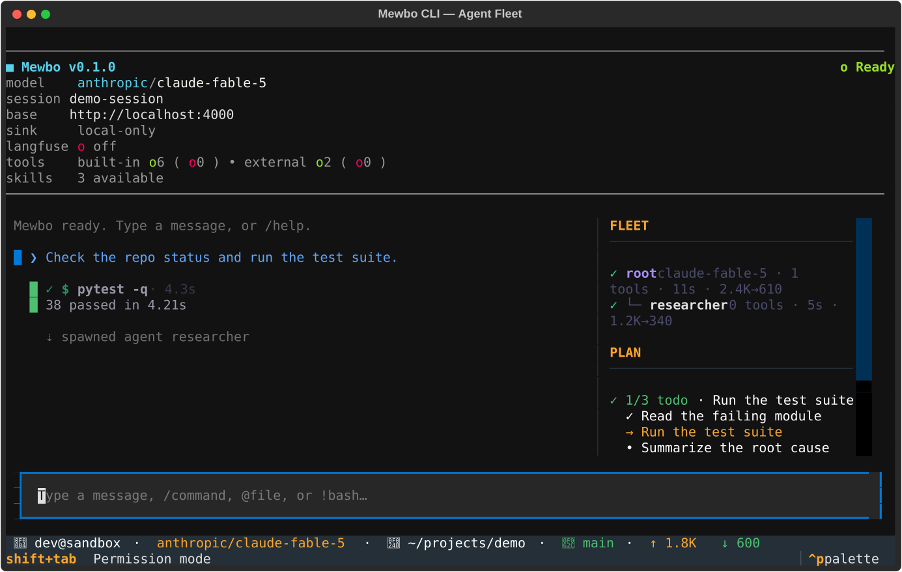

# Agent Fleet

A Mewbo agent can delegate work to sub-agents. The root agent spawns a helper for a focused task. The helper runs its own loop and reports back. The terminal client shows this whole tree while it runs, so you can follow every agent without leaving the screen.

## The fleet sidebar

When the agent spawns sub-agents, a fleet section appears in the sidebar. It lists one row per agent. Each row is a one-glance summary. It shows a status glyph, the agent's label, its model, its tool count, its elapsed time, and its token totals. A running agent shows a filled dot. A finished agent shows a check mark. A failed agent shows a cross. The row does not dump tool names, only the count, so the list stays scannable. The panel lives in [`fleet_panel.py`](repo:apps/mewbo_cli/src/mewbo_cli/tui/widgets/fleet_panel.py).

The sidebar rows tick on their own while the agents run. A stall shows up as a per-agent readout on the row, so a hung sub-agent is visible even when the root keeps working.

## Drilling into an agent

Select a row to open that agent's transcript. The client swaps the main transcript for the selected agent's view in place. It shows a breadcrumb, a per-agent footer, and the agent's own transcript rendered with the same cards you already know. Press `esc` to return to the live root transcript. The fleet sidebar stays put, so you can move from the root, into a child, and back again, all in one place. The drill-in view lives in [`fleet_drill.py`](repo:apps/mewbo_cli/src/mewbo_cli/tui/widgets/fleet_drill.py).

## Orchestration cards

When the root agent orchestrates the fleet, those tool calls render as dedicated cards instead of raw JSON. The cards live in [`orchestration_cards.py`](repo:apps/mewbo_cli/src/mewbo_cli/tui/widgets/orchestration_cards.py).

- A spawn renders as an agent-launch card. It shows the task, the model, and the agent type.
- A fleet check renders as a small table. It lists each agent, its status, its tokens or steps, and its last tool.
- A tool discovery renders as a short list of the tools it found, each with a one-line description.

## Everything streams in order

Every agent's output flows through one source of truth. The hub subscribes once to the session's event bus and demuxes each event by its agent. It keeps a strictly ordered log per agent, so text, tools, and spawns render in the order they actually happened. The root drives the live transcript. Sub-agent output streams too, labeled by agent, not held back for a batch dump at the end. The hub lives in [`agent_transcript_hub.py`](repo:apps/mewbo_cli/src/mewbo_cli/tui/agent_transcript_hub.py).

## Next steps

- [The Interface](interface.md): the transcript, the plan dock, and approval prompts.
- [Configuration](configuration.md): flags, the config chain, and session recovery.
- [Sub-agents](../features-agents.md): how delegation works across every Mewbo surface.
