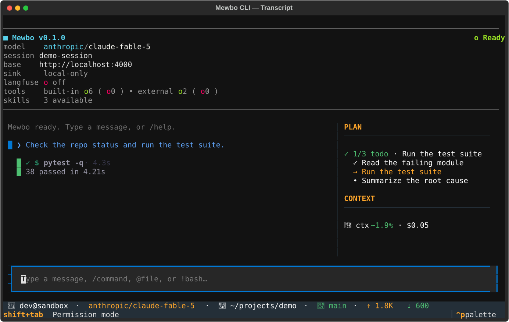
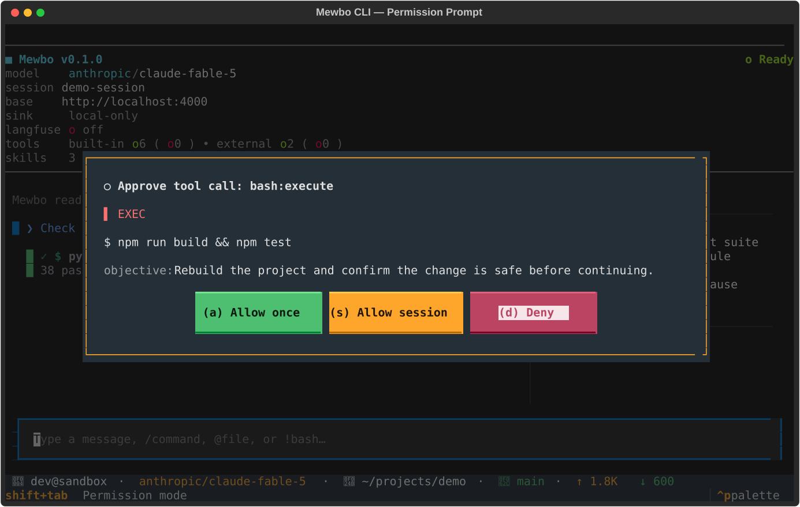

# The Interface

The terminal client renders one turn at a time on a single screen. The transcript fills the main area. A sidebar tracks progress. A footer shows what the agent is doing right now. This page walks through each surface and what you do with it.

## The live transcript

The transcript is the center of the screen. It streams the agent's reply as the tokens arrive, so you read the answer while it forms. The rendering lives in [`transcript_render.py`](repo:apps/mewbo_cli/src/mewbo_cli/tui/transcript_render.py).

Your turns and the agent's turns look different. Your messages carry a colored left rail so you can scan the conversation quickly. The agent's replies render as plain Markdown. One blank line separates every block.

Tool calls appear inline as cards, in the exact order the agent ran them. The card style tells you the kind of work at a glance.

- A file read is a compact one-line card. It names the file and the number of lines. It carries no body, because reads are frequent and should stay quiet.
- A shell command is an unmistakable terminal block. It shows a prompt, the command in bold, and the output below.
- An edit or a write renders as a colored diff. Added lines are green. Removed lines are red.
- Any other tool unwraps its result, or pretty-prints the JSON when there is no simpler form.

Each card also shows its state. A running tool is bright and full weight. A finished tool settles into a muted line with a check mark and its elapsed time, for example a short "ran" line with the seconds it took. A failed tool settles with a cross mark instead.

The footer at the bottom shows the current step and a live throughput readout. It reports the streaming rate, an upload phase, or a running tool with its elapsed seconds. If the agent stalls, the footer flips to a stalled indicator even though no new event has arrived. When the turn settles, the footer collapses into a short "done" summary with the total time.

## The plan and todo dock

When the agent tracks a working list, a dock appears in the sidebar. It shows an `N/M` count and one line per item. Each item carries a tri-state marker: done, in progress, or pending. Exactly one item is in progress at a time. The dock updates as the agent makes progress, so you read the plan at a glance while the transcript keeps flowing. The dock widget lives in [`todo_panel.py`](repo:apps/mewbo_cli/src/mewbo_cli/tui/widgets/todo_panel.py).

## Permission prompts

Mewbo asks before it does anything that changes your machine. The client decides each tool call through a layered chain, and only opens a prompt when a rule does not already settle it. The logic lives in [`permission_service.py`](repo:apps/mewbo_cli/src/mewbo_cli/tui/permission_service.py).

When the agent needs your decision, an approval modal opens. The modal shows the real payload. For an edit it shows the diff. For a shell command it shows the full command. A risk badge marks how sensitive the action is.

You resolve the modal with a single key.

- `a` allows this one call.
- `s` allows every call of this tool and action for the rest of the session.
- `d` denies the call. `esc` also denies, so the safe choice is the easy one.

"Allow session" keeps the grant in memory for the current run only. The modal widget lives in [`permission_modal.py`](repo:apps/mewbo_cli/src/mewbo_cli/tui/widgets/permission_modal.py).

You can also change how strict the prompts are. Press `shift+tab` to cycle the permission mode. The modes run from the normal prompt, to auto-accepting edits, to plan mode. The current mode shows in the footer.

## Plan mode approval

In plan mode the agent drafts a plan and pauses before it touches anything. The proposed plan renders as one bordered card titled "Proposed plan". It shows the plan as full Markdown, not raw JSON. The planning steps that produced it are hidden, so the card is the only decision surface.

You resolve the plan with a single key, through the plan approval modal in [`plan_modal.py`](repo:apps/mewbo_cli/src/mewbo_cli/tui/widgets/plan_modal.py).

- `a` approves the plan and runs it. The session switches from plan mode to act mode and executes.
- `k` keeps planning. Send your refinement as your next message. `esc` also keeps planning, so it is the safe default.
- `r` rejects the plan and abandons the proposal.

There are no plan slash commands. The decision is the modal, and nothing else.

## Next steps

- [Agent Fleet](agent-fleet.md): how the transcript extends when the agent delegates to sub-agents.
- [Configuration](configuration.md): flags, the config chain, and session recovery.
- [Remote Sync](remote-sync.md): keep the transcript local, or opt into a remote mirror.
