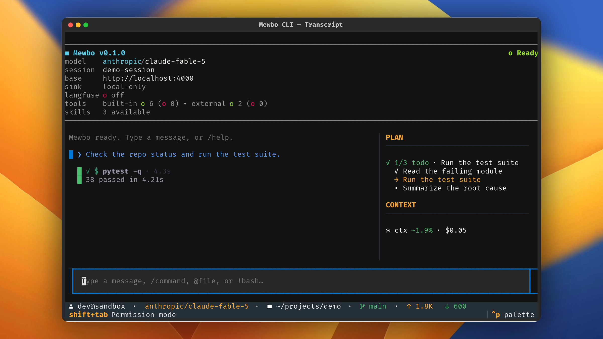
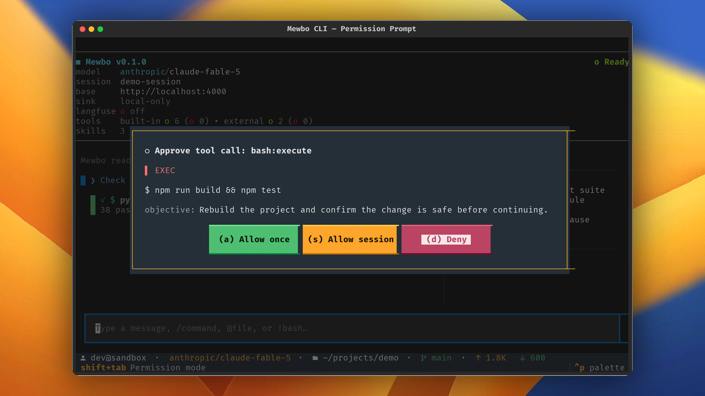

# The Interface

## Follow a run and approve it

The terminal client renders one turn at a time on a single screen, with the transcript in the middle and a sidebar beside it.

## The live transcript

The transcript streams the agent's reply as the tokens arrive. The rendering lives in [`transcript_render.py`](repo:apps/mewbo_cli/src/mewbo_cli/tui/transcript_render.py).

Tool calls appear inline as cards, in the exact order the agent ran them. The card style tells you the kind of work at a glance.

- A file read is a compact single line naming the file and its line count. Reads are frequent, so the card carries no body.
- A shell command renders as a terminal block, with the command in bold and its output below.
- An edit or a write renders as a colored diff. Added lines are green and removed lines are red.
- Any other tool unwraps its result, or prints readable JSON when there is no simpler form.

A running card is bright and full weight. A finished one settles into a muted line with a check mark and its elapsed time, a failed one with a cross.

The footer carries a live throughput readout, either the streaming rate, an upload phase, or a running tool's elapsed seconds. A stall flips it to a stalled indicator. A settled turn collapses it into a short `done` summary with the total time.

## The plan and todo dock

When the agent tracks a working list, a dock appears in the sidebar with an `N/M` count and one line per item. Each item carries a status marker, done, in progress, or pending, and exactly one item is in progress at a time. The dock widget lives in [`todo_panel.py`](repo:apps/mewbo_cli/src/mewbo_cli/tui/widgets/todo_panel.py).

## Permission prompts

Mewbo asks before it does anything that changes your machine. Your [permission rules](../features-permissions-hooks.md) settle most calls, and the terminal opens a modal only for what is left. The client side logic lives in [`permission_service.py`](repo:apps/mewbo_cli/src/mewbo_cli/tui/permission_service.py).

The modal shows the real payload, not a summary. You resolve it with a single key, through [`permission_modal.py`](repo:apps/mewbo_cli/src/mewbo_cli/tui/widgets/permission_modal.py).

- ++a++ allows this one call.
- ++s++ allows every call of this tool and action for the rest of the session. The grant is held in memory and dies with the run.
- ++d++ denies the call. ++esc++ also denies, so the safe choice is the easy one.

Press ++shift+tab++ to cycle the permission mode, from the normal prompt, to automatically accepting edits, to plan mode. The current mode shows in the footer.

## Plan mode approval

[Plan Mode](../features-plan-mode.md) pauses the agent before it touches anything. The terminal renders the proposal as one bordered card titled `Proposed plan`, in full Markdown rather than raw JSON, and hides the planning steps behind it. The card is the only decision surface.

You resolve it with a single key, through [`plan_modal.py`](repo:apps/mewbo_cli/src/mewbo_cli/tui/widgets/plan_modal.py).

- ++a++ approves the plan and runs it. The session switches to act mode and executes.
- ++k++ keeps planning. Send your refinement as your next message. ++esc++ also keeps planning, so it is the safe default.
- ++r++ rejects the plan and abandons the proposal.

## Next steps

- [Agent Fleet](agent-fleet.md) covers how the transcript extends when the agent delegates to sub-agents.
- [Configuration](configuration.md) covers flags, the config chain, and session recovery.
- [Remote Sync](remote-sync.md) covers keeping the transcript local, or opting into a remote mirror.
