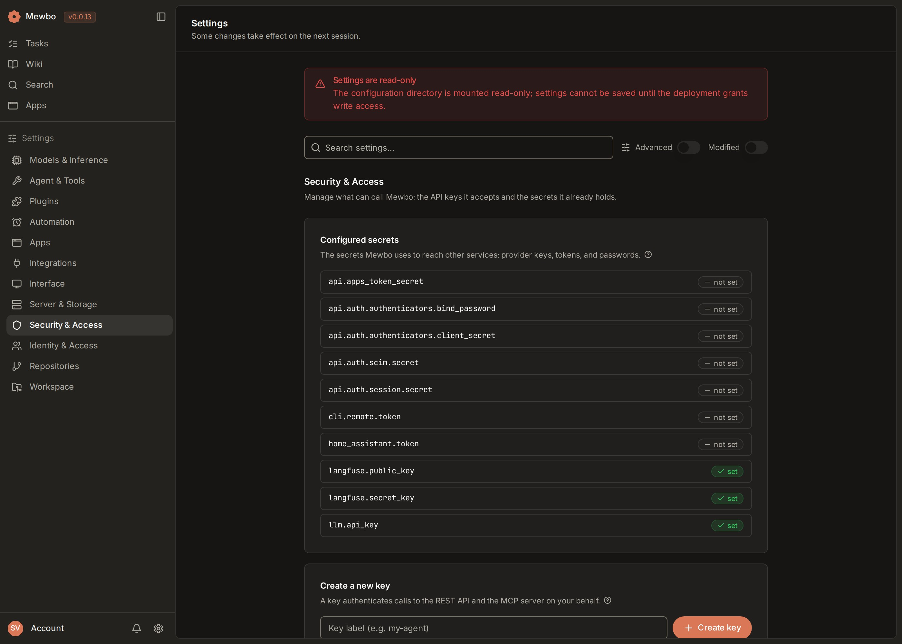

# Get Started

The web console is Mewbo's visual home. You watch an agent work in real time, run Search and the Wiki, and open a full browser IDE, all in one tab.

<div class="swiper ms-shots">
<div class="swiper-wrapper">
<div class="swiper-slide"><figure><figcaption>The console home, listing recent sessions</figcaption></figure></div>
<div class="swiper-slide"><figure><figcaption>Inside a task, step by step</figcaption></figure></div>
</div>
<div class="swiper-pagination"></div>
<div class="swiper-button-prev"></div>
<div class="swiper-button-next"></div>
</div>

The web console is Mewbo's browser client. It is an instrument for watching an agent work. You submit a task, the console streams the timeline as the session runs, and you follow each step live. Responses stream token by token. Tool calls, file edits, shell output, and sub-agent activity all render inline as they happen.

Mewbo also runs as a terminal CLI and as the Aura Android client. Choose the web console when you want to see the work, not just read a log. It shows a run as a live visual timeline, with diffs, shell output, and sub-agent activity rendered as rich cards. It is the only surface that carries the Agentic Search and Wiki product UIs, including the interactive 3D code graph. It is also where you open a full browser IDE beside a running session. The CLI suits a fast local loop in your terminal, and Aura brings Mewbo to your phone.

The console is built for asynchronous delegation. You hand off a task and walk away. You come back to a full, replayable trace of what the agent did. The console also hosts two dedicated products on top of the same engine. Agentic Search runs multi-source searches with cited answers. The Wiki turns a repository into browsable pages, a question-and-answer surface, and an interactive 3D code graph.

## What you need

The console is a frontend. It talks to a running Mewbo API. Stand up the API first, then point the console at it.

| Requirement | Notes |
|-------------|-------|
| A running Mewbo API | The console is a client over the REST API. See [Get Started](../getting-started.md#api-setup). |
| Node.js 20.19+ (or 22.12+) | Only for the development server; the range the pinned Vite requires. The Docker image ships a pre-built console. |
| An API key | Must match `api.master_token` on the API. See [Sign in](#sign-in) below. |

## Launch the console

There are two ways to run the console. Use Docker for a production stack. Use the Vite dev server for frontend development.

### Docker Compose

The published Docker stack builds and serves the console for you. It also starts the API, so this is the fastest path to a working console. Follow the [Docker quick-start](../getting-started.md#docker-quickstart), then open the console at `http://localhost:3001` — the console runs on host networking with a fixed port, so there's nothing to configure. No separate frontend build is needed. The full reference lives in [Docker Compose](../deployment-docker.md).

### Development server

For frontend work, run the Vite dev server against a local API.

```bash
# Start the API in one terminal
uv run mewbo-api

# Start the console in another
cd apps/mewbo_console && npm install && npm run dev
```

The dev server proxies `/api/` requests to the API at `127.0.0.1:5124` by default. Configure the connection with these environment variables.

| Variable | Purpose |
|----------|---------|
| `VITE_API_BASE_URL` | API server URL (default `http://127.0.0.1:5124`) |
| `VITE_API_KEY` | Frontend key, must match `api.master_token` on the API |
| `VITE_API_MODE` | `live` for direct API access, `auto` (default) for mock fallback |

## Sign in {#sign-in}

The console authenticates every request with an API key. In a Docker deployment the key is baked in from `MEWBO_VITE_API_KEY`, which must equal `MEWBO_MASTER_API_TOKEN` on the API. In development the key comes from `VITE_API_KEY` in your environment.

You mint and revoke keys from the console itself. Open the **Settings** screen and go to **Security & Access**, which holds the API key panel. Each issued key authenticates both the REST API and the [MCP server](../clients-mcp.md).

<div style="display: flex; justify-content: center;">
  
</div>

## Your first session

A session is one conversation with the agent. Here is the shortest path from a blank console to a finished task.

1. Open the console home. This is the session list and the composer.
2. Type your request into the composer. Pick a project, a model, or tool scope if you want to. The defaults work for a first run.
3. Submit. The console creates the session and opens its detail view.
4. Watch the run. The assistant reply streams in live. A progress card tracks the plan. Tool calls, edits, and sub-agent work render as cards in the workspace panel.
5. Steer if needed. While the run is active you can queue a follow-up message or stop the run from the composer.
6. Review when it settles. The finished session stays in your list. You can reopen it, fork from any message, or export it.

The console prompts for approval before any write or shell action, so a first run is safe to watch end to end.

## Next steps

- [Sessions](sessions.md): the session list, the composer, live streaming, steering, and recovery.
- [Search and Wiki](search-and-wiki.md): the Agentic Search product and the Wiki, including the 3D code graph.
- [Web IDE](ide.md): launch a full browser IDE tied to a session.
- [Widgets](widgets.md): interactive panels rendered inline in the conversation.
- [REST API Reference](../rest-api.md): the programmable surface the console sits on.
